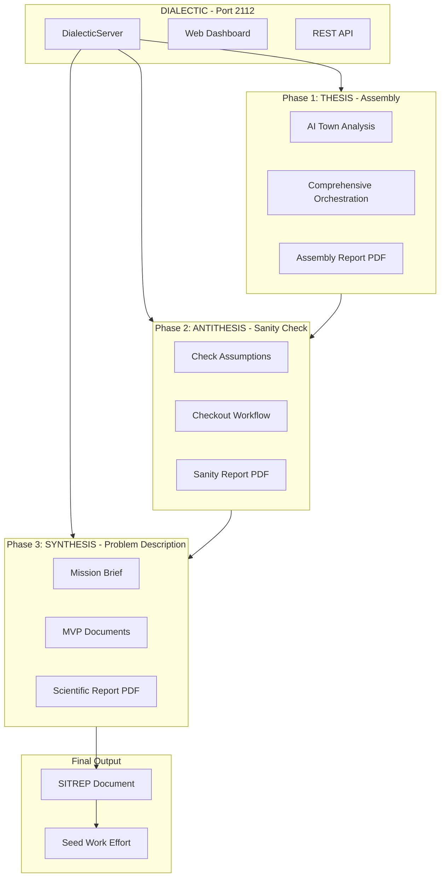

# DIALECTIC - The Dialectical Analysis Engine

## The God

**Name:** DIALECTIC

**True Name:** "The Dialectical Analysis Engine"

**Port:** 2112 (Rush's sci-fi concept album reference)

**Realm:** `dialectic_realm`

**Philosophy:** Hegelian Dialectics - Thesis, Antithesis, Synthesis



---

## Directory Structure

### Core Module: `src/waft/core/dialectic/`

```
src/waft/core/dialectic/
├── __init__.py
├── server.py              # HTTP server (port 2112)
├── phases/
│   ├── __init__.py
│   ├── assembly.py        # Thesis phase logic
│   ├── antithesis.py      # Antithesis phase logic
│   └── synthesis.py       # Synthesis phase logic
└── renderers/
    ├── __init__.py
    └── typst_renderer.py  # Typst PDF generation
```

### Realm: `_realms/dialectic_realm/`

```
_realms/dialectic_realm/
├── realm_manifest.json
├── README.md
├── sessions/              # Analysis sessions
├── outputs/               # Generated PDFs
│   ├── assembly/
│   ├── sanity/
│   └── synthesis/
└── templates/
    └── dialectic_components.typ
```

### Tools (Reusable): `tools/typst/`

```
tools/typst/
├── scientific_base.typ    # Scientific document base
├── phase_report.typ       # Phase report template
├── sitrep_template.typ    # SITREP formatting
├── dialectic_components.typ  # Dialectic-specific styling
└── README.md              # Usage documentation
```

---

## Implementation Files

### 1. Server: `src/waft/core/dialectic/server.py`

Following the `campfire.py` and `observatory/server.py` patterns:

```python
class DialecticServer:
    def __init__(self, project_path: Path, port: int = 2112):
        self.project_path = project_path
        self.port = port
        self.realm_path = project_path / "_realms" / "dialectic_realm"
        self.current_session = None

    def serve(self) -> None:
        # HTTP server with dashboard

    def run_assembly_phase(self) -> dict:
        # Execute AI Town + Orchestration
        # Generate Assembly PDF

    def run_antithesis_phase(self) -> dict:
        # Execute Check Assumptions + Checkout
        # Generate Sanity PDF

    def run_synthesis_phase(self) -> dict:
        # Execute Brief + MVP + Scientific docs
        # Generate Synthesis PDF

    def generate_sitrep(self) -> Path:
        # Combine all phases into SITREP
        # Return path to SITREP PDF

    def _get_html(self) -> str:
        # Three-panel dashboard
```

**Endpoints:**

- `GET /` - Dashboard (Thesis | Antithesis | Synthesis panels)
- `GET /api/status` - Current session state
- `POST /api/assembly/start` - Begin Assembly phase
- `POST /api/antithesis/start` - Begin Antithesis phase
- `POST /api/synthesis/start` - Begin Synthesis phase
- `POST /api/sitrep` - Generate final SITREP
- `GET /outputs/:file` - Serve generated PDFs

### 2. CLI Command: Update `src/waft/main.py`

```python
@app.command(name="dialectic")
def dialectic_cmd(
    path: str | None = typer.Option(None, "--path", "-p"),
    port: int = typer.Option(2112, "--port"),
    assembly: bool = typer.Option(False, "--assembly", "-a"),
    antithesis: bool = typer.Option(False, "--antithesis", "-t"),
    synthesis: bool = typer.Option(False, "--synthesis", "-s"),
    full: bool = typer.Option(False, "--full", "-f"),
    sitrep: bool = typer.Option(False, "--sitrep"),
):
    """
    Launch DIALECTIC - The Dialectical Analysis Engine.

    A God that orchestrates three-phase analysis:
    - THESIS (Assembly): AI Town + Orchestration
    - ANTITHESIS (Sanity Check): Check Assumptions + Checkout
    - SYNTHESIS (Problem Description): Brief + Scientific Docs

    Port: 2112 (default)
    """
```

### 3. Realm Manifest: `_realms/dialectic_realm/realm_manifest.json`

```json
{
  "realm_id": "dialectic_realm",
  "name": "DIALECTIC Realm",
  "description": "Realm of the Dialectical Analysis Engine",
  "port": 2112,
  "deity": "DIALECTIC",
  "philosophy": "Hegelian Dialectics: Thesis, Antithesis, Synthesis",
  "phases": ["assembly", "antithesis", "synthesis"],
  "created_at": "2026-01-21T09:00:00Z",
  "version": "1.0.0"
}
```

---

## Typst Tools

### 4. `tools/typst/scientific_base.typ`

Scientific document foundation with:

- Research paper styling
- Author/affiliation blocks
- Abstract formatting
- Citation style
- Equation/figure environments
- References section

### 5. `tools/typst/phase_report.typ`

Phase-specific templates:

- Phase header (THESIS/ANTITHESIS/SYNTHESIS)
- Evidence blocks with validation status
- Assumption tables (proven/refuted/unknown)
- Progress indicators
- Phase summary boxes

### 6. `tools/typst/sitrep_template.typ`

Military-style SITREP format:

- Date/Time Group
- Situation Summary
- Mission Statement
- Execution Details
- Logistics
- Command and Signal
- Classification badges

### 7. `tools/typst/dialectic_components.typ`

Dialectic-specific styling (following `odd_components.typ` pattern):

- Color palette (thesis=blue, antithesis=red, synthesis=purple)
- Phase transition markers
- Evidence-based callouts
- Verification badges
- Classification levels

---

## Phase Outputs

### Assembly Phase PDF

```
assembly_report_20260121_090700.pdf
├── Cover: "DIALECTIC - ASSEMBLY PHASE (THESIS)"
├── Section 1: Context Summary (from /context)
├── Section 2: Oracle Epistemic State
├── Section 3: AI Town Roster & Analysis
├── Section 4: Comprehensive Orchestration Results
├── Section 5: Gathered Evidence
└── Footer: Classification, Timestamp, Session ID
```

### Sanity Check Phase PDF

```
sanity_report_20260121_091500.pdf
├── Cover: "DIALECTIC - SANITY CHECK PHASE (ANTITHESIS)"
├── Section 1: Assumptions Extracted
├── Section 2: Validation Results
│   ├── Proven Assumptions (with evidence)
│   ├── Refuted Assumptions (with evidence)
│   └── Unknown Assumptions (needs testing)
├── Section 3: Checkout Summary
├── Section 4: Git Status Review
└── Footer: Classification, Timestamp, Session ID
```

### Synthesis Phase PDF (Scientific Format)

```
synthesis_report_20260121_092300.pdf
├── Title Page: Research-style
├── Abstract: Problem summary
├── Section 1: Introduction
├── Section 2: Methodology (Dialectical Analysis)
├── Section 3: Assembly Results (Thesis)
├── Section 4: Validation Results (Antithesis)
├── Section 5: Synthesis & Findings
├── Section 6: Mission Brief
├── Section 7: MVP Recommendations
├── Section 8: Conclusions
├── References
└── Appendices
```

### SITREP Document

```
SITREP_20260121_093000.pdf
├── Header: DATE-TIME GROUP, CLASSIFICATION
├── 1. SITUATION
│   ├── a. Internal State Summary
│   └── b. External State Summary
├── 2. MISSION
│   └── Derived from Synthesis phase
├── 3. EXECUTION
│   ├── a. Thesis Phase Results
│   ├── b. Antithesis Phase Results
│   └── c. Synthesis Phase Results
├── 4. SUSTAINMENT
│   └── Resources/Dependencies identified
├── 5. COMMAND AND SIGNAL
│   └── Next steps, Work Effort recommendation
└── Footer: Can be used to seed Work Effort
```

---

## Web Dashboard Design

```
+------------------------------------------------------------------+
|                  DIALECTIC // PORT 2112                           |
|            The Dialectical Analysis Engine                        |
+------------------------------------------------------------------+
|                                                                    |
|  +------------------+  +------------------+  +------------------+ |
|  |     THESIS       |  |   ANTITHESIS     |  |    SYNTHESIS     | |
|  |    (Assembly)    |  |  (Sanity Check)  |  | (Problem Desc)   | |
|  |                  |  |                  |  |                  | |
|  | [Start Phase]    |  | [Start Phase]    |  | [Start Phase]    | |
|  |                  |  |                  |  |                  | |
|  | Status: IDLE     |  | Status: WAITING  |  | Status: WAITING  | |
|  |                  |  |                  |  |                  | |
|  | Output:          |  | Output:          |  | Output:          | |
|  | [None]           |  | [None]           |  | [None]           | |
|  +------------------+  +------------------+  +------------------+ |
|                                                                    |
|  +--------------------------------------------------------------+ |
|  |                      SITREP GENERATION                        | |
|  |                                                                | |
|  |  [Generate SITREP]  [Seed Work Effort]  [Download All PDFs]   | |
|  +--------------------------------------------------------------+ |
|                                                                    |
|  Current Session: dialectic_20260121_090000                       |
|  Phase Progress: 0/3 complete                                     |
+------------------------------------------------------------------+
```

---

## Dependencies

- **Typst**: Required for PDF generation (`typst compile`)
- **Existing WAFT modules**: Being system, Oracle, Work Efforts
- **No new Python packages** - uses stdlib + existing deps

---

## Testing Plan

1. **Create realm structure**: Verify `_realms/dialectic_realm/` created correctly
2. **Register port**: Add 2112 to PortRegistry
3. **Start server**: `waft dialectic` on port 2112
4. **Run Assembly phase**: Verify PDF generation
5. **Run Antithesis phase**: Verify assumption checking
6. **Run Synthesis phase**: Verify scientific PDF
7. **Generate SITREP**: Verify combined output
8. **Seed Work Effort**: Test WE creation from SITREP

---

## Integration with Existing Systems

- **PortRegistry**: Registers port 2112 for `dialectic_realm`
- **Observatory**: Can monitor DIALECTIC as a mesh node
- **Work Efforts MCP**: SITREP can seed new Work Efforts
- **Oracle**: Provides epistemic state for Assembly phase
- **Being System**: AI Town spawns Beings for analysis

---

## Implementation TODOs

- [x] Create _realms/dialectic_realm/ directory structure with realm_manifest.json and templates
- [x] Create tools/typst/ folder with scientific_base.typ, phase_report.typ, sitrep_template.typ, dialectic_components.typ
- [x] Create src/waft/core/dialectic/ package with `__init__.py`, server.py, phases/, renderers/
- [x] Implement Assembly (Thesis) phase: AI Town + Orchestration logic, PDF generation
- [x] Implement Antithesis phase: Check Assumptions + Checkout logic, PDF generation
- [x] Implement Synthesis phase: Brief + MVP + Scientific docs, PDF generation
- [x] Implement SITREP generation combining all phases, Work Effort seeding capability
- [x] Add @app.command(name="dialectic") to src/waft/main.py with all options
- [x] Register port 2112 in PortRegistry for dialectic_realm
- [ ] Test complete workflow: Server start, all phases, SITREP generation

---

## Implementation Complete - 2026-01-21

### Files Created

**Core Module (`src/waft/core/dialectic/`):**
- `__init__.py` - Package init with DialecticServer export
- `server.py` - HTTP server with web dashboard and API endpoints
- `phases/__init__.py` - Phase modules init
- `phases/assembly.py` - THESIS phase implementation
- `phases/antithesis.py` - ANTITHESIS phase implementation
- `phases/synthesis.py` - SYNTHESIS phase implementation
- `renderers/__init__.py` - Renderer init
- `renderers/typst_renderer.py` - Typst PDF compilation

**Realm (`_realms/dialectic_realm/`):**
- `realm_manifest.json` - Realm configuration
- `README.md` - Documentation
- `outputs/` - Directory structure for phase outputs
- `sessions/` - Session storage

**Tools (`tools/typst/`):**
- `scientific_base.typ` - Scientific document template
- `phase_report.typ` - Phase report components
- `sitrep_template.typ` - SITREP formatting
- `dialectic_components.typ` - Shared styling components
- `README.md` - Usage documentation

**Updated Files:**
- `src/waft/main.py` - Added `waft dialectic` command
- `src/waft/core/realms/port_registry.py` - Added SERVICE_PORTS including dialectic_realm:2112