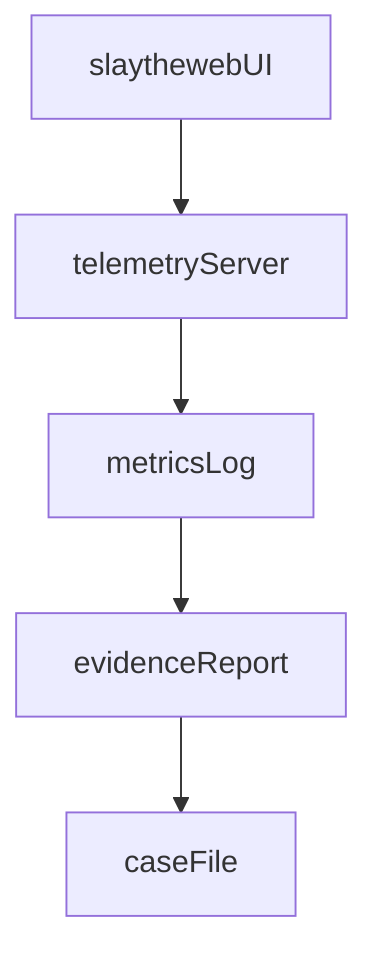

# Teleport Massive Autoplay Plan

## Scope and constraints

- Use the existing work effort [`_work_efforts/WE-260119-ejtx_teleport_massive_official_guide_to_scint_traversal`](./_work_efforts/WE-260119-ejtx_teleport_massive_official_guide_to_scint_traversal).
- NPM dev/build is allowed for this session.
- No file deletions.
- Use `playingcards.py` for Dealer card generation only (gameplay engine unchanged).

## Plan

1. Cleanup + readiness

- Delete accidental GitHub comments on `ctavolazzi/waft` PR/issue #1.
- Run `/continue` then `/reflect` and fill the journal entry content.
- Confirm plan is stored in `.cursor/plans/` (already present).

2. Fix `/reflect` reliability

- In [`src/waft/core/reflect.py`](./src/waft/core/reflect.py), define missing attributes (`ai_name`, `ai_metadata`, and the journal directory fields) and implement `_validate_journal_path`, `_create_index`, `_create_discovery_manifest`.
- Add the missing public methods used by [`src/waft/main.py`](./src/waft/main.py): `search_entries`, `cleanup_old_archives`, and `display_statistics`.
- Ensure `_ensure_journal_exists` uses the correct paths and no undefined symbols remain.

3. Oracle + deep analysis (slaytheweb reference)

- Run `/consult-the-oracle` before critique/response.
- If the repo is not present, clone into [`_external/slaytheweb`](./_external) and read docs + core logic (`README.md`, `DOCUMENTATION.md`, `src/game/*`, `tests/*`).
- Write a deep analysis document under the work effort folder.

4. Critique pipeline (after Oracle)

- Run `/critique-and-revise` on this plan, then `/critique`, `/check-assumptions`, `/verify`, and `/respond-to-critique` in order.
- Save outputs under the work effort folder.

5. Dealer + playingcards integration

- Add an adapter (e.g., [`src/waft/dealer/card_generator.py`](./src/waft/dealer/card_generator.py)) to encapsulate the `playingcards` dependency.
- Update [`src/waft/dealer/gates.py`](./src/waft/dealer/gates.py) and [`src/waft/cli/cards_cli.py`](./src/waft/cli/cards_cli.py) to use the adapter.
- Add a short integration note in the work effort folder.

6. MVP guide (Typst bananote)

- Create the `.typ` source and compiled PDF in the work effort folder with goals, core loop, card taxonomy, energy economy, dungeon/room/intent model, content pipeline, testing approach, and Teleport Massive narrative framing.

7. Telemetry server + prove-it + case-file

- Add a lightweight FastAPI telemetry server for `/prove-it` to log run metrics and compute summary stats.
- Run `/prove-it` and generate a `/case-file` report from the evidence.

8. Run the full game + UI automation

- Install dependencies in `_external/slaytheweb` and run `npm run dev`.
- Use Playwright to automate the UI: start a run, choose cards, play turns, gather telemetry, and capture failures.
- If a run fails, iterate fixes in the `_external/slaytheweb` clone and retry until stable.

9. Headless autoplay for evolution

- Build a code-only autoplay runner that imports slaytheweb game logic and simulates runs.
- Persist per-run metrics (turn count, win/loss, card usage, damage, energy spend).

10. Run-it workflow + wrap-up

- Execute `/run-it` once core artifacts exist to close the full workflow.
- Update ticket 008 (`TKT-ejtx-008`) with links to deliverables and change status as appropriate.
- Update the work effort index and [`_work_efforts/devlog.md`](./_work_efforts/devlog.md).
- Submit Empirica postflight.

## Verification

- After `/reflect` fixes, run `waft reflect --no-save` to confirm no runtime errors.
- Validate the Dealer integration with `waft cards draw` and `waft cards gates`.
- Confirm created deliverables exist under the work effort folder and are linked from the ticket/index.
- Verify UI automation produces telemetry logs and a passing run.

## Data flow (automation evidence)

