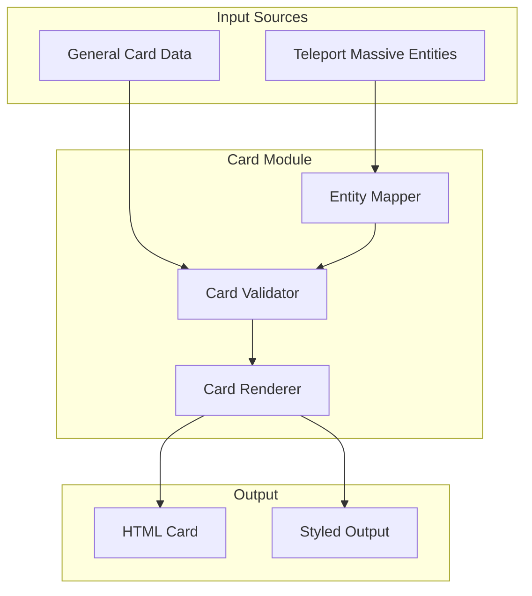

# Teleport Massive MTG Card Generation Module

## Overview

Create a comprehensive HTML/CSS-based card generation system inspired by Magic: The Gathering, designed for the Teleport Massive universe. The module will generate web-viewable cards with all MTG components and support both entity-based cards (from Teleport Massive employees, departments, concepts) and general card creation.

## Architecture

### Component Structure

```
src/waft/templates/cards/
├── __init__.py                    # Module exports
├── mtg_card.py                    # Main card generation API
├── templates/
│   ├── card_template.html         # HTML template with Handlebars-style placeholders
│   └── card_styles.css            # MTG-style CSS with frame colors, typography
├── data/
│   ├── card_schema.py             # Pydantic models for card data
│   └── entity_mapper.py           # Maps TM entities to card data
└── examples/
    └── generate_tm_cards.py       # Example script
```

### Data Flow



## Implementation Details

### 1. Card Data Schema (`data/card_schema.py`)

Define Pydantic models for card structure:

- `ManaCost`: List of mana symbols (W, U, B, R, G, C, or numbers)
- `CardType`: Type line (e.g., "Creature - Human Scientist")
- `CardRarity`: Common, Uncommon, Rare, Mythic Rare
- `CardFrame`: Frame color based on color identity
- `CardData`: Complete card structure with all MTG fields
  - `name`: Card name
  - `mana_cost`: ManaCost object
  - `type_line`: CardType
  - `art_url`: Path to art image
  - `abilities`: List of ability text
  - `power_toughness`: Optional (for creatures)
  - `flavor_text`: Optional quote
  - `rarity`: CardRarity
  - `frame_color`: Color identity (W, U, B, R, G, or multicolor)
  - `set_symbol`: Optional set symbol
  - `collector_number`: Optional

### 2. Entity Mapper (`data/entity_mapper.py`)

Map Teleport Massive entities to card data:

- **Employee Cards**: Map employees to creature cards
  - Name → card name
  - Role/Title → type line
  - Level → power/toughness
  - Skills → abilities
  - Lore → flavor text
  - Department → color identity

- **Department Cards**: Map departments to enchantment/artifact cards
  - Department name → card name
  - Function → abilities
  - Mission → flavor text

- **Concept Cards**: Map concepts (SWAB, SWAE, Scint, etc.) to spell/planeswalker cards
  - Concept name → card name
  - Description → abilities
  - Lore → flavor text

### 3. HTML Template (`templates/card_template.html`)

Create MTG-style card template with:

- Card frame with proper borders and corners
- Mana cost display (top right)
- Name bar (top)
- Art area (center)
- Type line (below art)
- Abilities text box (with proper formatting)
- Power/toughness box (bottom right, creatures only)
- Flavor text (italic, bottom)
- Rarity symbol (bottom)
- Frame color variations (white, blue, black, red, green, multicolor, artifact, land)

### 4. CSS Styling (`templates/card_styles.css`)

Implement MTG card aesthetics:

- **Frame Colors**:
  - White: #F9F9F9 with gold accents
  - Blue: #0E68AB with silver accents
  - Black: #150B00 with gold accents
  - Red: #D3202A with gold accents
  - Green: #00733E with gold accents
  - Multicolor: Gradient backgrounds
  - Artifact: Gray metallic
  - Land: Brown/beige

- **Typography**:
  - Card name: Bold, serif font
  - Type line: Italic
  - Abilities: Regular with keyword highlighting
  - Flavor text: Italic, smaller
  - Power/toughness: Bold, large

- **Layout**:
  - Standard MTG card size: 63mm × 88mm (2.5" × 3.5")
  - Proper padding and margins
  - Rounded corners
  - Drop shadows for depth

### 5. Main API (`mtg_card.py`)

Python API similar to poker cards:

```python
from dataclasses import dataclass
from pathlib import Path

@dataclass
class MTGCard:
    """MTG-style card data structure."""
    name: str
    mana_cost: list[str]
    type_line: str
    art_url: str | None
    abilities: list[str]
    power_toughness: tuple[int, int] | None
    flavor_text: str | None
    rarity: str = "common"
    frame_color: str = "artifact"
    # ... other fields

def generate_mtg_card(
    card_data: MTGCard | dict,
    output_path: Path,
    template_path: Path | None = None,
    styles_path: Path | None = None
) -> Path:
    """Generate HTML card from card data."""
    # Load template
    # Replace placeholders with card data
    # Apply styles
    # Save HTML file
    # Return path

def generate_card_from_entity(
    entity_type: str,  # "employee", "department", "concept"
    entity_id: str,
    output_path: Path,
    project_path: Path | None = None
) -> Path:
    """Generate card from Teleport Massive entity."""
    # Load entity data
    # Map to card data
    # Generate card
    # Return path

def generate_card_deck(
    cards: list[MTGCard | dict],
    output_dir: Path,
    layout: str = "grid"  # "grid", "list", "single"
) -> Path:
    """Generate HTML page with multiple cards."""
    # Generate all cards
    # Create index page
    # Return path
```

### 6. Integration Points

- **Teleport Massive Integration**:
  - Read from `_realms/bureaucracy_realm/corporations/teleport_massive_20250701/`
  - Use `corporate_manifest.json` for employee data
  - Use Being system for character stats

- **Template System**:
  - Follow pattern from `src/waft/templates/typst/wrappers/deckz_poker.py`
  - Register in template registry (optional, for discovery)

- **Art Assets**:
  - Support local image paths
  - Support placeholder generation (if art not available)
  - Reference existing art in `_realms/` if available

## File Locations

- **Main Module**: `src/waft/templates/cards/mtg_card.py`
- **Templates**: `src/waft/templates/cards/templates/`
- **Data Models**: `src/waft/templates/cards/data/`
- **Examples**: `examples/generate_teleport_massive_cards.py`
- **Output**: `_realms/bureaucracy_realm/corporations/teleport_massive_20250701/cards/`

## Example Usage

```python
from src.waft.templates.cards import MTGCard, generate_mtg_card, generate_card_from_entity

# General card
card = MTGCard(
    name="Quantum Entanglement",
    mana_cost=["2", "U", "U"],
    type_line="Instant",
    art_url="path/to/art.jpg",
    abilities=["Create a quantum link between two target creatures."],
    flavor_text="Distance is an illusion.",
    rarity="rare",
    frame_color="blue"
)
generate_mtg_card(card, Path("output/card.html"))

# Entity card
generate_card_from_entity(
    entity_type="employee",
    entity_id="being_20260119_030048_f8e06283",
    output_path=Path("output/employee_card.html")
)

# Deck generation
cards = [card1, card2, card3]
generate_card_deck(cards, Path("output/deck/"))
```

## Testing Strategy

1. **Unit Tests**: Test card data validation, entity mapping
2. **Visual Tests**: Generate sample cards for each frame color and type
3. **Integration Tests**: Test with real Teleport Massive data
4. **Example Script**: Create example generating cards for all employees

## Dependencies

- `pydantic`: For data validation
- `jinja2` or `string.Template`: For HTML template rendering
- Standard library: `pathlib`, `json`, `dataclasses`

## Future Enhancements

- PDF export (using WeasyPrint or similar)
- Batch generation from CSV/JSON
- Card set management
- Print-ready layouts (9-card sheets)
- Interactive card viewer
- Integration with Cider project format (optional)

## References

- [Cider Project](https://github.com/oatear/cider) - Card design IDE inspiration
- MTG card dimensions and styling guidelines
- Existing poker card implementation: `src/waft/templates/typst/wrappers/deckz_poker.py`