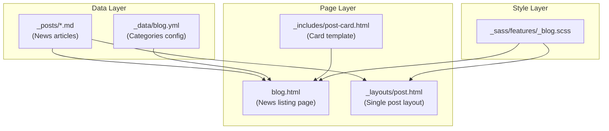

# Blog/News Feature for Chico Fab Lab

## Architecture




## File Structure

### New Files to Create

| File | Purpose ||------|---------|| `_posts/` | Directory for blog posts (Jekyll convention) || `_layouts/post.html` | Single post template with author, date, share || `_includes/post-card.html` | Reusable post preview card || `_data/blog.yml` | Categories and author definitions || `_sass/features/_blog.scss` | Blog-specific styles || `blog.html` | Main blog listing page at `/blog/` |

### Files to Modify

| File | Change ||------|--------|| `_config.yml` | Add posts permalink, defaults || `_data/navigation.yml` | Add Blog link to nav || `assets/css/main.scss` | Import blog SCSS |

## Post Format

Each post in `_posts/` follows Jekyll naming: `YYYY-MM-DD-title-slug.md`

```yaml
---
layout: post
title: "Workshop Announcement: Intro to 3D Printing"
date: 2025-12-20
author: "CFL Team"
category: announcement
tags: [workshop, 3d-printing, beginner]
image: /assets/img/blog/3d-printing-workshop.jpg
excerpt: "Join us for a hands-on introduction to 3D printing..."
---
Post content in markdown...
```


## Features

- **Listing Page**: Paginated grid of post cards with category filters
- **Post Page**: Full article with:
- Hero image (optional)
- Author byline and date
- Reading time estimate
- Category/tag badges
- Related posts
- Social share buttons (optional)
- **RSS Feed**: Already supported via `jekyll-feed` plugin
- **Categories**: Announcement, Workshop, Project Spotlight, Community

## Sample Posts (3 seed posts)

1. `2025-12-20-welcome-to-cfl-news.md` - Announcement
2. `2025-12-19-december-workshop-schedule.md` - Workshop
3. `2025-12-18-member-spotlight-laser-art.md` - Project Spotlight