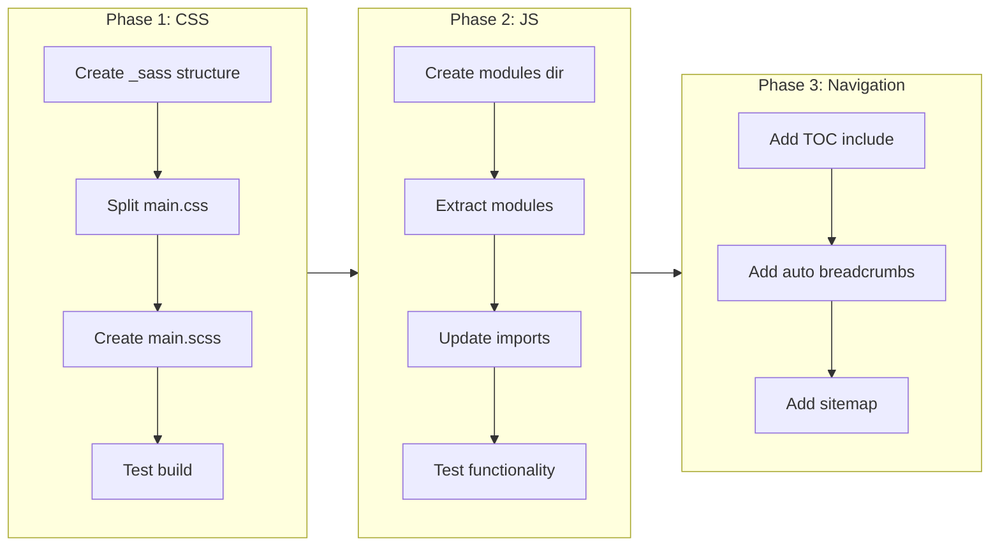

# Codebase Modularization & SEO Enhancements

## Current State (Verified)

- **CSS**: 10,138 lines in single `main.css`
- **JS**: 3,215 lines in single `main.js` (plus 4 game files)
- **Sass**: Jekyll has `jekyll-sass-converter` installed but unused
- **Breadcrumbs**: Component exists at `_includes/components/breadcrumbs.html` but not auto-included
- **TOC**: None
- **Sitemap**: None

## Phase 1: CSS Modularization (Sass)

Convert `assets/css/main.css` to Sass partials using Jekyll's built-in support.

### Target Structure

```
_sass/
  _variables.scss      # CSS custom properties (~100 lines)
  _base.scss           # Reset, html, body, typography (~200 lines)
  _layout.scss         # Header, footer, main, grid (~400 lines)
  _components/
    _buttons.scss      # .cfl-btn (~200 lines)
    _cards.scss        # .card, .card-grid (~400 lines)
    _alerts.scss       # .cfl-alert (~100 lines)
    _badges.scss       # .cfl-badge (~100 lines)
    _drawer.scss       # .cfl-drawer (~200 lines)
    _settings.scss     # .cfl-settings (~800 lines)
    _forms.scss        # Inputs, selects (~200 lines)
    _tables.scss       # .cfl-table (~150 lines)
    _tabs.scss         # .cfl-tabs (~150 lines)
    _toggles.scss      # .cfl-toggle (~100 lines)
    _tooltips.scss     # .cfl-tooltip (~100 lines)
    _spinners.scss     # .cfl-spinner (~50 lines)
    _breadcrumbs.scss  # .cfl-breadcrumbs (~50 lines)
    _progress.scss     # .cfl-progress (~100 lines)
  _features/
    _wiki.scss         # Wiki-specific styles (~300 lines)
    _search.scss       # Search component (~200 lines)
    _marquee.scss      # Marquee banner (~100 lines)
    _achievements.scss # Achievement badges (~200 lines)
    _privacy.scss      # Privacy disclaimer (~150 lines)
  _games/
    _pong.scss         # Pong styles (~500 lines)
    _sbip.scss         # Super Block Invaders Pong (~300 lines)
  _utilities/
    _print.scss        # Print styles (~100 lines)
    _accessibility.scss # Skip links, focus (~50 lines)
    _animations.scss   # Keyframes (~100 lines)
    _themes.scss       # Dark/light mode (~200 lines)

assets/css/
  main.scss            # Import manifest only
```

### Entry Point (`assets/css/main.scss`)

```scss
---
---
// Variables first
@import "variables";
@import "themes";

// Base styles
@import "base";
@import "layout";

// Components (alphabetical)
@import "components/alerts";
@import "components/badges";
// ... etc

// Features
@import "features/wiki";
// ... etc

// Utilities last
@import "utilities/print";
@import "utilities/accessibility";
```

## Phase 2: JS Modularization (ES Modules)

Split `assets/js/main.js` into focused modules.

### Target Structure

```
assets/js/
  main.js              # Entry point, imports all
  modules/
    config.js          # CFL_CONFIG setup
    storage.js         # safeGet, safeSet, safeParse utilities
    dark-mode.js       # Dark mode toggle
    drawer.js          # Settings drawer
    settings-widget.js # FAB settings widget
    search.js          # Wiki search
    keyboard.js        # Keyboard shortcuts
    privacy.js         # Privacy disclaimer
    achievements.js    # Achievement system
    daily-tip.js       # Daily tip widget
    code-copy.js       # Code block copy buttons
    smooth-scroll.js   # Smooth scrolling
```

### Approach

Use native ES modules with `type="module"` in the script tag. No bundler needed for this scale.

```html
<script type="module" src="/assets/js/main.js"></script>
```

## Phase 3: Auto Table of Contents

Add auto-generated TOC for wiki pages with 3+ headings.

### Implementation

1. Create `_includes/toc.html` - Liquid template that extracts h2/h3 from content
2. Add CSS for sticky sidebar TOC on desktop, collapsible on mobile
3. Update `_layouts/default.html` to include TOC for wiki pages

### TOC Include Logic

```liquid

  
  
    
  

```

## Phase 4: Auto Breadcrumbs

Automatically add breadcrumbs to wiki pages using existing component.

### Implementation

1. Update `_layouts/default.html` to auto-include breadcrumbs for wiki pages
2. Generate items from: Home > Category (from front matter) > Page Title

```liquid

  
  [{"label": "Home", "href": "{{ site.baseurl }}/"},
   {"label": "{{ page.category | default: 'Wiki' | capitalize }}", "href": "{{ site.baseurl }}/wiki/"},
   {"label": "{{ page.title }}"}]
  
  

```

## Phase 5: Sitemap Generation

Create `sitemap.xml` for SEO.

### Option A: Jekyll Plugin (Recommended)

Add `jekyll-sitemap` to Gemfile:

```ruby
gem "jekyll-sitemap"
```

Add to `_config.yml`:

```yaml
plugins:
  - jekyll-sitemap
```

### Option B: Manual Liquid Template

Create `sitemap.xml` in root with Liquid iteration over all pages.

## Implementation Order



## Files Modified

- `assets/css/main.css` - Deleted (replaced by Sass)
- `assets/css/main.scss` - New entry point
- `_sass/**/*.scss` - New directory with ~25 partials
- `assets/js/main.js` - Refactored to module imports
- `assets/js/modules/*.js` - New directory with ~12 modules
- `_layouts/default.html` - Add TOC and breadcrumbs
- `_includes/toc.html` - New TOC component
- `_config.yml` - Add sitemap plugin
- `Gemfile` - Add jekyll-sitemap

## Risk Mitigation

1. **CSS archive exists**: `assets/css/archive/main-v1-warm-paper-20251216.css` for rollback reference
2. **Incremental approach**: Each phase can be committed and tested independently
3. **No build tooling required**: Uses Jekyll's native Sass and browser-native ES modules