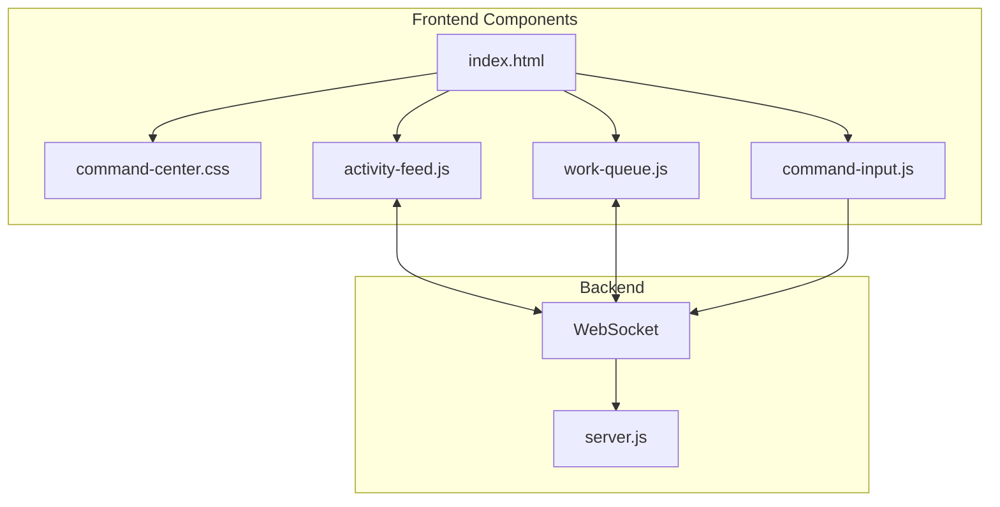

# Mission Control: Live AI Command Center Redesign

## Problem
The current detail view ([`index.html` lines 219-501](mcp-servers/dashboard-v3/public/index.html)) has:
- 3-column layout overloaded with 15+ metric panels
- No live/real-time interaction capability
- Poor mobile responsiveness
- Static data display instead of operational awareness

## Solution
Add a new **Command Center View** as an alternative to the classic detail view, featuring:

```
+--------------------------------------------------+
| <- Back | WE-ID | Status | Start | Done          |
+----------------------------+---------------------+
|                            |  WORK QUEUE         |
|  LIVE ACTIVITY FEED        |  > In Progress (2)  |
|  [terminal-style output]   |  o Up Next (3)      |
|                            |  v Done (5)         |
+----------------------------+---------------------+
| > type command here...                     [Send]|
+--------------------------------------------------+
```

## Architecture



## Implementation

### Phase 1: HTML Structure
Add command center view section to [`index.html`](mcp-servers/dashboard-v3/public/index.html):
- New `#commandCenterView` div alongside existing `#detailView`
- View toggle button to switch between "Classic" and "Command Center"
- Non-destructive: preserves existing detail view

### Phase 2: Activity Feed Component
Create [`public/components/activity-feed.js`](mcp-servers/dashboard-v3/public/components/activity-feed.js):
- Terminal-style streaming output
- Entry types: info, success, warning, error, action
- Auto-scroll with pause on hover
- Demo mode with simulated activity

### Phase 3: Work Queue Component
Create [`public/components/work-queue.js`](mcp-servers/dashboard-v3/public/components/work-queue.js):
- Group tickets by status: In Progress, Up Next, Done
- Click to expand details
- Visual status indicators

### Phase 4: Command Input Component
Create [`public/components/command-input.js`](mcp-servers/dashboard-v3/public/components/command-input.js):
- Text input with suggestions dropdown
- Commands: `start`, `complete`, `pause`, `create ticket`, `status`
- Enter to submit, Escape to clear

### Phase 5: WebSocket Updates
Modify [`server.js`](mcp-servers/dashboard-v3/server.js):
- New broadcast types: `activity`, `command_response`
- Activity event streaming to connected clients

### Phase 6: App Integration
Modify [`app.js`](mcp-servers/dashboard-v3/public/app.js):
- Initialize command center components
- Wire view toggle logic
- Connect WebSocket events to feed

## Files Changed

| File | Action |
|------|--------|
| [`index.html`](mcp-servers/dashboard-v3/public/index.html) | Add command center HTML section |
| [`command-center.css`](mcp-servers/dashboard-v3/public/styles/components/command-center.css) | Already created |
| [`main.css`](mcp-servers/dashboard-v3/public/styles/main.css) | Already updated |
| `components/activity-feed.js` | Create new |
| `components/work-queue.js` | Create new |
| `components/command-input.js` | Create new |
| [`app.js`](mcp-servers/dashboard-v3/public/app.js) | Add view toggle, init components |
| [`server.js`](mcp-servers/dashboard-v3/server.js) | Add activity broadcast |

## Out of Scope (Future)
- Drag-and-drop ticket reordering
- Natural language command parsing
- Full bidirectional AI context sharing
- Theme customization for command center