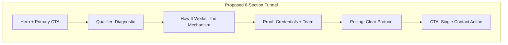

# Conversion-Focused UX Redesign

## Overview

Transform the current 12+ section information-heavy page into a streamlined 6-section conversion funnel with a clear CTA path, improved visual hierarchy, and enhanced readability.---

## Current State Analysis

The page currently has this structure (from [src/index.html](src/index.html)):

```javascript
Hero → Diagnostic → Exclusion → Mechanism → Theatres → Inventory 
→ Outputs → Field Notes → Assets → Team → Parameters → Pricing 
→ Comms → Contact → Footer
```

**Problems identified:**

- 12+ sections before primary CTA
- Three competing CTAs (Weird Question Hotline, Book a call, INITIATE_LINK)
- Flat visual hierarchy (everything looks equally important)
- Muted color palette (#52525b text is hard to read)

---

## Proposed Architecture



---

## Implementation Plan

### Phase 1: Design Token Overhaul

**File:** [src/css/tokens.css](src/css/tokens.css)Update color palette and typography tokens:

```css
/* Enhanced palette */
--primary: #c2410c;      /* Burnt orange - more sophisticated */
--secondary: #78350f;    /* Deep brown - warmth */
--accent: #0d9488;       /* Teal - contrast pop */
--highlight: #fbbf24;    /* Gold - premium feel */

/* Improved readability */
--muted: #71717a;        /* Higher contrast (was #52525b) */
--text-base: 1.125rem;   /* 18px base (was 1rem) */
```


### Phase 2: Section Consolidation

**File:** [src/index.html](src/index.html)| Current Section | Action | New Location ||-----------------|--------|--------------|| Hero | Keep + enhance | Section 1 || Diagnostic | Keep | Section 2 || Exclusion | Remove (negative framing) | - || Mechanism | Keep | Section 3 || Theatres | Merge into Credentials | Section 4 || Inventory | Merge into Credentials | Section 4 || Outputs | Collapse into Mechanism | Section 3 || Field Notes | Move to footer link | Footer || Assets | Remove (empty state) | - || Team | Keep (solo card only) | Section 4 || Parameters | Merge into Pricing | Section 5 || Pricing | Keep + clarify | Section 5 || Comms Panel | Remove (competing CTA) | - || Contact | Keep + emphasize | Section 6 |

### Phase 3: Visual Hierarchy System

**File:** [src/css/base.css](src/css/base.css) and [src/css/components.css](src/css/components.css)Create three tier treatments:| Tier | Sections | Treatment ||------|----------|-----------|| Primary | Hero, Final CTA | Full-width, bold bg, gradient || Secondary | Mechanism, Pricing | Cards with shadows || Tertiary | Diagnostic, Credentials | Subtle borders |

### Phase 4: Single CTA Path

**File:** [src/index.html](src/index.html)Consolidate to one primary action:

- **Remove:** "INITIATE_LINK" newsletter form
- **Demote:** "Or inspect the mechanism" secondary link
- **Primary CTA:** "Weird Question Hotline" button (appears in Hero + Final section)
- **Add:** Floating CTA button that appears after scrolling past hero

### Phase 5: Empty State Cleanup

**File:** [src/index.html](src/index.html)

- Remove placeholder team cards (OPERATIVE 002, 003)
- Remove "Secure Assets" section with fake files
- Single team card for Christopher only

---

## Files Modified

| File | Changes ||------|---------|| [src/css/tokens.css](src/css/tokens.css) | New color palette, typography scale || [src/css/base.css](src/css/base.css) | Line-height, section spacing || [src/css/components.css](src/css/components.css) | Visual hierarchy tiers, floating CTA || [src/index.html](src/index.html) | Section consolidation, CTA cleanup |---

## Estimated Time

| Phase | Time ||-------|------|| Design tokens | 30 min || Section consolidation | 60 min || Visual hierarchy | 45 min || CTA path + floating button | 30 min || Testing + polish | 45 min || **Total** | **~3.5 hrs** |---

## Success Metrics (Post-Launch)

1. Reduced scroll depth to primary CTA (from 12+ sections to 6)