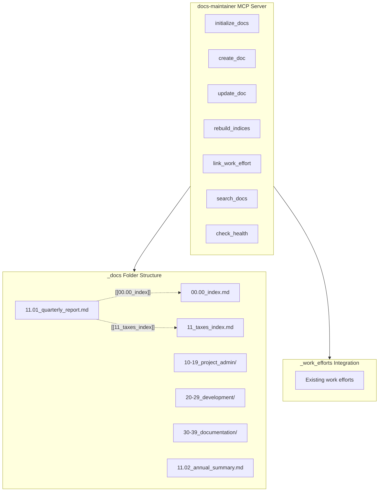

# Decimal-Docs-Maintainer MCP Server

## Architecture Overview



## File Structure

```
/Users/ctavolazzi/Code/.mcp-servers/
  docs-maintainer/
    server.py          # Main FastMCP server
    requirements.txt   # Dependencies (fastmcp, python-frontmatter)
    README.md          # Usage documentation
```

## Johnny Decimal Structure for _docs

```
_docs/
  00.00_index.md                    # Master index (central hub)
  10-19_project_admin/
    10_general/
      10_general_index.md
      10.01_project_overview.md
    11_planning/
      11_planning_index.md
      11.01_roadmap.md
  20-29_development/
    20_architecture/
      20_architecture_index.md
      20.01_system_design.md
  30-39_reference/
    30_apis/
      30_apis_index.md
```

## MCP Tools to Implement

### 1. `initialize_docs`
- Creates `_docs` folder if missing
- Creates `00.00_index.md` with initial structure
- Sets up default area folders (10-19, 20-29, etc.)

### 2. `create_doc`
- Parameters: `repo_path`, `area` (10-19), `category` (11), `title`, `content`
- Auto-generates next sequential ID (e.g., 11.05)
- Creates file with frontmatter:
  ```yaml
  ---
  id: "11.05"
  title: "Document Title"
  created: "2025-12-20T10:31:00Z"
  updated: "2025-12-20T10:31:00Z"
  links:
    - "[[00.00_index]]"
    - "[[11_planning_index]]"
  related_work_efforts: []
  ---
  ```
- Updates category index and master index

### 3. `update_doc`
- Parameters: `file_path`, `content`, `add_links`
- Updates `updated` timestamp
- Manages Obsidian links

### 4. `rebuild_indices`
- Scans entire `_docs` tree
- Regenerates all `*_index.md` files
- Fixes broken links
- Returns health report

### 5. `link_work_effort`
- Parameters: `doc_path`, `work_effort_id`
- Adds bidirectional links between `_docs` and `_work_efforts`

### 6. `search_docs`
- Parameters: `repo_path`, `query`, `search_content`
- Searches titles, content, and frontmatter

### 7. `check_health`
- Returns documentation health score
- Lists: missing metadata, broken links, orphaned docs

## Key Implementation Details

### ID Generation Logic (from existing work-efforts pattern)

```python
async def get_next_id(category_dir: Path) -> str:
    existing = [f.stem for f in category_dir.glob("*.md") if not f.stem.endswith("_index")]
    numbers = [int(m.group(1)) for f in existing if (m := re.match(r"\d+\.(\d+)", f))]
    next_num = max(numbers, default=0) + 1
    category = category_dir.name.split("_")[0]
    return f"{category}.{next_num:02d}"
```

### Index File Template

```markdown
# [Category Name] Index

## Documents
- [[11.01_document_one]] - Description
- [[11.02_document_two]] - Description

## Related
- [[00.00_index|Master Index]]
- [[../10_general/10_general_index|General]]

## Work Efforts
- [[../../_work_efforts/00-09_project_management/00_portfolio/00.01_example|Related Task]]
```

## Cursor Integration

Add to `.cursor/mcp.json`:

```json
{
  "mcpServers": {
    "docs-maintainer": {
      "command": "python",
      "args": ["/Users/ctavolazzi/Code/.mcp-servers/docs-maintainer/server.py"]
    }
  }
}
```

## Dependencies

- `fastmcp>=2.0.0` - MCP protocol handling
- `python-frontmatter>=1.1.0` - YAML frontmatter parsing
- `pathlib` (stdlib) - File path operations

## Integration with _work_efforts

The server will:
1. Read existing `_work_efforts` structure to find related items
2. Add `related_docs` field to work effort frontmatter when linked
3. Add `related_work_efforts` field to doc frontmatter when linked
4. Display cross-references in index files