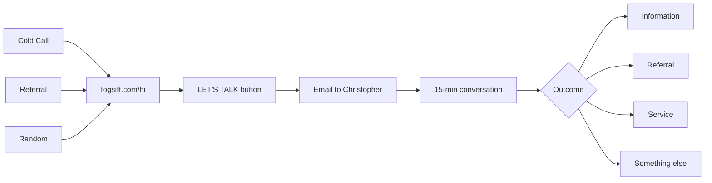

# Discovery Call Landing Page

## The Goal

Funnel anyone - cold call prospects, referrals, random visitors - toward one action: **give Christopher 15 minutes** to figure out what's mutually beneficial.

## The Core Message

> "Give me a few minutes. We'll figure out what would actually help you - information, services, a referral, or something else entirely."

This is different from a services page. You're not saying "here's what I do." You're saying "let's have a conversation and figure out what you need."

## Page Structure

```
+--------------------------------------------------+
|                                                  |
|              [Your Photo]                        |
|                                                  |
|         Christopher Tavolazzi                    |
|         Chico, CA                                |
|                                                  |
+--------------------------------------------------+
|                                                  |
|      Give me 15 minutes.                         |
|                                                  |
|      We'll figure out what you actually need.    |
|                                                  |
+--------------------------------------------------+
|                                                  |
|  What could come from our conversation:          |
|                                                  |
|  - An answer to your question                    |
|  - A referral to someone who can help            |
|  - A service I can provide                       |
|  - Something neither of us has thought of yet    |
|                                                  |
+--------------------------------------------------+
|                                                  |
|  No pitch. No pressure. If I can't help,         |
|  I'll tell you.                                  |
|                                                  |
+--------------------------------------------------+
|                                                  |
|           [ LET'S TALK ]                         |
|                                                  |
|     (email link with pre-filled subject)         |
|                                                  |
+--------------------------------------------------+
|                                                  |
|  15+ conversations | Clients in 8+ industries    |
|                                                  |
|  "Christopher asked the questions we should      |
|   have been asking ourselves."                   |
|                                                  |
+--------------------------------------------------+
|                                                  |
|         More at fogsift.com                      |
|                                                  |
+--------------------------------------------------+
```

## Key Differences from Main Site

| Main Site | Landing Page |
|-----------|--------------|
| "Here's what FogSift does" | "Let's figure out what YOU need" |
| Services-focused | Conversation-focused |
| Professional consulting | Personal connection |
| Multiple CTAs | One CTA: Let's Talk |

## Implementation

Create [`src/hi.html`](src/hi.html):
- Single-purpose: drive to email/booking
- Mobile-first, loads fast
- Reuses existing fonts/colors for brand consistency
- More conversational tone than main site
- One testimonial snippet for credibility
- Link to main site for those who want more

## The User Journey



## What You Say on the Phone

> "Check out fogsift.com/hi - you can reach out from there and we'll set up a quick call."

Simple. Direct. Matches the page they'll see.
