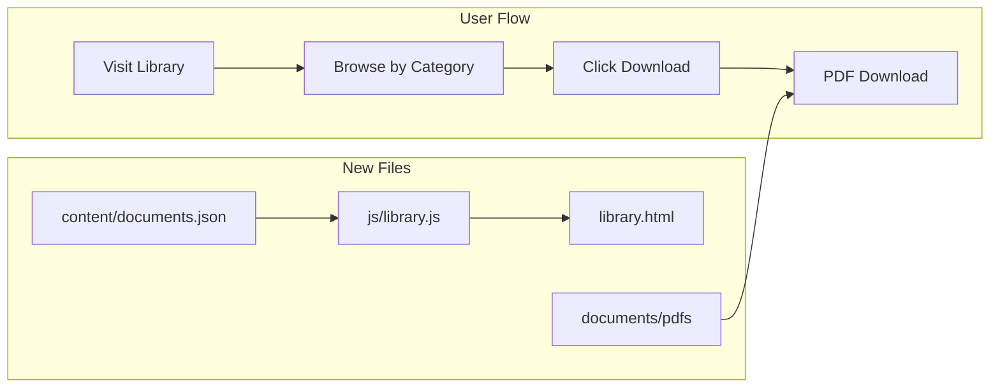

# Document Library Feature

## What We're Building

A new `/library.html` page with a browsable, filterable collection of downloadable PDFs (consulting forms, templates, framework worksheets). Uses the existing industrial badge aesthetic.

## Architecture




## File Structure

```javascript
src/
  library.html              # New page
  js/library.js             # Category filtering logic
  content/documents.json    # Document metadata
  documents/                # PDF storage folder
    forms/
    templates/
    worksheets/
    guides/
```


## Key Implementation Details

1. **Page Design**: Card grid similar to pricing section, with category filter tabs at top
2. **Document Metadata** ([`content/documents.json`](src/content/documents.json)): Title, description, category, filename, file size
3. **Categories**: Forms, Templates, Worksheets, Guides
4. **Download**: Direct `<a href="documents/..." download>` links - no JavaScript required for actual download

## Starter Documents (Placeholders)

- Client Intake Form (Forms)
- Statement of Work Template (Templates)  
- Five Whys Worksheet (Worksheets)
- Diagnostic Process Guide (Guides)

## Navigation Update

Add "Library" link to nav in [`index.html`](src/index.html) and update footer links.

## Notes

- PDFs stored locally in repo (you'll add actual PDFs later)