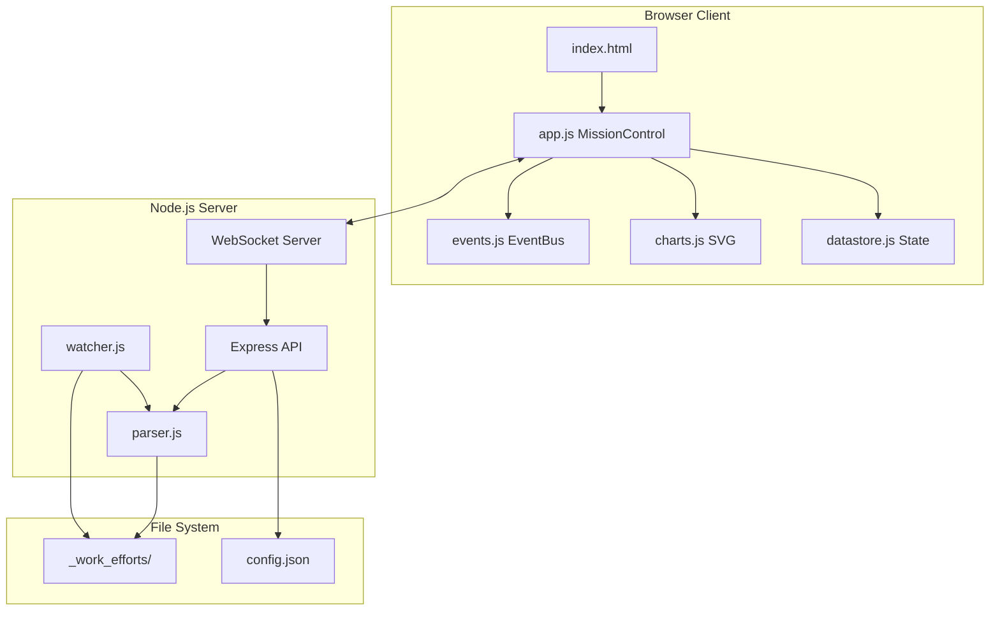

# Documentation & Cleanup Deep Dive

## Current State Analysis

**Codebase Size:**
- `app.js`: 2,838 lines (main client application)
- `styles.css`: 5,061 lines (comprehensive styling)
- `server.js`: 765 lines (Express + WebSocket server)
- `charts.js`: 417 lines (SVG chart library)
- `datastore.js`: 323 lines (state management)
- `events.js`: 814 lines (EventBus + ToastManager)
- `parser.js`: 235 lines (dual-format parser)
- `watcher.js`: 140 lines (debounced file watcher)

**Existing Docs:**
- [README.md](mcp-servers/dashboard/README.md) - Basic, needs major expansion
- [ai-docs.txt](mcp-servers/dashboard/public/docs/ai-docs.txt) - Good API reference
- [EVENT-SYSTEM-DECISION.md](mcp-servers/dashboard/docs/EVENT-SYSTEM-DECISION.md) - Architecture decision
- [brand-backup/README.md](mcp-servers/dashboard/public/assets/brand-backup/README.md) - Brand guidelines

---

## Deliverables

### 1. Enhanced README with Screenshots

Update [README.md](mcp-servers/dashboard/README.md) to include:
- Hero screenshot of dashboard
- Feature highlights with GIFs/images
- Quick start for different scenarios
- Troubleshooting section
- Contributing guidelines

**Screenshot Locations:**
- Dashboard overview (hero)
- Live Demo walkthrough
- Work effort detail view
- Mobile responsive view
- Toast notifications

### 2. Inline Code Documentation

Add JSDoc comments to all public functions and classes:

| File | Priority | Focus Areas |
|------|----------|-------------|
| `server.js` | High | API endpoints, WebSocket protocol |
| `app.js` | High | MissionControl class, event handlers |
| `events.js` | Medium | EventBus, ToastManager, AnimationController |
| `parser.js` | Medium | Format detection, parsing logic |
| `charts.js` | Medium | SVG generation functions |
| `datastore.js` | Low | State management patterns |
| `watcher.js` | Low | Debounce/throttle logic |

### 3. Architecture Documentation

Create `docs/ARCHITECTURE.md` with:

### 4. User Guide

Create `docs/USER-GUIDE.md` covering:
- Getting started
- Dashboard navigation
- Work effort lifecycle
- Live Demo walkthrough
- Keyboard shortcuts
- Mobile usage
- API usage examples

### 5. Code Cleanup

Minor cleanup opportunities identified:
- Remove duplicate backup files (keep only brand-backup)
- Consolidate CSS comments
- Add missing error boundaries

---

## File Changes

| Action | File | Description |
|--------|------|-------------|
| UPDATE | `mcp-servers/dashboard/README.md` | Expand with screenshots, features |
| CREATE | `mcp-servers/dashboard/docs/ARCHITECTURE.md` | System architecture |
| CREATE | `mcp-servers/dashboard/docs/USER-GUIDE.md` | End-user documentation |
| UPDATE | `mcp-servers/dashboard/server.js` | Add JSDoc comments |
| UPDATE | `mcp-servers/dashboard/public/app.js` | Add JSDoc comments |
| UPDATE | `mcp-servers/dashboard/public/events.js` | Add JSDoc comments |
| UPDATE | `mcp-servers/dashboard/lib/parser.js` | Add JSDoc comments |
| DELETE | `mcp-servers/dashboard/public/BACKUP_diamond_animations.css` | Duplicate (kept in brand-backup) |
| UPDATE | `_docs/00.00_index.md` | Add link to Mission Control docs |

---

## Execution Order

1. **Screenshots** - Capture current UI state
2. **Architecture Doc** - Create system overview
3. **README Expansion** - Hero section with screenshots
4. **Inline Comments** - Document server.js and app.js
5. **User Guide** - Write comprehensive usage guide
6. **Cleanup** - Remove duplicates, consolidate
7. **Index Updates** - Cross-link documentation

---

## Notes

- Screenshots will be saved to `mcp-servers/dashboard/docs/images/`
- Will use browser tools to capture live dashboard
- Preserving brand-backup as sacred (per previous session)
- Work effort WE-251227-1gku already marked documentation complete, but that was minimal