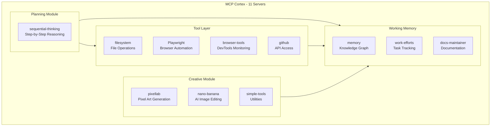
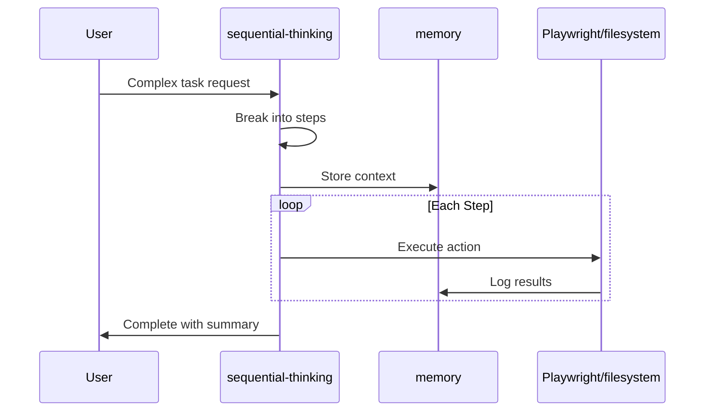

# Explore MCP Cortex Architecture

## Architecture Overview

## Module Breakdown

### 1. Working Memory (Persistence Layer)
| Server | Purpose | Storage |
|--------|---------|---------|
| `memory` | Knowledge graph for entities/relations | `~/.cursor/memory.jsonl` |
| `work-efforts` | Johnny Decimal task tracking | `_work_efforts/` folder |
| `docs-maintainer` | Documentation management | `_docs/` folder |

### 2. Planning Module (Executive Function)
| Server | Purpose | Use Case |
|--------|---------|----------|
| `sequential-thinking` | Step-by-step reasoning | Complex problem decomposition |

### 3. Tool Layer (External Interactions)
| Server | Purpose | Difference |
|--------|---------|------------|
| `filesystem` | File CRUD operations | Scoped to workspace |
| `Playwright` | Browser automation via accessibility | Fast, no vision model needed |
| `browser-tools` | DevTools monitoring + audits | Requires Chrome extension |
| `github` | GitHub API via MCP | Complements `gh` CLI |

### 4. Creative Module (Asset Generation)
| Server | Purpose | Requires |
|--------|---------|----------|
| `pixellab` | Pixel art characters/tilesets | PixelLab subscription |
| `nano-banana` | AI image gen/editing | Gemini API key |
| `simple-tools` | Random names, IDs, dates | Nothing (local) |

## Exploration Options

### Option A: Quick Demo of Each Module
1. **Working Memory**: Query the knowledge graph (`read_graph`)
2. **Planning**: Use sequential-thinking for a simple problem
3. **Tool Layer**: Test Playwright navigation
4. **Creative**: Generate a random name or date

### Option B: Deep Dive - Working Memory
- Explore what's in your knowledge graph
- See how work-efforts and docs-maintainer integrate
- Add new entities/relations

### Option C: Deep Dive - Browser Automation
- Compare Playwright vs browser-tools capabilities
- Test accessibility-based navigation
- Run DevTools audits

### Option D: Architecture Documentation
- Create a visual reference doc in `_docs/`
- Document server interactions
- Add to AGENTS.md

## Key Server Interactions

## Next Step
Choose which exploration path interests you most, and we'll dive in.