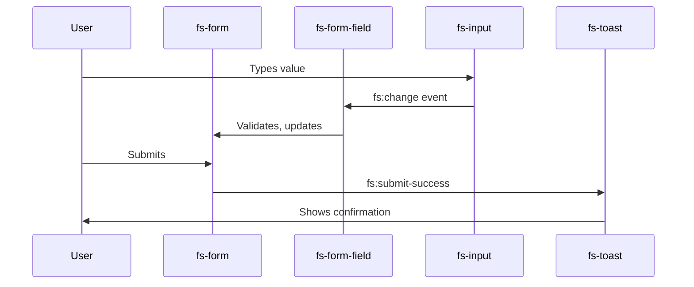

# FogSift Component Library - Comprehensive Plan

## Philosophy: Clean, DRY, Composable, Hookable

```
┌─────────────────────────────────────────────────────────────────┐
│  DESIGN PRINCIPLES                                               │
├─────────────────────────────────────────────────────────────────┤
│  1. COMPOSABLE   - Small pieces that combine into bigger ones   │
│  2. HOOKABLE     - Components communicate via events/slots      │
│  3. DRY          - Shared base class, utilities, mixins         │
│  4. VARIED       - Multiple variants per component              │
│  5. ACCESSIBLE   - ARIA, keyboard nav, focus management         │
│  6. THEMEABLE    - All styling via CSS custom properties        │
└─────────────────────────────────────────────────────────────────┘
```

---

## Architecture: Layered Component System

```mermaid
flowchart TB
    subgraph layer0 [Layer 0: Foundation]
        tokens[Design Tokens]
        base[FsBase Class]
        utils[Utilities]
    end
    
    subgraph layer1 [Layer 1: Primitives]
        button[Button]
        input[Input]
        badge[Badge]
        avatar[Avatar]
        separator[Separator]
        skeleton[Skeleton]
    end
    
    subgraph layer2 [Layer 2: Form Elements]
        checkbox[Checkbox]
        radio[Radio]
        switch_el[Switch]
        select[Select]
        textarea[Textarea]
        slider[Slider]
        form[Form]
    end
    
    subgraph layer3 [Layer 3: Layout Components]
        card[Card]
        accordion[Accordion]
        tabs[Tabs]
        collapsible[Collapsible]
        carousel[Carousel]
        table_el[Table]
    end
    
    subgraph layer4 [Layer 4: Overlay Components]
        modal[Modal/Dialog]
        drawer[Drawer/Sheet]
        popover[Popover]
        tooltip[Tooltip]
        dropdown[Dropdown]
        toast[Toast]
        alert[Alert Dialog]
    end
    
    subgraph layer5 [Layer 5: Complex Components]
        nav[Navigation]
        hero[Hero Sections]
        video[Video Player]
        command[Command Palette]
        datepicker[Date Picker]
        pagination[Pagination]
    end
    
    layer0 --> layer1
    layer1 --> layer2
    layer1 --> layer3
    layer2 --> layer3
    layer3 --> layer4
    layer4 --> layer5
```



---

## Directory Structure

```
src/js/components/
├── core/
│   ├── fs-base.js           # Base class with shared logic
│   ├── fs-styles.js         # Shared style utilities
│   ├── fs-events.js         # Custom event helpers
│   └── fs-utils.js          # DOM utilities, animations
│
├── primitives/
│   ├── fs-button.js         # Buttons (solid, outline, ghost, link)
│   ├── fs-badge.js          # Status badges, tags
│   ├── fs-avatar.js         # User avatars with fallback
│   ├── fs-icon.js           # Icon wrapper (SVG)
│   ├── fs-separator.js      # Horizontal/vertical dividers
│   ├── fs-skeleton.js       # Loading placeholders
│   └── fs-spinner.js        # Loading spinners
│
├── forms/
│   ├── fs-input.js          # Text input with variants
│   ├── fs-textarea.js       # Multi-line input
│   ├── fs-checkbox.js       # Checkboxes
│   ├── fs-radio.js          # Radio buttons
│   ├── fs-switch.js         # Toggle switches
│   ├── fs-select.js         # Dropdown select
│   ├── fs-slider.js         # Range sliders
│   ├── fs-label.js          # Form labels
│   ├── fs-form-field.js     # Label + input + error wrapper
│   └── fs-form.js           # Form container with validation
│
├── layout/
│   ├── fs-card.js           # Cards (default, outlined, elevated)
│   ├── fs-accordion.js      # Expandable sections
│   ├── fs-accordion-item.js
│   ├── fs-tabs.js           # Tab navigation
│   ├── fs-tab-panel.js
│   ├── fs-collapsible.js    # Single collapse toggle
│   ├── fs-carousel.js       # Image/content carousel
│   ├── fs-carousel-item.js
│   ├── fs-table.js          # Data tables
│   ├── fs-aspect-ratio.js   # Aspect ratio container
│   └── fs-scroll-area.js    # Custom scrollbars
│
├── overlays/
│   ├── fs-modal.js          # Modal dialogs
│   ├── fs-drawer.js         # Slide-out panels (sheet)
│   ├── fs-popover.js        # Positioned popovers
│   ├── fs-tooltip.js        # Hover tooltips
│   ├── fs-dropdown.js       # Dropdown menus
│   ├── fs-context-menu.js   # Right-click menus
│   ├── fs-toast.js          # Toast notifications
│   ├── fs-alert-dialog.js   # Confirmation dialogs
│   └── fs-hover-card.js     # Rich hover previews
│
├── navigation/
│   ├── fs-nav.js            # Main navigation
│   ├── fs-nav-item.js
│   ├── fs-breadcrumb.js     # Breadcrumb trail
│   ├── fs-pagination.js     # Page navigation
│   ├── fs-menubar.js        # Application menubar
│   └── fs-command.js        # Command palette (⌘K)
│
├── media/
│   ├── fs-video.js          # Video player with controls
│   ├── fs-audio.js          # Audio player
│   └── fs-image.js          # Lazy-load image with skeleton
│
├── heroes/
│   ├── fs-hero.js           # Base hero section
│   ├── fs-hero-split.js     # Text + image side-by-side
│   ├── fs-hero-centered.js  # Centered content
│   ├── fs-hero-video.js     # Video background hero
│   └── fs-hero-animated.js  # Animated text/effects
│
├── data-display/
│   ├── fs-stat.js           # Number + label
│   ├── fs-progress.js       # Progress bars
│   ├── fs-meter.js          # Gauges/meters
│   ├── fs-testimonial.js    # Quote cards
│   ├── fs-pricing-card.js   # Pricing tiers
│   ├── fs-feature-card.js   # Feature highlights
│   └── fs-timeline.js       # Vertical timeline
│
└── index.js                  # Export all components
```

---

## Base Class: The Foundation

```javascript
// core/fs-base.js - All components extend this
class FsBase extends HTMLElement {
    // === LIFECYCLE ===
    constructor() {
        super();
        this._listeners = [];
        this._state = {};
    }
    
    connectedCallback() {
        this._setup();
        this.render();
    }
    
    disconnectedCallback() {
        this._cleanup();
    }
    
    // === STATE MANAGEMENT ===
    setState(updates) {
        Object.assign(this._state, updates);
        this.render();
    }
    
    // === EVENT SYSTEM (Hookable) ===
    emit(name, detail) {
        this.dispatchEvent(new CustomEvent(`fs:${name}`, {
            bubbles: true,
            composed: true,
            detail
        }));
    }
    
    on(event, handler) {
        this.addEventListener(event, handler);
        this._listeners.push([event, handler]);
    }
    
    // === SLOT SYSTEM (Composable) ===
    getSlot(name) {
        return this.querySelector(`[slot="${name}"]`);
    }
    
    // === UTILITIES ===
    cls(...classes) {
        return classes.filter(Boolean).join(' ');
    }
    
    // === ANIMATION HELPERS ===
    async animate(keyframes, options) {
        return this.animate(keyframes, options).finished;
    }
    
    // === CLEANUP ===
    _cleanup() {
        this._listeners.forEach(([e, h]) => this.removeEventListener(e, h));
    }
}
```

---

## Component Variants: Creative & Varied

### Button Variants
```html
<!-- Styles -->
<fs-button>Default</fs-button>
<fs-button variant="outline">Outline</fs-button>
<fs-button variant="ghost">Ghost</fs-button>
<fs-button variant="link">Link</fs-button>
<fs-button variant="destructive">Delete</fs-button>

<!-- Sizes -->
<fs-button size="sm">Small</fs-button>
<fs-button size="lg">Large</fs-button>
<fs-button size="icon"><fs-icon name="plus"/></fs-button>

<!-- States -->
<fs-button loading>Loading...</fs-button>
<fs-button disabled>Disabled</fs-button>

<!-- With icons -->
<fs-button icon-left="mail">Send Email</fs-button>
<fs-button icon-right="arrow-right">Next</fs-button>
```

### Card Variants
```html
<fs-card>Basic card</fs-card>
<fs-card variant="outlined">Outlined</fs-card>
<fs-card variant="elevated">With shadow</fs-card>
<fs-card variant="interactive" href="/page">Clickable</fs-card>
<fs-card variant="hero">Large hero card</fs-card>
<fs-card variant="glass">Glassmorphism</fs-card>
```

### Input Variants
```html
<fs-input placeholder="Email"/>
<fs-input type="password" show-toggle/>
<fs-input variant="filled"/>
<fs-input variant="flushed"/>
<fs-input icon-left="search" placeholder="Search..."/>
<fs-input error="Invalid email"/>
<fs-input success hint="Looks good!"/>
```

---

## Hookable: Component Communication



### Example: Form with connected components

```html
<fs-form @fs:submit="handleSubmit">
    <fs-form-field name="email" label="Email" required>
        <fs-input type="email" placeholder="you@example.com"/>
    </fs-form-field>
    
    <fs-form-field name="message" label="Message">
        <fs-textarea rows="4"/>
    </fs-form-field>
    
    <fs-button type="submit">Send</fs-button>
</fs-form>

<fs-toast-provider/>

<script>
// Components hook together via events
document.querySelector('fs-form').addEventListener('fs:submit', (e) => {
    // Toast automatically shows via event bubbling
    FsToast.show({ message: 'Message sent!', type: 'success' });
});
</script>
```

---

## Component Categories (Full List)

### Primitives (13)
| Component | Variants | Description |
|-----------|----------|-------------|
| `fs-button` | solid, outline, ghost, link, destructive | All button styles |
| `fs-badge` | default, success, warning, error, outline | Status indicators |
| `fs-avatar` | circle, square, sizes | User images with fallback initials |
| `fs-icon` | 50+ icons | SVG icon system |
| `fs-separator` | horizontal, vertical | Visual dividers |
| `fs-skeleton` | text, circle, rect | Loading placeholders |
| `fs-spinner` | dots, ring, bars | Loading animations |

### Form Elements (12)
| Component | Features | Description |
|-----------|----------|-------------|
| `fs-input` | icons, validation, variants | Text inputs |
| `fs-textarea` | auto-resize, char count | Multi-line text |
| `fs-checkbox` | indeterminate, groups | Checkboxes |
| `fs-radio` | groups, cards | Radio buttons |
| `fs-switch` | sizes, labels | Toggle switches |
| `fs-select` | search, multi, groups | Dropdowns |
| `fs-slider` | range, marks, tooltips | Range inputs |
| `fs-date-picker` | range, presets | Date selection |
| `fs-time-picker` | 12/24h | Time selection |
| `fs-color-picker` | swatches, custom | Color selection |
| `fs-file-upload` | drag-drop, preview | File inputs |
| `fs-form-field` | label, error, hint | Field wrapper |

### Layout (10)
| Component | Features | Description |
|-----------|----------|-------------|
| `fs-card` | 6 variants, slots | Content containers |
| `fs-accordion` | multi-open, animated | Expandable sections |
| `fs-tabs` | vertical, pills, underline | Tab navigation |
| `fs-collapsible` | animated | Single toggle |
| `fs-carousel` | auto-play, dots, arrows | Content slider |
| `fs-table` | sort, filter, pagination | Data tables |
| `fs-aspect-ratio` | 16:9, 4:3, 1:1, custom | Ratio containers |
| `fs-scroll-area` | custom scrollbars | Scroll containers |
| `fs-resizable` | panels | Resizable layouts |
| `fs-grid` | responsive | Grid system |

### Overlays (9)
| Component | Features | Description |
|-----------|----------|-------------|
| `fs-modal` | sizes, animations | Modal dialogs |
| `fs-drawer` | left, right, bottom | Slide panels |
| `fs-popover` | positions, triggers | Positioned content |
| `fs-tooltip` | delay, positions | Hover hints |
| `fs-dropdown` | nested, icons | Dropdown menus |
| `fs-context-menu` | keyboard nav | Right-click menus |
| `fs-toast` | types, positions | Notifications |
| `fs-alert-dialog` | confirm/cancel | Confirmation dialogs |
| `fs-hover-card` | delay, rich content | Hover previews |

### Navigation (6)
| Component | Features | Description |
|-----------|----------|-------------|
| `fs-nav` | mobile drawer | Main navigation |
| `fs-breadcrumb` | truncation | Page trail |
| `fs-pagination` | compact, extended | Page navigation |
| `fs-menubar` | keyboard nav | App menubar |
| `fs-command` | search, shortcuts | Command palette |
| `fs-sidebar` | collapsible | Side navigation |

### Media (4)
| Component | Features | Description |
|-----------|----------|-------------|
| `fs-video` | custom controls, pip | Video player |
| `fs-audio` | waveform, playlist | Audio player |
| `fs-image` | lazy, skeleton, zoom | Smart images |
| `fs-gallery` | lightbox, grid | Image galleries |

### Heroes (5)
| Component | Features | Description |
|-----------|----------|-------------|
| `fs-hero` | base hero | Simple hero |
| `fs-hero-split` | image position | Two-column hero |
| `fs-hero-centered` | animated text | Centered hero |
| `fs-hero-video` | autoplay, overlay | Video background |
| `fs-hero-gradient` | animated gradients | Gradient backgrounds |

### Data Display (8)
| Component | Features | Description |
|-----------|----------|-------------|
| `fs-stat` | trend indicators | Stats with labels |
| `fs-progress` | circular, linear | Progress indicators |
| `fs-meter` | colored segments | Value gauges |
| `fs-testimonial` | with avatar | Quote cards |
| `fs-pricing-card` | featured tag | Pricing tiers |
| `fs-feature-card` | icon, title, desc | Feature highlights |
| `fs-timeline` | horizontal, vertical | Event timelines |
| `fs-countdown` | animated | Countdown timers |

---

## Implementation Phases

### Phase 1: Core Foundation (Week 1)
- Base class and utilities
- Design tokens integration
- 5 primitive components
- Build system setup

### Phase 2: Forms (Week 2)
- All form elements
- Validation system
- Form field wrapper

### Phase 3: Layout (Week 3)
- Card, Accordion, Tabs
- Carousel, Table
- Collapsible

### Phase 4: Overlays (Week 4)
- Modal, Drawer, Popover
- Tooltip, Dropdown
- Toast system

### Phase 5: Advanced (Week 5)
- Navigation components
- Media players
- Hero sections

### Phase 6: Polish (Week 6)
- Animation refinement
- Accessibility audit
- Documentation
- Example pages

---

## Design Token Integration

All components use CSS custom properties from `tokens.css`:

```css
/* Components inherit these automatically */
fs-button {
    --fs-button-bg: var(--burnt-orange);
    --fs-button-color: var(--cream);
    --fs-button-radius: var(--radius-badge);
    --fs-button-shadow: var(--shadow-hard);
}

/* Override per-instance */
<fs-button style="--fs-button-bg: var(--teal)">Custom</fs-button>
```

---

## Total Components: ~67

This gives FogSift a Shadcn-level component library that's:
- **Clean**: Consistent API across all components
- **DRY**: Shared base class, utilities, styles
- **Composable**: Slot-based content, nested components
- **Hookable**: Event-driven communication
- **Varied**: Multiple variants per component
- **Creative**: Unique designs matching FogSift aesthetic
