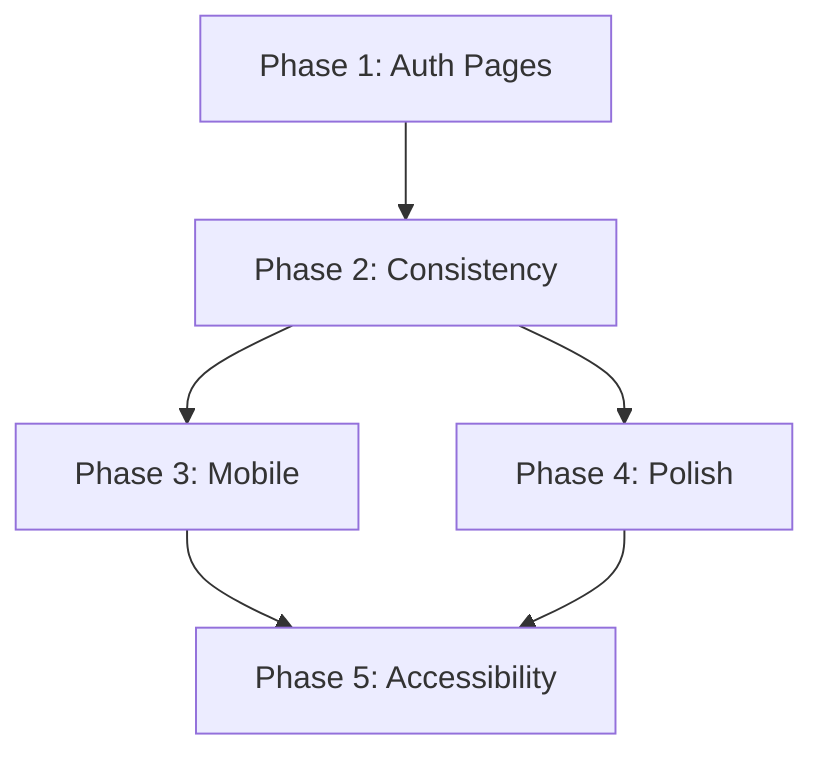

# Full UX/UI Review Plan

## Current State Summary

The site uses a Wikipedia-inspired design with:

- CSS design tokens in [`Base.astro`](src/layouts/Base.astro) (lines 134-176)
- Atomic component structure in [`src/components/`](src/components/)
- Previous UI work documented in [`20.01_ui-pattern-enhancement.md`](_work_efforts/20-29_design/20_ui-ux/20.01_ui-pattern-enhancement.md)

## Phase 1: Auth Pages (Priority)

### 1.1 Login Page ([`src/pages/login/index.astro`](src/pages/login/index.astro))

**Issues to address:**

- Inconsistent styling (duplicates CSS from Base.astro instead of using layout)
- No footer/nav consistency with main site
- Missing "Remember me" checkbox
- No social login placeholders for future
- Error state could be more user-friendly

**Improvements:**

- Use `Base.astro` layout instead of custom HTML
- Add consistent header with back-to-home link
- Improve error messaging with specific feedback
- Add loading state to button (already exists, verify polish)

### 1.2 Register Page ([`src/pages/register/index.astro`](src/pages/register/index.astro))

**Issues:**

- Same layout inconsistency as login
- No password strength indicator
- No terms/privacy checkbox before submit
- Missing email validation feedback

**Improvements:**

- Use Base.astro layout
- Add inline validation feedback
- Add password strength meter
- Add checkbox for terms acceptance with links

### 1.3 Forgot Password ([`src/pages/forgot-password/index.astro`](src/pages/forgot-password/index.astro))

**Check and improve:**

- Consistent styling with login/register
- Clear success/error states
- Link back to login

### 1.4 UserMenu Component ([`src/components/auth/UserMenu.astro`](src/components/auth/UserMenu.astro))

**Issues:**

- Fixed positioning (top-right) may conflict with other elements
- Dropdown animation could be smoother
- Mobile: username hidden but could show initials instead

**Improvements:**

- Review z-index stacking
- Add subtle entrance animation
- Show user initials on mobile instead of hiding completely

---

## Phase 2: Consistency Audit

### 2.1 Loading States

Multiple components use different loading spinner implementations:

- `[...slug].astro` lines 52-79
- `index.astro` lines 79-101
- `users/[id].astro` lines 296-316

**Action:** Create reusable `LoadingSpinner.astro` atom component

### 2.2 Auth Gate Pattern

Repeated auth-gate code across pages. Consider:

- Creating `AuthGate.astro` wrapper component
- Or middleware-based auth redirect

### 2.3 Button Styles

Multiple `.btn` class definitions across files. Consolidate into:

- Global button styles in Base.astro
- Or dedicated `Button.astro` component

### 2.4 Form Styles

Form styling duplicated in LoginForm, RegisterForm, profile pages.

**Action:** Create shared form CSS classes or `FormGroup.astro` component

---

## Phase 3: Mobile Experience

### 3.1 Navigation ([`Base.astro`](src/layouts/Base.astro) lines 373-390)

**Current:** Nav stacks vertically on mobile, centered

**Improvements:**

- Consider hamburger menu for cleaner mobile nav
- Ensure touch targets are 44px minimum
- Test UserMenu dropdown on mobile

### 3.2 Content Width

- Current max-width: 800px works well
- Ensure padding on small screens (currently 1rem)

### 3.3 Forms

- Ensure input fields are full-width on mobile
- Increase tap target sizes for buttons
- Test password toggle visibility button

### 3.4 Hero Component

- Check tagline text sizing on mobile (uses clamp, should be good)
- Verify CTA button size on touch devices

---

## Phase 4: Visual Polish

### 4.1 Transitions

Add subtle transitions to:

- Link hover states (currently instant)
- Button hover states
- Card hover states (TopicCard already has this)

### 4.2 Focus States

Ensure visible focus rings for:

- All interactive elements
- Form inputs (currently 2px outline, good)
- Navigation links

### 4.3 Loading Experience

- Improve auth-gate spinner with subtle pulse or better animation
- Consider skeleton screens for content areas

### 4.4 Micro-interactions

- Form validation feedback animations
- Success/error state transitions
- Dropdown open/close smoothing

---

## Phase 5: Accessibility

### 5.1 Semantic HTML

- Audit heading hierarchy (h1-h6 levels)
- Ensure landmark regions (header, main, footer, nav) are correct
- Verify form labels are properly associated

### 5.2 ARIA

- Add aria-live regions for dynamic content (error messages)
- Ensure dropdown menus have proper aria-expanded
- Add skip-to-content link

### 5.3 Keyboard Navigation

- Tab order should be logical
- Dropdown menus keyboard accessible
- Escape key closes modals/dropdowns

### 5.4 Color Contrast

- Current muted text (#666) may need checking
- Verify all text meets WCAG AA (4.5:1 for normal, 3:1 for large)

### 5.5 Reduced Motion

- Hero already respects prefers-reduced-motion
- Audit other animations

---

## Implementation Order

1. **Auth pages first** - User's priority, highest impact
2. **Consistency** - Creates reusable components for remaining work
3. **Mobile + Polish** - Can be done in parallel
4. **Accessibility** - Final pass ensures everything is compliant

---

## Files to Create/Modify

| Action | File | Purpose |

|--------|------|---------|

| Create | `src/components/atoms/LoadingSpinner.astro` | Reusable loading indicator |

| Create | `src/components/atoms/Button.astro` | Consistent button styles |

| Create | `src/components/molecules/FormGroup.astro` | Consistent form field wrapper |

| Modify | `src/pages/login/index.astro` | Use Base layout, improve UX |

| Modify | `src/pages/register/index.astro` | Use Base layout, add validation |

| Modify | `src/layouts/Base.astro` | Add skip link, consolidate button/form styles |

| Modify | `src/components/auth/UserMenu.astro` | Mobile improvements |

| Update | `_work_efforts/20-29_design/20_ui-ux/` | Create new work effort |

---

## Success Criteria

- [ ] Auth pages use consistent Base layout
- [ ] All loading states use same spinner component
- [ ] Mobile nav is touch-friendly (44px targets)
- [ ] All interactive elements have visible focus states
- [ ] Color contrast passes WCAG AA
- [ ] Keyboard navigation works throughout
- [ ] No duplicate CSS for buttons