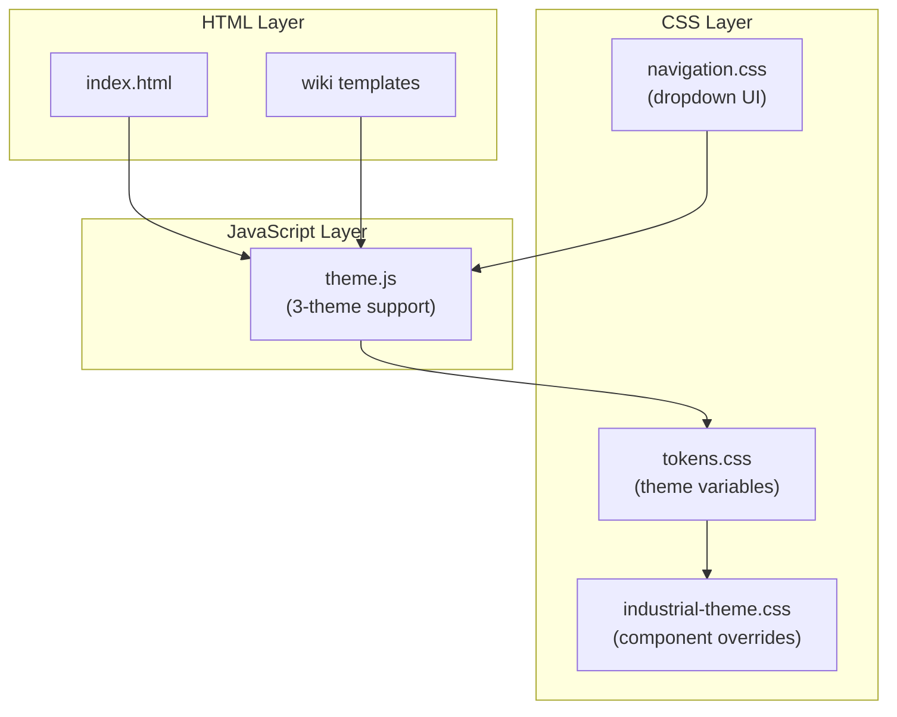

# Industrial Punchcard Theme Implementation

## Architecture Overview



## Files to Modify

| File | Change |
|------|--------|
| [`src/css/tokens.css`](src/css/tokens.css) | Add `[data-theme="industrial-punchcard"]` variables |
| [`src/js/theme.js`](src/js/theme.js) | Add `THEMES` array, `setTheme()`, dropdown support |
| [`src/css/navigation.css`](src/css/navigation.css) | Replace toggle button with dropdown styling |
| [`src/index.html`](src/index.html) | Replace theme toggle with dropdown select |
| [`src/wiki-template.html`](src/wiki-template.html) | Replace theme toggle with dropdown select |
| [`src/wiki-index-template.html`](src/wiki-index-template.html) | Replace theme toggle with dropdown select |

## New File to Create

| File | Purpose |
|------|---------|
| `src/css/industrial-theme.css` | Component-specific overrides (puff effects, hard shadows, punchcard texture) |

## Implementation Details

### 1. Theme Variables (`tokens.css`)

Add new selector with:
- Color palette: Warm Cream `#FDFBF7`, Deep Mocha `#3E2723`, Safety Orange `#E67E22`
- Industrial-specific shadows: hard-edge `4px 4px 0` style
- Thicker borders: `4px` for industrial feel
- Punchcard texture as CSS background

### 2. Theme JavaScript (`theme.js`)

```javascript
const THEMES = ['light', 'dark', 'industrial-punchcard'];

cycle() {
    const current = this.get();
    const idx = THEMES.indexOf(current);
    const next = THEMES[(idx + 1) % THEMES.length];
    this.set(next);
}
```

### 3. Theme Dropdown UI

Replace sun/moon toggle with styled `<select>` element:
- Styled to match each theme
- Shows current theme name
- Triggers `Theme.set(value)` on change

### 4. Component Overrides (`industrial-theme.css`)

Full coverage of claymorphism/brutalist styling:
- **Buttons**: Thick borders, hard shadows, transform on press
- **Cards**: Inset "puff" shadows, slot backgrounds
- **Navigation**: Industrial frame styling
- **Inputs**: Typewriter/terminal aesthetic
- **Background**: Punchcard paper texture via SVG/CSS gradient