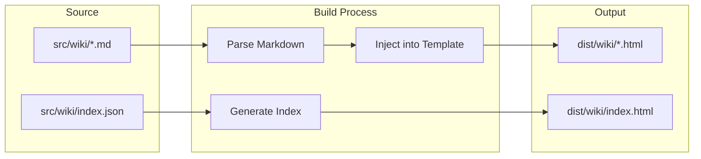

# Markdown Wiki Implementation

## Architecture




## Key Files to Create/Modify

| File | Purpose |

|------|---------|

| `src/wiki/` | Markdown content directory |

| `src/wiki-template.html` | HTML template for wiki pages |

| `src/wiki/index.json` | Wiki structure/metadata |

| [`scripts/build.js`](scripts/build.js) | Extend to process markdown |

| [`src/css/components.css`](src/css/components.css) | Wiki-specific styles |

| [`package.json`](package.json) | Add `marked` dependency |

## Implementation Steps

### 1. Add Markdown Parser

Add `marked` to package.json (lightweight, zero-config markdown parser).

### 2. Create Wiki Content Structure

```javascript
src/wiki/
  index.json          # Wiki metadata and navigation structure
  getting-started.md  # Example doc
  concepts/
    root-cause.md     # Example knowledge article
  field-notes/
    001-map-territory.md  # Migrated from articles.json
```


### 3. Create Wiki Page Template

New file `src/wiki-template.html` — minimal HTML shell with:

- Same nav/footer as main site
- Sidebar for wiki navigation
- Content area for rendered markdown
- Back/breadcrumb links

### 4. Extend Build Script

Add to [`scripts/build.js`](scripts/build.js):

- Read all `.md` files from `src/wiki/`
- Parse markdown to HTML using `marked`
- Inject into wiki template
- Generate wiki index page from `index.json`
- Copy to `dist/wiki/`

### 5. Add Wiki Styles

Extend [`src/css/components.css`](src/css/components.css) with:

- `.wiki-layout` (sidebar + content)
- `.wiki-nav` (category tree)
- `.wiki-content` (prose typography)
- Code block styling

### 6. Add Navigation Link

Add "Wiki" link to main nav in [`src/index.html`](src/index.html).

## Content Workflow (After Implementation)

1. Create/edit `.md` file in `src/wiki/`
2. Update `src/wiki/index.json` if adding new page
3. Run `npm run build`
4. Deploy

## Deliverables

- Wiki pages at `/wiki/page-name.html`
- Wiki index at `/wiki/index.html`
- Sidebar navigation with categories