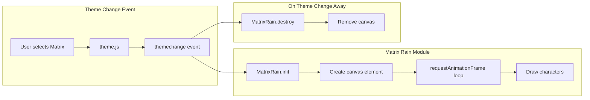

# Matrix Theme Implementation

## Summary

Add a fourth theme called "Matrix" to FogSift with:
- Animated falling code (digital rain) via HTML Canvas
- Green phosphor color palette (#00FF41 on #0D0208)
- CRT scanline/glow effects
- Full integration with existing theme system

## Architecture



## Files to Modify

### 1. [src/js/theme.js](src/js/theme.js)
Add `'matrix'` to `THEMES` array and `THEME_LABELS` object:

```javascript
THEMES: ['light', 'dark', 'industrial-punchcard', 'matrix'],
THEME_LABELS: {
    'light': 'Light',
    'dark': 'Dark',
    'industrial-punchcard': 'Industrial',
    'matrix': 'Matrix'
},
```

### 2. [src/css/tokens.css](src/css/tokens.css)
Add `[data-theme="matrix"]` variable block with green phosphor palette:

| Variable | Value | Purpose |
|----------|-------|---------|
| `--cream` | `#0D0208` | Near-black background |
| `--chocolate` | `#00FF41` | Phosphor green text |
| `--burnt-orange` | `#00FF41` | CTA buttons (green) |
| `--accent` | `#008F11` | Secondary green |
| `--highlight` | `#39FF14` | Bright neon accents |

### 3. [scripts/build.js](scripts/build.js)
- Add `'matrix'` to `VALID_THEMES` array (line 26)
- Add `'src/css/matrix-theme.css'` to `CSS_FILES` array
- Add `'src/js/matrix-rain.js'` to `JS_FILES` array  
- Add Matrix option to nav template theme picker

## Files to Create

### 4. src/js/matrix-rain.js (NEW)
Canvas-based falling code animation module:

```javascript
const MatrixRain = {
    canvas: null,
    ctx: null,
    animationId: null,
    drops: [],
    
    // Katakana + Latin + Numbers
    chars: 'アァカサタナハマヤャラワガザダバパイィキシチニヒミリヰギジヂビピウゥクスツヌフムユュルグズブヅプエェケセテネヘメレヱゲゼデベペオォコソトノホモヨョロヲゴゾドボポヴッン0123456789ABCDEFGHIJKLMNOPQRSTUVWXYZ',
    
    init() { /* Create canvas, start animation */ },
    destroy() { /* Stop animation, remove canvas */ },
    draw() { /* Render frame with trail effect */ },
    resize() { /* Handle viewport resize */ }
};
```

Key implementation details:
- Canvas positioned `fixed` with `z-index: -1`
- Trail effect: `rgba(13, 2, 8, 0.05)` fill each frame
- Column width: 14px font size
- Reset probability: `Math.random() > 0.975`
- Uses `requestAnimationFrame` (not setInterval)
- Subscribes to `Theme.subscribe()` for cleanup

### 5. src/css/matrix-theme.css (NEW)
Theme-specific styles (~200 lines):

- CRT scanline overlay effect (CSS pseudo-element)
- Text glow: `text-shadow: 0 0 10px #00FF41`
- Component overrides (cards, buttons, nav)
- Monospace font preference for terminal feel

## Theme Picker UI

Add to navigation template in build.js:

```html
<button class="theme-picker-option" data-theme="matrix" 
        role="option" onclick="ThemePicker.select('matrix')">
    <span class="theme-option-icon">▓</span>
    <span class="theme-option-label">Matrix</span>
    <span class="theme-option-check" aria-hidden="true">✓</span>
</button>
```

## Accessibility

- `prefers-reduced-motion: reduce` disables rain animation
- Canvas has `aria-hidden="true"` (decorative)
- Green on black passes WCAG AA contrast (13.3:1)

## Testing Checklist

- [ ] Theme cycles correctly: Light → Dark → Industrial → Matrix → Light
- [ ] Rain animation starts on Matrix selection
- [ ] Rain stops and canvas removed on theme change
- [ ] No memory leaks (animation properly cancelled)
- [ ] Responsive: rain resizes with viewport
- [ ] Reduced motion preference respected
- [ ] All components readable over rain effect