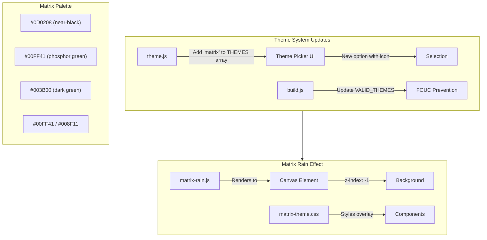

# Matrix Theme Implementation

## Overview

Add a new "Matrix" theme to FogSift featuring the iconic green falling code aesthetic with animated digital rain background. The theme will integrate seamlessly with the existing 3-theme system (Light, Dark, Industrial).

## Architecture



## Files to Create/Modify

### New Files
1. **`src/js/matrix-rain.js`** - Canvas-based falling code animation
   - Self-contained module that creates/destroys canvas on theme change
   - Configurable speed, density, character set (katakana + ASCII)
   - Performance-optimized with requestAnimationFrame
   - Responds to Theme.subscribe() events

2. **`src/css/matrix-theme.css`** - Theme-specific styles
   - Green phosphor color palette with CSS variables
   - CRT scanline overlay effect (subtle)
   - Text glow/shadow effects
   - Component overrides matching industrial-theme.css pattern

### Modified Files
1. **[`src/js/theme.js`](src/js/theme.js)** - Add 'matrix' to THEMES array and THEME_LABELS
2. **[`scripts/build.js`](scripts/build.js)** - Add 'matrix' to VALID_THEMES, add new files to CSS_FILES/JS_FILES arrays, update nav template
3. **[`src/css/tokens.css`](src/css/tokens.css)** - Add `[data-theme="matrix"]` variable block

## Color Palette

| Token | Value | Usage |
|-------|-------|-------|
| `--cream` | `#0D0208` | Near-black background |
| `--chocolate` | `#00FF41` | Primary phosphor green text |
| `--burnt-orange` | `#00FF41` | CTA buttons (same green) |
| `--accent` | `#008F11` | Secondary green |
| `--highlight` | `#39FF14` | Bright neon green accents |
| `--glow` | `0 0 10px #00FF41` | Text/element glow effect |

## Matrix Rain Implementation

The canvas effect will use these techniques:
- Characters: Mix of half-width katakana (U+FF66-U+FF9D) and ASCII
- Columns calculated from viewport width / font size
- Each column drops at slightly randomized speeds
- Characters fade from bright green to dark green as they fall
- Occasional "bright flash" characters for visual interest

## Theme Picker UI Update

Add new option to theme picker dropdown:
```html
<button class="theme-picker-option" data-theme="matrix" role="option" onclick="ThemePicker.select('matrix')">
    <span class="theme-option-icon">▓</span>
    <span class="theme-option-label">Matrix</span>
    <span class="theme-option-check" aria-hidden="true">✓</span>
</button>
```

## Accessibility Considerations

- Reduced motion: Disable rain animation when `prefers-reduced-motion: reduce`
- High contrast: Ensure sufficient contrast ratios (green on black passes WCAG AA)
- Canvas is decorative only (aria-hidden="true")
