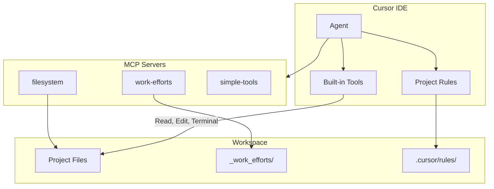

# Comprehensive Cursor Optimization

## Overview

This plan covers:

1. MCP server path fixes and new tools
2. Rules migration (.mdc to RULE.md folders)
3. Expanded CURSOR_REFERENCE.md documentation (7 sections)
4. Configuration optimization guide
5. Architecture diagrams

---

## Part 1: MCP Server Improvements

### 1.1 Fix Path Resolution

**File:** `/Users/ctavolazzi/Code/.cursor/mcp.json`

**Problem:** `${workspaceFolder}` resolves to current project, breaking custom servers.

**Solution:** Use absolute paths:

```json
{
  "mcpServers": {
    "filesystem": {
      "command": "npx",
      "args": ["-y", "@modelcontextprotocol/server-filesystem", "${workspaceFolder}"]
    },
    "work-efforts": {
      "command": "node",
      "args": ["/Users/ctavolazzi/Code/.mcp-servers/work-efforts/server.js"]
    },
    "simple-tools": {
      "command": "node",
      "args": ["/Users/ctavolazzi/Code/.mcp-servers/simple-tools/server.js"]
    }
  }
}
```

### 1.2 Add search_work_efforts Tool

**File:** `/Users/ctavolazzi/Code/.mcp-servers/work-efforts/server.js`

```javascript
{
  name: 'search_work_efforts',
  description: 'Search work efforts by keyword in title or content',
  inputSchema: {
    type: 'object',
    properties: {
      repo_path: { type: 'string', description: 'Repository path' },
      query: { type: 'string', description: 'Search keyword' },
      case_sensitive: { type: 'boolean', default: false }
    },
    required: ['repo_path', 'query']
  }
}
```

### 1.3 Add format_date Tool

**File:** `/Users/ctavolazzi/Code/.mcp-servers/simple-tools/server.js`

```javascript
{
  name: 'format_date',
  description: 'Format dates (ISO, human-readable, filename-safe)',
  inputSchema: {
    type: 'object',
    properties: {
      date: { type: 'string', description: 'Date to format (or "now")' },
      format: { type: 'string', enum: ['iso', 'human', 'filename', 'devlog'], default: 'iso' }
    }
  }
}
```

---

## Part 2: Migrate Rules to New Format

### Current State (Legacy .mdc)

```
.cursor/rules/
├── documentation.mdc
├── file-naming.mdc
├── project-structure.mdc
└── work-efforts.mdc
```

### Target State (RULE.md Folders)

```
.cursor/rules/
├── documentation/
│   └── RULE.md
├── file-naming/
│   └── RULE.md
├── project-structure/
│   └── RULE.md
└── work-efforts/
    └── RULE.md
```

### Migration Details

| Rule | Type | Glob/Apply |

|------|------|------------|

| documentation | Apply to Specific Files | `_docs/**/*` |

| file-naming | Always Apply | - |

| project-structure | Always Apply | - |

| work-efforts | Apply to Specific Files | `_work_efforts/**/*` |

### RULE.md Format

Each file needs frontmatter:

```markdown
---
description: "Brief description for Agent to decide relevance"
globs: ["pattern/**/*"]
alwaysApply: false
---

[Original content from .mdc file]
```

### Migration Steps

1. Create folder for each rule
2. Create RULE.md with proper frontmatter
3. Copy content from .mdc file
4. Delete old .mdc files
5. Verify rules load in Cursor Settings

---

## Part 3: Expand CURSOR_REFERENCE.md

**File:** `/Users/ctavolazzi/Code/howtowincapitalism/_docs/CURSOR_REFERENCE.md`

### 3.1 Agent Tools Section

| Category | Tools |

|----------|-------|

| Search | Read File, List Directory, Codebase, Grep, Search Files, Web, Fetch Rules |

| Edit | Edit & Reapply, Delete File |

| Run | Terminal |

| MCP | Toggle MCP Servers, custom tools |

| Advanced | Auto-apply, Auto-run, Guardrails, Auto-fix |

### 3.2 Terminal & Sandbox Section

- How sandbox works (file access, network, temp files)
- Allowlist configuration
- Enterprise controls
- Troubleshooting (shell themes, CURSOR_AGENT env var)

### 3.3 Codebase Indexing Section

- 7-step indexing process
- Privacy and security
- What gets indexed
- Semantic search vs grep
- Configuration options

### 3.4 Rules Section

Document the four rule types:

- **Project Rules** (`.cursor/rules/`) - Version-controlled, scoped
- **User Rules** - Global preferences
- **Team Rules** - Organization-wide (Team/Enterprise)
- **AGENTS.md** - Simple markdown alternative

Include:

- Rule anatomy (RULE.md format, frontmatter)
- Rule types (Always Apply, Apply Intelligently, Specific Files, Manual)
- Best practices
- This project's rules and their purposes

### 3.5 Mermaid Diagrams Section

- When to use diagrams
- Supported types (flowchart, sequence, class, graph)
- C4 model approach

### 3.6 Workflow Tips Section

Document effective Cursor workflows:

- **Tool progression:** Chat (bootstrapping) → Inline Edit (refinement) → Tab (flow state)
- **Tight feedback loops:** Integrate with browser, designs, project management
- **Task scoping:** Clear, focused prompts lead to better results
- **Component reuse:** Reference existing patterns in codebase
- **Cursor Browser:** Built-in testing for web applications
- **Co-pilot mindset:** Use Cursor to improve decision-making, not replace it
- **When to fall back:** Complex systems benefit from surgical Tab/Inline edits

### 3.7 Large Codebases Section

Document strategies for working with large/complex codebases:

- **Chat for exploration:** Navigate unfamiliar code, ask questions, find implementations
- **Domain-specific rules:** Capture latent knowledge that's not in docs
- **Auto-attach rules:** Use glob patterns for formatting standards
- **Plan-creation process:** Ask mode for planning, Agent mode for implementation
- **Tool selection guide:**

| Tool | Use Case | Strength | Limitation |

|------|----------|----------|------------|

| Tab | Quick manual changes | Full control, fast | Single-file |

| Inline Edit | Scoped changes | Focused edits | Single-file |

| Chat | Multi-file changes | Auto-gathers context | Slower |

- **Best practices:**
  - Scope down changes, don't try to do too much
  - Include relevant context (@files, @folder)
  - Create new chats often
  - Break bigger changes into smaller chunks

---

## Part 4: Architecture Diagram

Add to CURSOR_REFERENCE.md:



---

## Part 5: Configuration Guide

### 5.1 MCP Allowlist

**Location:** Settings > Cursor Settings > Agents > Auto-Run > MCP Allowlist

```
work-efforts:create_work_effort
work-efforts:list_work_efforts
work-efforts:update_work_effort
work-efforts:search_work_efforts
simple-tools:generate_random_name
simple-tools:generate_unique_id
simple-tools:format_date
```

### 5.2 Terminal Command Allowlist

**Location:** Settings > Cursor Settings > Agents > Auto-Run > Command Allowlist

```
date
ls
cat
git status
git diff
npm run
```

### 5.3 Recommended Settings

| Setting | Value | Why |

|---------|-------|-----|

| Auto-Run Mode | Run in Sandbox | Safety with convenience |

| Auto-Run Network | Off | Local-only operations |

| Allow Git Writes | Off | Review before push |

| File-Deletion Protection | On | Prevent accidental deletes |

| Dotfile Protection | On | Protect config files |

---

## Files to Modify

| File | Changes |

|------|---------|

| `/Users/ctavolazzi/Code/.cursor/mcp.json` | Absolute paths |

| `/Users/ctavolazzi/Code/.mcp-servers/work-efforts/server.js` | +search_work_efforts |

| `/Users/ctavolazzi/Code/.mcp-servers/simple-tools/server.js` | +format_date |

| `.cursor/rules/documentation/RULE.md` | New (migrate from .mdc) |

| `.cursor/rules/file-naming/RULE.md` | New (migrate from .mdc) |

| `.cursor/rules/project-structure/RULE.md` | New (migrate from .mdc) |

| `.cursor/rules/work-efforts/RULE.md` | New (migrate from .mdc) |

| `_docs/CURSOR_REFERENCE.md` | +7 new sections |

## Files to Delete (after migration)

- `.cursor/rules/documentation.mdc`
- `.cursor/rules/file-naming.mdc`
- `.cursor/rules/project-structure.mdc`
- `.cursor/rules/work-efforts.mdc`

---

## Verification

1. **MCP Paths:** Restart Cursor, verify servers load
2. **New Tools:** Test search_work_efforts and format_date
3. **Rules:** Verify rules appear in Cursor Settings > Rules
4. **Documentation:** Review expanded CURSOR_REFERENCE.md
5. **Allowlists:** Configure via Cursor Settings UI

---

## Estimated Time

- MCP config + tools: 15 minutes
- Rules migration: 15 minutes
- Documentation expansion: 25 minutes
- Configuration guide: 10 minutes
- Testing: 10 minutes

**Total: ~75 minutes**