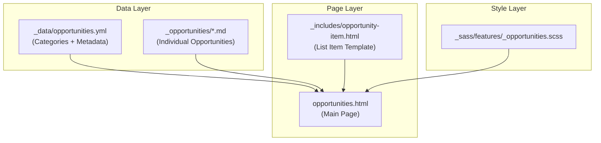

# Chico Fab Lab Opportunity Menu MVP

## Architecture Overview




## Data Structure

### 1. Categories Configuration: `_data/opportunities.yml`

```yaml
categories:
    - id: volunteer
    label: Volunteer
    icon: "🙋"
    color: success
    - id: membership
    label: Membership
    icon: "🎫"
    color: info
    - id: classes
    label: Classes
    icon: "📚"
    color: warning
    - id: jobs
    label: Jobs
    icon: "💼"
    color: accent
    - id: projects
    label: Projects
    icon: "🔧"
    color: neutral
    - id: services
    label: Services
    icon: "🛠️"
    color: info
```


### 2. Opportunity Collection: `_opportunities/*.md`

Each opportunity is a markdown file with frontmatter:

```yaml
---
title: "Workshop Instructor"
category: volunteer
status: open        # open, filled, coming_soon
commitment: "4 hrs/month"
description: "Teach skills to community members"
requirements:
    - "Experience with equipment"
    - "Good communication skills"
contact: "hello@chicofablab.org"
apply_url: "https://discord.gg/chicofablab"
order: 1
---
# Full description in markdown body
```


## File Changes

### New Files to Create

| File | Purpose ||------|---------|| [`_data/opportunities.yml`](_data/opportunities.yml) | Category definitions and metadata || [`_opportunities/`](_opportunities/) | Collection folder for opportunity markdown files || [`opportunities.html`](opportunities.html) | Main opportunity menu page || [`_includes/opportunity-item.html`](_includes/opportunity-item.html) | Reusable list item template || [`_sass/features/_opportunities.scss`](_sass/features/_opportunities.scss) | Styles for opportunity list |

### Files to Modify

| File | Change ||------|--------|| [`_config.yml`](_config.yml) | Add `opportunities` collection || [`_data/navigation.yml`](_data/navigation.yml) | Add nav link to Opportunities || [`assets/css/main.scss`](assets/css/main.scss) | Import opportunities SCSS |

## Page Layout Design

```javascript
+------------------------------------------+
|  OPPORTUNITIES AT CHICO FAB LAB          |
|  Find your way to get involved           |
+------------------------------------------+
|  [All] [Volunteer] [Membership] ...      |  <- Filter pills
+------------------------------------------+
|  Showing X opportunities                 |
+------------------------------------------+
|  +--------------------------------------+|
|  | 🙋 Workshop Instructor    [OPEN]     ||
|  | Volunteer · 4 hrs/month              ||
|  | Teach skills to community members    ||
|  | [Apply →]                            ||
|  +--------------------------------------+|
|  +--------------------------------------+|
|  | 🎫 Maker Membership       [OPEN]     ||
|  | Membership · $50/month               ||
|  | Full access to equipment and space   ||
|  | [Learn More →]                       ||
|  +--------------------------------------+|
|  ...                                     |
+------------------------------------------+
```


## Component: opportunity-item.html

Reuses existing design patterns from [`_includes/card.html`](_includes/card.html):

- Category badge (colored by type)
- Status indicator (open/filled/coming soon)
- Title, commitment, description
- Apply/learn more link

## JavaScript

Minimal JS for client-side filtering (similar to existing wiki search in [`assets/js/main.js`](assets/js/main.js)):

- Filter pills toggle `data-category` attribute
- Show/hide items based on active filter
- Update results count

## Seed Data (MVP)

Create 6-8 sample opportunities (1-2 per category):

- Volunteer: Workshop Instructor, Lab Monitor
- Membership: Maker Tier, Community Tier  
- Classes: 3D Printing 101, Laser Basics
- Services: Custom Fabrication, Prototyping

## Implementation Order

1. Add collection config to `_config.yml`
2. Create `_data/opportunities.yml` with categories
3. Create `_opportunities/` folder with sample `.md` files
4. Create `_includes/opportunity-item.html` template
5. Create `_sass/features/_opportunities.scss` styles
6. Create `opportunities.html` main page with filter logic