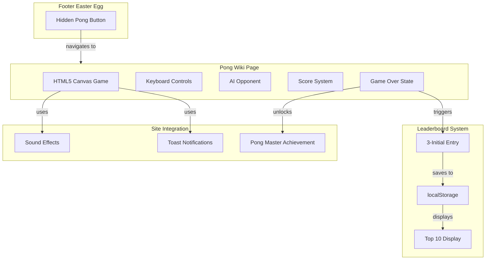

# Pong Game Easter Egg Implementation

## Overview

Add a complete, playable Pong game easter egg to the site with a hidden footer button and a 3-initial leaderboard.

## Architecture



## Files to Create/Modify

### 1. Create `_wiki/pong.mkd` (New File)

A complete Pong game page including:

**Game Features:**

- Canvas-based rendering (600x400px responsive)
- Player paddle (left, keyboard W/S or Arrow keys)
- AI paddle (right, adjustable difficulty)
- Ball physics with angle deflection
- Score tracking (first to 5 wins)
- Pause/Resume (Spacebar or P key)
- Game over screen with play again option

**Leaderboard Features:**

- 3-character initial entry on game win
- Top 10 scores stored in localStorage (`cflPongLeaderboard`)
- Display initials, score, and date
- Clear leaderboard option

**Page Metadata:**

```yaml
---
title: "Pong"
layout: default
sitemap: false
category: fun
icon: "🏓"
---
```

### 2. Modify `_layouts/default.html`

Add in the achievements section (~line 1256):

```javascript
'pong-master': {
    name: 'Pong Champion',
    desc: 'Win a game of Pong',
    icon: '🏓',
    sound: 'success',
    category: 'secret',
    rarity: 'rare'
}
```

### 3. Modify Footer (in `_layouts/default.html`)

Add a subtle hidden button after the existing footer content (~line 102-106):

```html
<span class="footer-easter-egg" id="pong-easter-egg" title="🏓">·</span>
```

With accompanying CSS:

```css
.footer-easter-egg {
    cursor: pointer;
    opacity: 0.3;
    transition: all 0.3s ease;
}
.footer-easter-egg:hover {
    opacity: 1;
    transform: scale(1.2);
}
```

### 4. Update `docs/EASTER-EGGS.md`

Document the new Pong easter egg location and mechanics.

## Game Implementation Details

**Controls:**

- W/S or Up/Down arrows: Move paddle
- Space or P: Pause/Resume
- Enter: Start game / Submit initials
- R: Restart after game over

**Game Logic:**

- Ball speed increases slightly each volley
- AI has slight reaction delay (adjustable)
- Paddle collision affects ball angle based on hit position
- First to 5 points wins

**Leaderboard Schema:**

```javascript
// localStorage key: 'cflPongLeaderboard'
[
  { initials: "ABC", score: 5, date: "2025-12-16" },
  { initials: "XYZ", score: 5, date: "2025-12-15" }
]
```