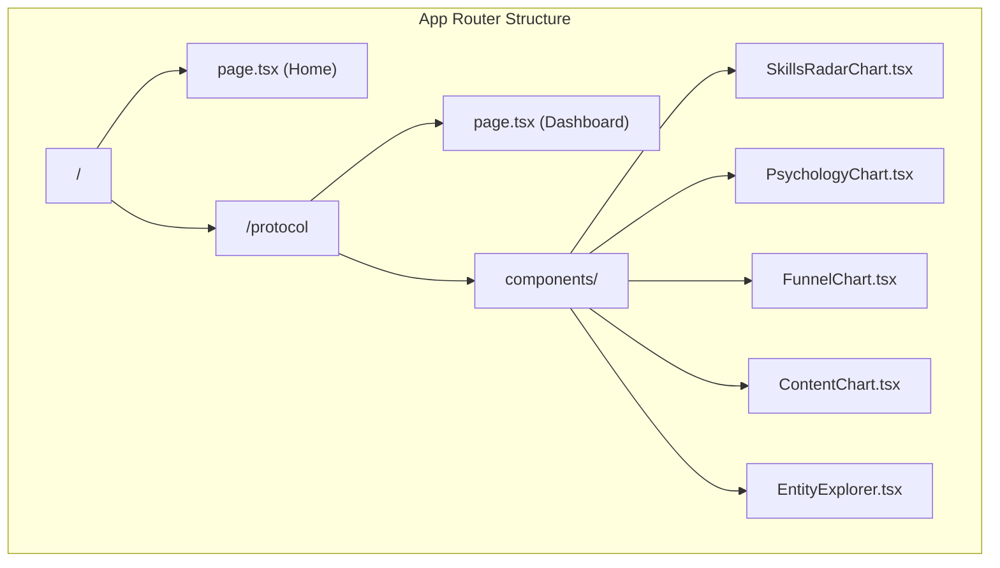

# Protocol Dashboard Integration Plan

## Summary

Add "The PorchRoot Protocol" interactive dashboard to the existing Next.js porchroot project as a new route at `/protocol`. The dashboard will retain its light theme (distinct from the main site) and include all interactive Chart.js visualizations.

## Architecture



## Key Files to Create/Modify

| File | Action | Purpose |
|------|--------|---------|
| [`frontend/package.json`](frontend/package.json) | Modify | Add `chart.js` and `react-chartjs-2` dependencies |
| `frontend/src/app/protocol/page.tsx` | Create | Main dashboard page (client component) |
| `frontend/src/app/protocol/layout.tsx` | Create | Layout with protocol-specific metadata |
| `frontend/src/app/protocol/components/` | Create | Chart components directory |
| [`frontend/tailwind.config.ts`](frontend/tailwind.config.ts) | Modify | Add `stone` color palette for protocol pages |
| `frontend/src/app/protocol/protocol.css` | Create | Protocol-specific styles (sliders, animations) |

## Implementation Details

### 1. Dependencies
Install Chart.js ecosystem:
```bash
npm install chart.js react-chartjs-2
```

### 2. Component Architecture
- **Page**: Single client component with `"use client"` directive
- **Charts**: Each chart type extracted to its own component for maintainability
- **Entity Explorer**: Interactive card grid with state management for detail panel
- **Funnel Calculator**: Slider-driven with real-time chart updates

### 3. Styling Strategy
- Add Tailwind `stone` colors to config for the light theme
- Create `protocol.css` for custom styles (range inputs, card hovers)
- Use CSS modules scope to prevent style conflicts with main site

### 4. Fonts
Register `Lora` serif font in layout (dashboard's heading font) alongside existing fonts.

## Notes
- Dashboard uses Lora (serif) for headings vs Merriweather on main site
- No navigation link from main site - accessed directly via `/protocol`
- All Chart.js rendering is client-side (SSR disabled for chart components)