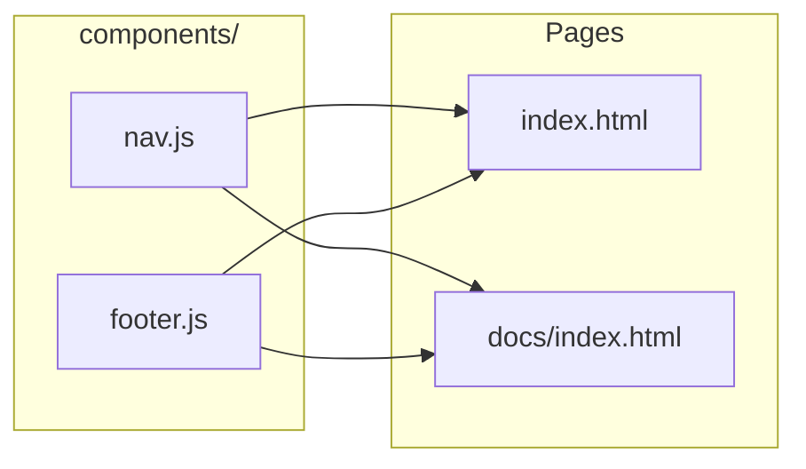

# Shared Components System for Site Navigation

## Overview

Create a JavaScript-based components system that renders consistent navigation and footer across all pages. This eliminates HTML duplication and ensures mobile behavior (hamburger dropdown) works identically everywhere.

## Architecture




## Files to Create

| File | Purpose ||------|---------|| [`components/nav.js`](mcp-servers/dashboard/public/components/nav.js) | Renders site nav with brand, links, API status, hamburger toggle || [`components/footer.js`](mcp-servers/dashboard/public/components/footer.js) | Renders consistent footer with links and status |

## Files to Modify

| File | Changes ||------|---------|| [`public/index.html`](mcp-servers/dashboard/public/index.html) | Replace nav HTML with `<div id="site-nav"></div>`, add component scripts || [`public/docs/index.html`](mcp-servers/dashboard/public/docs/index.html) | Same - placeholder div + scripts || [`public/styles.css`](mcp-servers/dashboard/public/styles.css) | Unify mobile nav behavior, remove `.has-sidebar` exceptions |

## Component Design

### nav.js

```javascript
// Auto-detects current page for active state
// Renders: brand | links (Dashboard, Docs) | API status | hamburger
// Mobile: hamburger toggles dropdown menu
```

**Features:**

- Auto-highlights current page link
- API health check with status dot (green/red)
- Hamburger menu for mobile (consistent on all pages)
- Click outside to close dropdown

### footer.js

```javascript
// Renders: brand + version | Docs link | GitHub | System status
// Consistent across all pages
```


## CSS Changes

1. Remove `.has-sidebar .site-nav-links { display: none }` exception
2. Apply hamburger dropdown behavior to all pages, not just `.docs-page`
3. Standardize API status class names to `online`/`offline`

## Mobile Behavior (All Pages)

```javascript
Desktop (>768px):  [Brand] — [Dashboard] [Docs] — [API Status]
Mobile (<=768px):  [Brand] — [Hamburger ☰]
                              ↓ (tap)
                            [Dashboard]
                            [Docs]
                            [API Status]
```


## Implementation Order

1. Create `components/nav.js` with full navigation logic
2. Create `components/footer.js` for shared footer
3. Update `index.html` - replace nav/footer HTML with placeholders + scripts