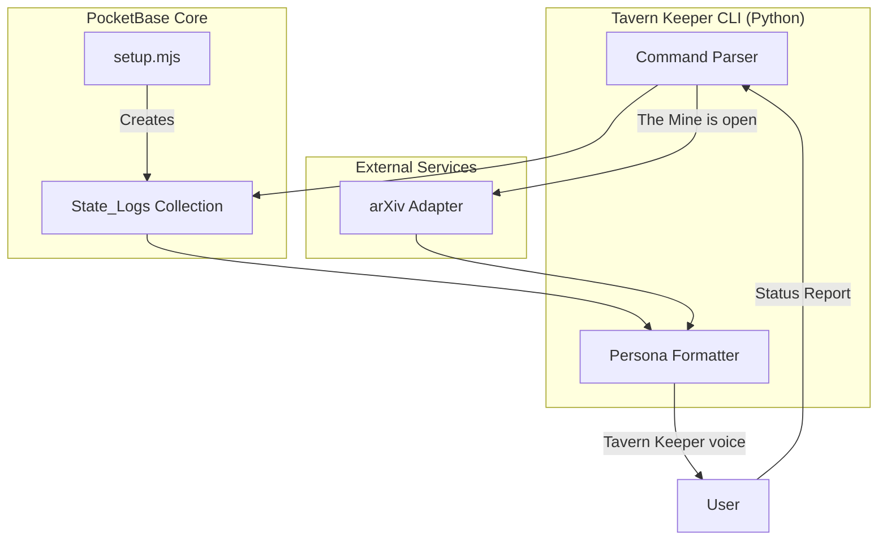

# Phase 1: State_Logs Collection + Tavern Keeper CLI

## Recommendation: Python for Command Interface

Python is the better choice because:

- arXiv adapter is already Python
- crewAI (Phase 3) is Python-based
- Better for CLI/persona interactions
- PocketBase REST API is language-agnostic

## Architecture




## Files to Create/Modify

### 1. Modify: [setup.mjs](awesome-pocketbase/pocketbase-demo/setup.mjs)

Add `state_logs` collection with the schema from the vision doc:

- `timestamp`: datetime (auto-set)
- `component`: select enum (pocketbase, crewai, arxiv, realworld)
- `status`: select enum (online, offline, degraded, error)
- `message`: text
- `metadata`: json

### 2. Create: `sovereign/` directory structure

```javascript
sovereign/
  __init__.py
  tavern_keeper.py      # Main CLI entry point
  pb_client.py          # PocketBase REST client (Python)
  commands/
    __init__.py
    status_report.py    # "Status Report" command
    mine_open.py        # "The Mine is open" command
  persona.py            # Tavern Keeper response formatting
```


### 3. Create: `sovereign/pb_client.py`

Python wrapper for PocketBase REST API using `requests`:

- Admin authentication
- CRUD for `state_logs` collection
- Query recent logs

### 4. Create: `sovereign/tavern_keeper.py`

Main CLI with three commands:

- `status` (or "Status Report") - Query State_Logs
- `mine` (or "The Mine is open") - Run arXiv crawl
- `garrison` (placeholder) - Security check

### 5. Create: `sovereign/persona.py`

Format all output in Tavern Keeper voice:

- Philosophical, weathered tone
- Quote Protocol VII: Tardigrade when relevant
- End messages with the signature quote

## Implementation Steps

1. **Start PocketBase** - User must run `npm run serve` in pocketbase-demo
2. **Add State_Logs collection** - Extend setup.mjs
3. **Run setup** - `node setup.mjs` to create collection
4. **Create Python package** - sovereign/ with dependencies
5. **Implement pb_client.py** - REST client for PocketBase
6. **Implement status_report.py** - Query and format logs
7. **Implement tavern_keeper.py** - CLI entry point
8. **Test end-to-end** - Write a log, query via Status Report

## Key Code Patterns

### State_Logs Collection Schema (for setup.mjs)

```javascript
{
  name: 'state_logs',
  type: 'base',
  schema: [
    { name: 'component', type: 'select', values: ['pocketbase', 'crewai', 'arxiv', 'realworld', 'security'] },
    { name: 'status', type: 'select', values: ['online', 'offline', 'degraded', 'error'] },
    { name: 'message', type: 'text', required: true },
    { name: 'metadata', type: 'json', required: false }
  ],
  listRule: '',
  viewRule: '',
  createRule: '',
  updateRule: '',
  deleteRule: '@request.auth.id != ""'
}
```


### Tavern Keeper CLI Usage (target)

```bash
# Run Status Report
python -m sovereign.tavern_keeper status

# Or using the voice command
python -m sovereign.tavern_keeper "Status Report"

# Open the Mine (arXiv crawl)
python -m sovereign.tavern_keeper mine --query "local-first architecture"
```


## Dependencies (requirements.txt)

```javascript
requests>=2.31.0
```


## Post-Implementation

After Phase 1 is complete:

- Update work effort 40.01 with implementation details
- Update devlog with progress