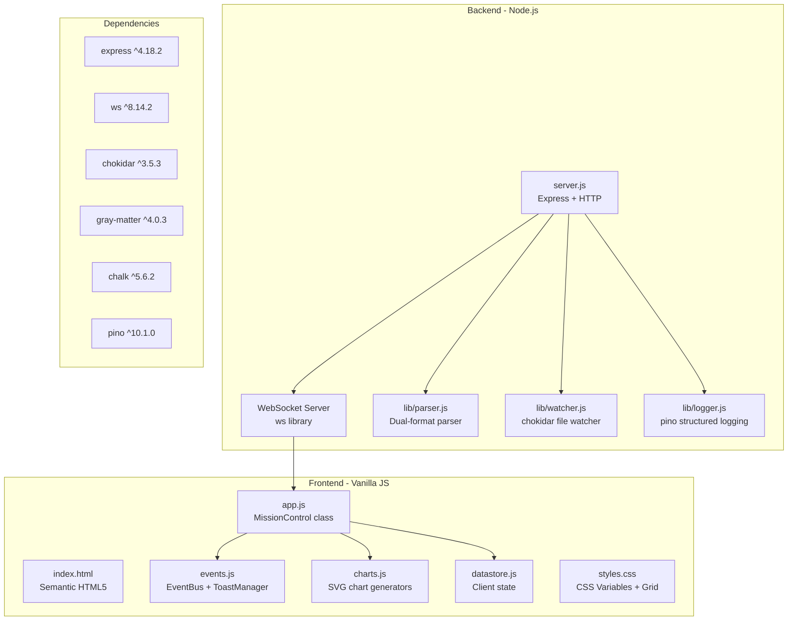

# Test Mission Control Browser UI

## Tech Stack Map



### Backend Stack
| Component | Tech | Purpose |
|-----------|------|---------|
| HTTP Server | Express 4.18 | REST API, static file serving |
| WebSocket | ws 8.14 | Real-time updates to clients |
| File Watching | chokidar 3.5 | Monitor `_work_efforts` changes |
| Frontmatter | gray-matter 4.0 | Parse YAML frontmatter in markdown |
| Logging | pino 10.1 | Structured JSON logging |
| CLI | chalk 5.6 | Colorful terminal output |

### Frontend Stack (Zero Dependencies)
| Component | Tech | Purpose |
|-----------|------|---------|
| UI | Vanilla JS (ES6+ classes) | No framework overhead |
| Styling | CSS Variables + Grid/Flexbox | Responsive, themeable |
| Fonts | JetBrains Mono, Space Grotesk | Code + UI typography |
| Events | Custom EventBus | Pub/sub with wildcards |
| Charts | Hand-rolled SVG | Donut, bar, line, sparkline, heatmap |
| State | Custom DataStore | Client-side caching |

### Data Formats Supported
- **MCP v0.3.0**: `WE-YYMMDD-xxxx` directories with `TKT-xxxx-NNN` tickets
- **Johnny Decimal**: `XX-XX_category/XX_subcategory/XX.XX_document.md`

---

## Execution Steps

### 1. Clean Install
```bash
cd /Users/ctavolazzi/Code/active/_pyrite/mcp-servers/dashboard
rm -rf node_modules package-lock.json
npm install
```

### 2. Start Server
```bash
npm run dev
```
Server runs on port 3847 (auto-finds next available if busy).

### 3. Test UI in Browser
- Navigate to http://localhost:3847
- Take snapshots at desktop, tablet (768px), and mobile (375px)
- Verify responsive CSS (TKT-fwmv-001 - completed)
- Explore pending feature areas (modals, charts, controls)

### 4. Document Findings
Report UI status, any issues, and recommendations.

---

## Key Files Reference
| File | Lines | Purpose |
|------|-------|---------|
| `server.js` | ~880 | Express server, WebSocket, REST API |
| `public/app.js` | ~2900 | Main MissionControl class |
| `public/events.js` | ~900 | EventBus, ToastManager, AnimationController |
| `public/charts.js` | ~420 | SVG chart generators |
| `public/styles.css` | - | CSS with responsive breakpoints |
| `lib/parser.js` | ~330 | Dual-format work effort parser |