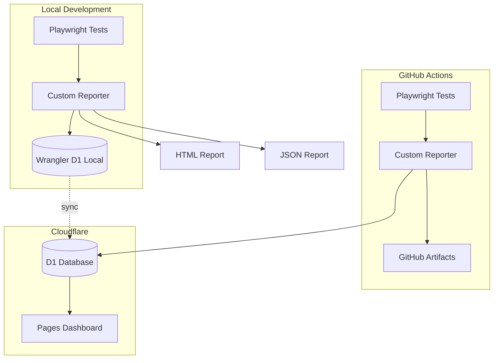
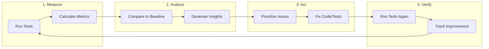

# Test Suite Infrastructure Plan

Build a regression testing infrastructure with logging, reports, trends dashboard, and CI integration using Cloudflare D1 for persistent storage.

## Architecture



## Database Schema

```sql
-- Test runs table
CREATE TABLE test_runs (
  id INTEGER PRIMARY KEY AUTOINCREMENT,
  run_id TEXT UNIQUE NOT NULL,
  branch TEXT,
  commit_sha TEXT,
  started_at TEXT NOT NULL,
  finished_at TEXT,
  total_tests INTEGER,
  passed INTEGER,
  failed INTEGER,
  skipped INTEGER,
  duration_ms INTEGER,
  environment TEXT -- 'local' | 'ci'
);

-- Individual test results
CREATE TABLE test_results (
  id INTEGER PRIMARY KEY AUTOINCREMENT,
  run_id TEXT NOT NULL,
  test_file TEXT NOT NULL,
  test_name TEXT NOT NULL,
  status TEXT NOT NULL, -- 'passed' | 'failed' | 'skipped'
  duration_ms INTEGER,
  error_message TEXT,
  retry_count INTEGER DEFAULT 0,
  FOREIGN KEY (run_id) REFERENCES test_runs(run_id)
);

-- Indexes for dashboard queries
CREATE INDEX idx_runs_started ON test_runs(started_at);
CREATE INDEX idx_results_status ON test_results(status);
CREATE INDEX idx_results_test ON test_results(test_file, test_name);
```

## File Structure

```
tests/
  infrastructure/
    db/
      schema.sql              -- D1 schema (results + metrics + insights)
      migrations/             -- Schema migrations
    reporters/
      d1-reporter.ts          -- Custom Playwright reporter
      json-reporter.ts        -- JSON output reporter
    analyzer/
      quality-analyzer.ts     -- Calculate health scores
      insight-generator.ts    -- Generate actionable insights
      comparator.ts           -- Compare runs for trends
    dashboard/
      index.html              -- Trends dashboard (static)
      dashboard.ts            -- Dashboard logic
      insights-panel.ts       -- Insights UI component
    cli/
      health.ts               -- npm run test:health
      insights.ts             -- npm run test:insights
      resolve.ts              -- npm run test:resolve
      compare.ts              -- npm run test:compare
    utils/
      d1-client.ts            -- D1 database client
      run-id.ts               -- Generate unique run IDs
  *.spec.ts                   -- Existing test files
```

## Key Components

### 1. Custom Playwright Reporter (`d1-reporter.ts`)

Extends Playwright's reporter interface to:

- Generate unique run ID on test start
- Track individual test results
- Calculate aggregates on completion
- Write to D1 (local via wrangler, remote in CI)
- Output HTML and JSON reports

### 2. D1 Client (`d1-client.ts`)

Wrapper for D1 operations:

- Insert test runs and results
- Query historical data for trends
- Works with both local (wrangler) and remote D1

### 3. Dashboard (`dashboard/index.html`)

Static HTML dashboard showing:

- Pass rate over time (line chart)
- Flaky test detection (tests that fail intermittently)
- Slowest tests (performance regression)
- Test count trends
- Filterable by branch, date range

### 4. GitHub Actions Integration

Update `.github/workflows/playwright-e2e.yml`:

- Run tests with custom reporter
- Upload results to D1
- Upload HTML report as artifact
- Add summary annotations

## Implementation Steps

1. **Set up D1 database**

   - Create D1 database via wrangler
   - Apply schema
   - Configure local binding in wrangler.toml

2. **Build custom reporter**

   - Implement Playwright Reporter interface
   - Add D1 write logic
   - Generate HTML/JSON output

3. **Create dashboard**

   - Build static HTML with chart.js
   - Query D1 for trends data
   - Deploy to Pages

4. **Update CI workflow**

   - Add D1 credentials to GitHub secrets
   - Configure reporter in CI
   - Add artifact upload

## Configuration Updates

### wrangler.toml additions

```toml
[[d1_databases]]
binding = "TEST_RESULTS_DB"
database_name = "test-results"
database_id = "<will be generated>"
```

### playwright.config.ts additions

```typescript
reporter: [
  ['list'],
  ['html', { open: 'never' }],
  ['./tests/infrastructure/reporters/d1-reporter.ts'],
  ['./tests/infrastructure/reporters/json-reporter.ts', {
    outputFile: 'test-results/results.json'
  }],
],
```

## Iterative Engineering Feedback Loop

The core value of this system: **test results drive system improvements**.

### Quality Metrics

Each test run calculates a **Health Score** (0-100):

```typescript
interface HealthScore {
  overall: number;          // Weighted composite score
  breakdown: {
    passRate: number;       // % tests passing (weight: 40%)
    stability: number;      // Inverse of flakiness (weight: 30%)
    performance: number;    // Tests within time budget (weight: 20%)
    coverage: number;       // Test count vs expected (weight: 10%)
  };
  trend: 'improving' | 'stable' | 'declining';
}
```

### Actionable Insights

The system generates prioritized action items:

| Insight Type | Trigger | Action |

|--------------|---------|--------|

| **Flaky Test** | Same test fails >20% of runs | Fix test or underlying code |

| **Performance Regression** | Test duration increased >50% | Investigate slow code path |

| **New Failure** | Test that was passing now fails | Immediate attention needed |

| **Coverage Gap** | Area with no tests | Write new tests |

| **Stale Test** | Test always passes, never changes | Review if still valuable |

### Database Schema Additions

```sql
-- Quality metrics per run
CREATE TABLE quality_metrics (
  id INTEGER PRIMARY KEY AUTOINCREMENT,
  run_id TEXT UNIQUE NOT NULL,
  health_score INTEGER,
  pass_rate REAL,
  stability_score REAL,
  performance_score REAL,
  coverage_score REAL,
  trend TEXT,
  FOREIGN KEY (run_id) REFERENCES test_runs(run_id)
);

-- Generated insights
CREATE TABLE insights (
  id INTEGER PRIMARY KEY AUTOINCREMENT,
  run_id TEXT NOT NULL,
  type TEXT NOT NULL,  -- 'flaky' | 'regression' | 'new_failure' | 'coverage_gap' | 'stale'
  severity TEXT NOT NULL,  -- 'critical' | 'warning' | 'info'
  test_file TEXT,
  test_name TEXT,
  message TEXT NOT NULL,
  suggested_action TEXT,
  resolved_at TEXT,
  FOREIGN KEY (run_id) REFERENCES test_runs(run_id)
);

-- Track improvement over time
CREATE TABLE improvement_log (
  id INTEGER PRIMARY KEY AUTOINCREMENT,
  insight_id INTEGER,
  action_taken TEXT,
  before_score INTEGER,
  after_score INTEGER,
  created_at TEXT NOT NULL,
  FOREIGN KEY (insight_id) REFERENCES insights(id)
);
```

### Feedback Loop Workflow



### Dashboard Insights View

The dashboard includes an **Insights Panel**:

- Critical issues at top (new failures)
- Trend indicators (improving/declining)
- Suggested next actions
- Historical improvement tracking
- "Resolved" workflow to mark issues fixed

### CLI Commands

```bash
# View current health score
npm run test:health

# List open insights
npm run test:insights

# Mark insight as resolved
npm run test:resolve <insight-id>

# Compare runs
npm run test:compare <run-id-1> <run-id-2>
```

## Deliverables

1. D1 database with schema for test results and quality metrics
2. Custom Playwright reporter writing to D1
3. JSON reporter for machine-readable output
4. Quality analyzer generating health scores and insights
5. HTML trends dashboard with insights panel
6. CLI commands for health/insights management
7. Updated GitHub Actions workflow
8. Documentation in `tests/infrastructure/README.md`