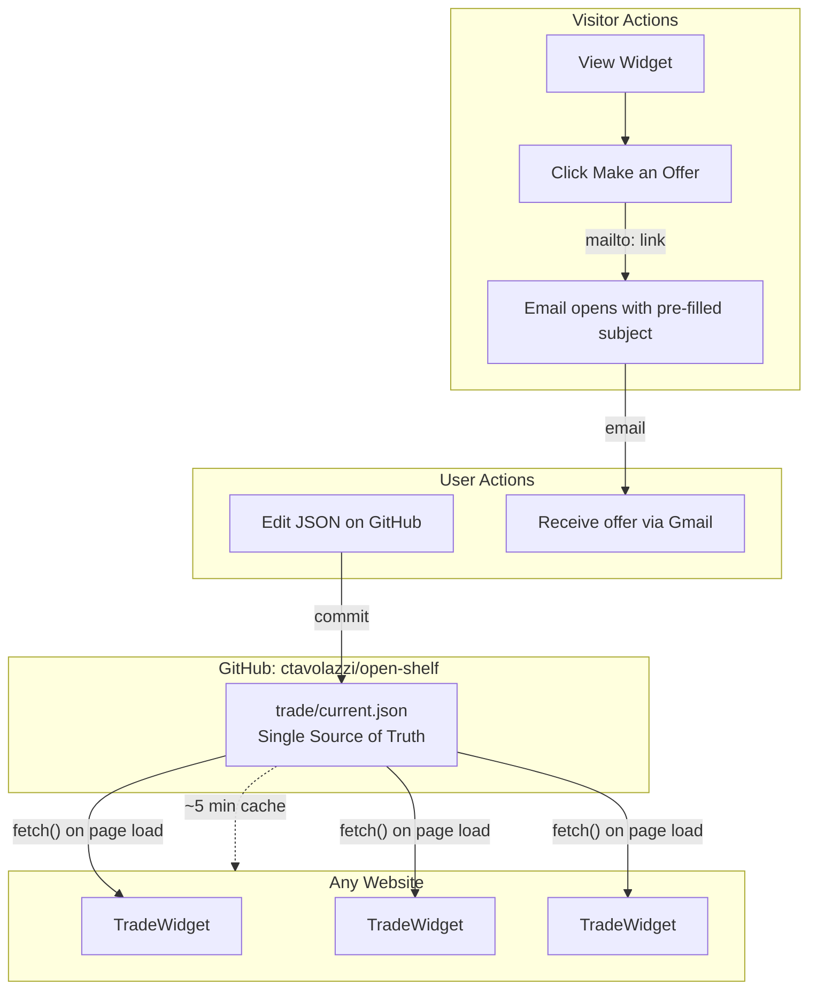
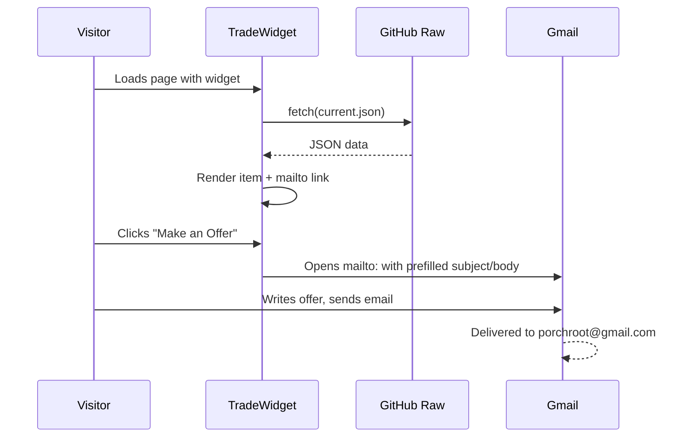
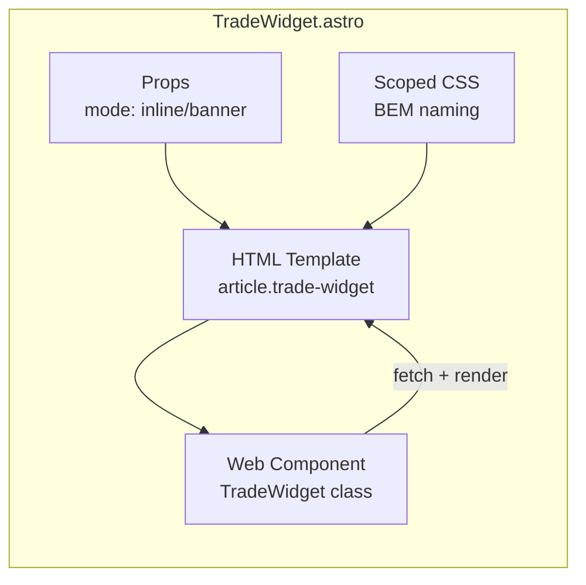

# Trade Widget Component

## Architecture Diagram



## Data Flow



## Component Structure



## GitHub Repo Structure

**Repo:** `ctavolazzi/open-shelf`

```
open-shelf/
  trade/
    current.json        # Current trade item
  README.md             # What this repo is for
```

**trade/current.json:**

```json
{
  "name": "Pilot Better Pen",
  "description": "The best pen ever made",
  "tradeNumber": 1,
  "email": "porchroot@gmail.com"
}
```

**Raw URL:**

```
https://raw.githubusercontent.com/ctavolazzi/open-shelf/main/trade/current.json
```

## Widget File

**One file:** `src/components/trade/TradeWidget.astro`

```astro
---
/**
 * TRADEWIDGET - One Red Paperclip Trading Component
 *
 * Fetches current item from GitHub (ctavolazzi/open-shelf)
 * Display modes: inline, banner
 *
 * To update item: Edit trade/current.json in open-shelf repo
 */

export interface Props {
  mode?: 'inline' | 'banner';
  class?: string;
}

const { mode = 'inline', class: className } = Astro.props;

const DATA_URL = 'https://raw.githubusercontent.com/ctavolazzi/open-shelf/main/trade/current.json';
---

<article
  class:list={['trade-widget', `trade-widget--${mode}`, className]}
  data-url={DATA_URL}
>
  <div class="trade-widget__loading">Loading...</div>
</article>

<script>
  class TradeWidget extends HTMLElement {
    async connectedCallback() {
      const url = this.dataset.url;
      try {
        const res = await fetch(url);
        const data = await res.json();
        this.render(data);
      } catch (e) {
        this.innerHTML = '<p>Trade widget unavailable</p>';
      }
    }

    render(data) {
      const subject = encodeURIComponent(`Trade Offer for: ${data.name}`);
      const body = encodeURIComponent(`Hi! I'd like to trade for your ${data.name}.\n\nI'm offering:\n\n`);

      this.innerHTML = `
        <header class="trade-widget__header">
          <span class="trade-widget__badge">Trade #${data.tradeNumber}</span>
          <span class="trade-widget__title">Currently Trading</span>
        </header>
        <div class="trade-widget__content">
          <p class="trade-widget__item-name">${data.name}</p>
          <p class="trade-widget__item-desc">${data.description}</p>
        </div>
        <a href="mailto:${data.email}?subject=${subject}&body=${body}" class="trade-widget__cta">
          Make an Offer
        </a>
      `;
    }
  }

  customElements.define('trade-widget', TradeWidget);
</script>

<style>
  /* Inline mode (default) */
  .trade-widget {
    border: 1px solid var(--color-border, #a2a9b1);
    background: var(--color-surface, #f8f9fa);
    padding: 1rem;
    max-width: 20rem;
  }

  .trade-widget__header {
    display: flex;
    align-items: center;
    gap: 0.5rem;
    margin-bottom: 0.75rem;
  }

  .trade-widget__badge {
    font-size: 0.75rem;
    background: var(--color-text, #202122);
    color: var(--color-bg, #fff);
    padding: 0.125rem 0.5rem;
    border-radius: 2px;
  }

  .trade-widget__title {
    font-size: 1rem;
  }

  .trade-widget__item-name {
    font-size: 1.25rem;
    font-weight: bold;
    margin: 0 0 0.25rem;
  }

  .trade-widget__item-desc {
    margin: 0 0 1rem;
    color: var(--color-text-muted, #666);
  }

  .trade-widget__cta {
    display: block;
    text-align: center;
    background: var(--color-link, #0645ad);
    color: var(--color-bg, #fff);
    padding: 0.75rem 1rem;
    text-decoration: none;
    font-weight: 600;
  }

  .trade-widget__cta:hover {
    opacity: 0.9;
  }

  /* Banner mode */
  .trade-widget--banner {
    max-width: none;
    display: flex;
    align-items: center;
    justify-content: space-between;
    padding: 0.75rem 1rem;
  }

  .trade-widget--banner .trade-widget__header {
    margin-bottom: 0;
  }

  .trade-widget--banner .trade-widget__content {
    display: flex;
    align-items: center;
    gap: 0.5rem;
    flex: 1;
    margin: 0 1rem;
  }

  .trade-widget--banner .trade-widget__item-name {
    font-size: 1rem;
    margin: 0;
  }

  .trade-widget--banner .trade-widget__item-desc {
    margin: 0;
    font-size: 0.875rem;
  }

  .trade-widget--banner .trade-widget__cta {
    padding: 0.5rem 1rem;
    white-space: nowrap;
  }

  .trade-widget__loading {
    color: var(--color-text-muted, #666);
    font-style: italic;
  }
</style>
```

## Usage

```astro
---
import TradeWidget from '../components/trade/TradeWidget.astro';
---

<!-- Inline (sidebar, dedicated section) -->
<TradeWidget />

<!-- Banner (full width, top/bottom of page) -->
<TradeWidget mode="banner" />
```

## Display Modes

### Inline (default)

- Sidebar-style box
- Shows all details
- Max-width: 20rem

### Banner

- Full-width horizontal bar
- Compact: badge, item name, description inline, CTA button
- Good for page header/footer

### Floating (deferred)

- Add later if needed
- Would require more JS for toggle behavior

## To Update Your Trade Item

1. Go to github.com/ctavolazzi/open-shelf
2. Edit `trade/current.json`
3. Commit
4. All widgets everywhere update (~5 min cache)

## Security

| Concern | Answer |

|---------|--------|

| JSON is public | Trade item is public anyway |

| Who can edit | Only you (repo owner) |

| Secrets exposed | None (just item name/description/email) |

| GitHub down | Widget shows "unavailable" (rare) |

## What We're Building

- 1 GitHub repo (open-shelf)
- 1 JSON file (trade/current.json)
- 1 Astro component with Web Component for fetch
- 2 display modes (inline, banner)
- ~100 lines total
- Architecture documentation in _docs/

## What We're NOT Building

- Floating mode (add later if wanted)
- Trade history display (add when trade #2 happens)
- Image support (add when you have photos)