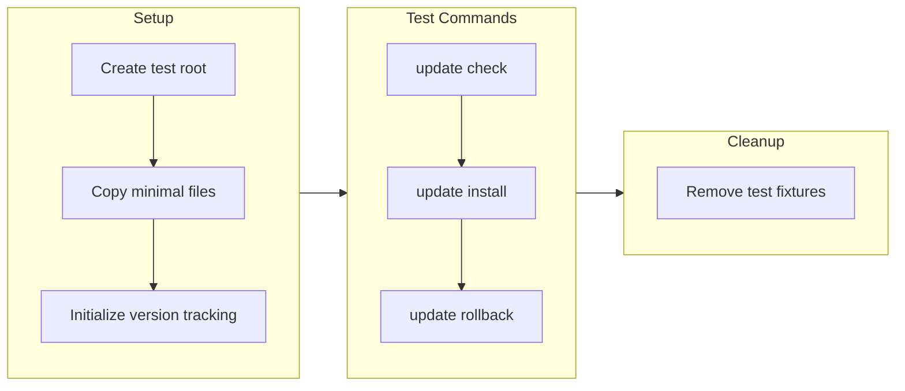

# Update System End-to-End Test Plan

## Approach

Test the full update lifecycle in an **isolated sandbox** (`tests/fixtures/update-test/`) to avoid modifying the real installation.

## File to Create

[tests/update-system.test.js](tests/update-system.test.js) - New test file

## Test Cases

### 1. Update Check (Network Test)

- Verify `checkForUpdates()` fetches from GitHub API
- Verify cache is created at `.update-cache.json`