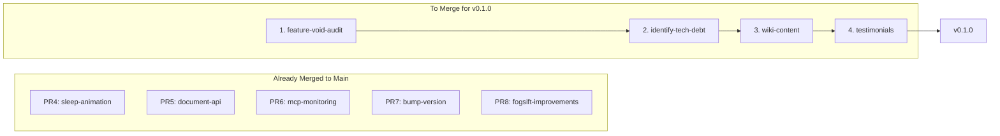

# v0.1.0 Release Preparation Plan

## Current State
- **origin/main:** v0.0.4 (16 commits ahead of local)
- **Local main:** v0.0.3 (needs pull)
- **Target version:** 0.1.0

## Branch Merge Order

Merging in dependency order to minimize conflicts:



| Order | Branch | Changes | Risk |
|-------|--------|---------|------|
| 1 | `feature-void-audit-A47jp` | FEATURE_VOID_AUDIT.md (new file) | None |
| 2 | `identify-tech-debt-DcxVD` | ESLint, error handling, TECH_DEBT.md | Low |
| 3 | `wiki-content-architecture-kDXNI` | 29 wiki pages, CSS, build script | Medium |
| 4 | `testimonials-social-proof-A47jp` | Testimonials section, CHANGELOG | Medium (CSS overlap) |

## Execution Steps

### Phase 1: Sync and Merge (Git Operations)

1. **Pull origin/main to local**
   ```bash
   git pull origin main
   ```

2. **Merge branches sequentially** (preferring branch changes on conflicts)
   - Merge `feature-void-audit-A47jp`
   - Merge `identify-tech-debt-DcxVD`
   - Merge `wiki-content-architecture-kDXNI`
   - Merge `testimonials-social-proof-A47jp`

3. **Resolve any conflicts** (prefer branch changes per your preference)

### Phase 2: Version Bump and Documentation

4. **Bump version to 0.1.0**
   - Update [`package.json`](package.json) version field
   - Update any version references in code

5. **Update README.md** - Currently just `# fogsift`, needs full content:
   - Project description
   - Features list
   - Tech stack
   - Setup instructions
   - Deployment info
   - Links to wiki and docs

6. **Update CHANGELOG.md** - Consolidate all changes into v0.1.0 entry

7. **Review/update other docs:**
   - [`AGENTS.md`](AGENTS.md) - verify current
   - [`TECH_DEBT.md`](TECH_DEBT.md) - mark completed items

### Phase 3: Build and Test

8. **Run build**
   ```bash
   npm run build
   ```

9. **Test locally** - Verify site works with browser tools

### Phase 4: Cleanup and Deploy

10. **Delete stale remote branches:**
    - `claude/explore-codebase-bugs-QomcU` (empty)
    - `claude/security-audit-AwDy6` (empty)
    - All 5 merged PR branches
    - All 4 newly merged branches

11. **Commit and push**
    ```bash
    git add .
    git commit -m "release: v0.1.0 - Wiki expansion, testimonials, tech debt fixes"
    git push origin main
    ```

12. **Deploy to Cloudflare**
    ```bash
    npm run deploy
    ```

## Files to Update

| File | Action |
|------|--------|
| [`package.json`](package.json) | Version 0.0.4 -> 0.1.0 |
| [`README.md`](README.md) | Complete rewrite |
| [`CHANGELOG.md`](CHANGELOG.md) | Add v0.1.0 consolidated entry |
| [`TECH_DEBT.md`](TECH_DEBT.md) | Update status of fixed items |

## Branches to Delete (11 total)

**Empty (2):**
- `origin/claude/explore-codebase-bugs-QomcU`
- `origin/claude/security-audit-AwDy6`

**Already Merged via PRs (5):**
- `origin/claude/bump-version-uWIiQ`
- `origin/claude/document-api-architecture-NisEt`
- `origin/claude/fogsift-improvements-cJc0k`
- `origin/claude/mcp-monitoring-system-jATXw`
- `origin/claude/sleep-animation-effects-njYxu`

**Newly Merged (4):**
- `origin/claude/feature-void-audit-A47jp`
- `origin/claude/identify-tech-debt-DcxVD`
- `origin/claude/testimonials-social-proof-A47jp`
- `origin/claude/wiki-content-architecture-kDXNI`

## Expected v0.1.0 Content

After all merges, v0.1.0 will include:
- Wiki with 29 pages of consulting methodology content
- Testimonials section with social proof
- ESLint configuration and error handling improvements
- Feature void audit planning document
- CSS modularization (from PR #8)
- MCP monitoring dashboard (from PR #6)
- Sleep animation effects (from PR #4)
