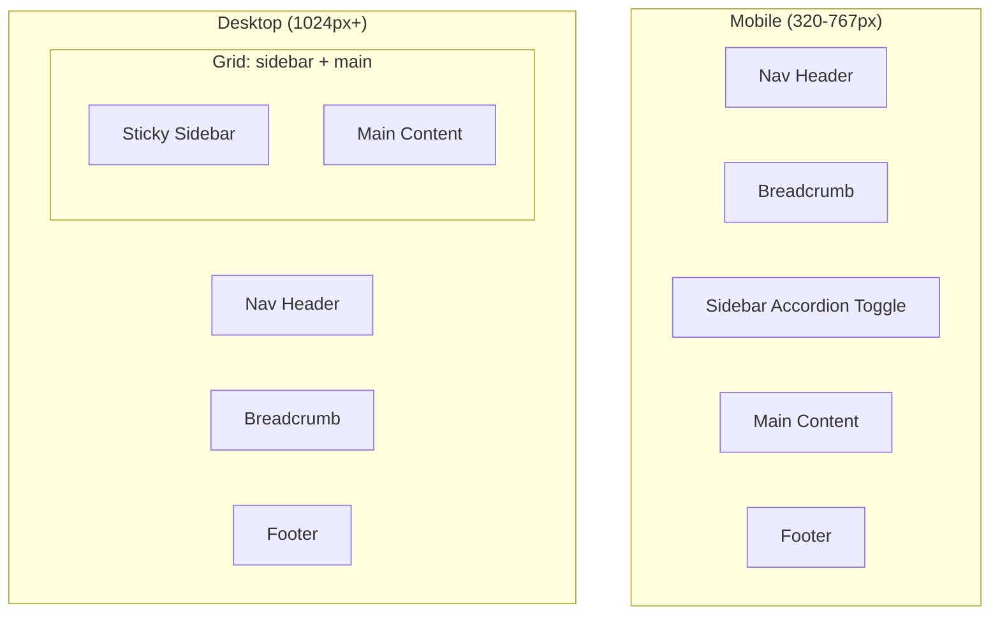

# Wiki Content Box Model and Responsive Layout Restructure

## Problem Summary

The current wiki layout has:

- Fixed 260px sidebar that breaks awkwardly between breakpoints
- Hardcoded padding values that don't scale
- 900px single breakpoint creating layout gaps
- No mobile-friendly sidebar behavior

## Target Breakpoints

| Breakpoint | Width | Layout ||------------|-------|--------|| Mobile | 320px - 767px | Single column, accordion sidebar || Tablet | 768px - 1023px | Single column, accordion sidebar || Desktop | 1024px+ | Two-column, sticky sidebar |

## Architecture




## File Changes

### 1. [src/wiki-template.html](src/wiki-template.html)

**Semantic restructure:**

- Wrap `.wiki-layout` content in proper `<article>` and `<aside>` tags
- Add toggle button for mobile sidebar accordion
- Add ARIA attributes for accessibility
```html
<!-- New structure -->
<div class="wiki-layout">
    <button class="wiki-sidebar-toggle" aria-expanded="false" aria-controls="wiki-sidebar">
        Navigation <span class="toggle-icon">+</span>
    </button>
    <aside id="wiki-sidebar" class="wiki-sidebar" role="navigation">
        <!-- existing sidebar content -->
    </aside>
    <main class="wiki-main" role="main">
        <article class="wiki-content">...</article>
        <footer class="wiki-footer">...</footer>
    </main>
</div>
```


### 2. [src/css/wiki.css](src/css/wiki.css)

**Major CSS changes:A. Base layout using CSS Grid with flexbox fallback:**

```css
.wiki-layout {
    display: flex;
    flex-direction: column;
    max-width: 1200px;
    margin: 0 auto;
    padding: var(--space-md);
    gap: var(--space-md);
}

@supports (display: grid) {
    @media (min-width: 1024px) {
        .wiki-layout {
            display: grid;
            grid-template-columns: minmax(240px, 280px) 1fr;
            gap: var(--space-lg);
        }
    }
}
```

**B. Mobile accordion sidebar:**

```css
.wiki-sidebar-toggle {
    display: flex;
    /* Mobile-only toggle button */
}

@media (min-width: 1024px) {
    .wiki-sidebar-toggle { display: none; }
    .wiki-sidebar { display: block; position: sticky; }
}
```

**C. Fluid spacing using clamp():**

```css
body.wiki-body {
    padding-top: clamp(100px, 15vh, 140px);
}

.wiki-main {
    padding: clamp(var(--space-md), 4vw, var(--space-xl));
}
```

**D. Content max-width that adapts:**

```css
.wiki-content {
    max-width: min(65ch, 100%);
    margin: 0 auto;
}
```


### 3. [src/wiki-template.html](src/wiki-template.html) - JavaScript

Add minimal JS for accordion toggle:

```javascript
const WikiNav = {
    toggle() {
        const sidebar = document.getElementById('wiki-sidebar');
        const toggle = document.querySelector('.wiki-sidebar-toggle');
        const expanded = toggle.getAttribute('aria-expanded') === 'true';
        toggle.setAttribute('aria-expanded', !expanded);
        sidebar.classList.toggle('open');
    }
};
```


### 4. [src/wiki-index-template.html](src/wiki-index-template.html)

Update the index page to use consistent responsive patterns:

- `.wiki-categories` grid: `repeat(auto-fit, minmax(min(280px, 100%), 1fr))`
- `.jd-sitemap-grid`: responsive grid with proper min-width

## Breakpoint Summary

| Element | Mobile | Tablet | Desktop ||---------|--------|--------|---------|| `.wiki-layout` | flex column | flex column | grid 2-col || `.wiki-sidebar` | accordion (hidden) | accordion (hidden) | sticky visible || `.wiki-main` | full width | full width | flex: 1 || `.wiki-content` | 100% width | max 65ch | max 65ch || `.jd-sitemap-grid` | 1 col | 2 col | 3 col |

## Minimum Supported Width

**320px** - Ensures compatibility with iPhone SE and similar small devices.

## Testing Checklist