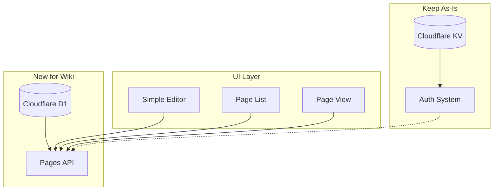

# Wiki Platform M0 - Revised Plan

Addressing the concerns from self-critique: keep what works, validate before committing, build incrementally.

## Key Changes from Original

| Original | Revised | Why |

|----------|---------|-----|

| Migrate auth to D1 | Keep auth in KV | Auth works, don't fix what isn't broken |

| Pagefind for search | D1 LIKE queries | Pagefind requires rebuild, not real-time |

| 4-6 week timeline | 6-8 weeks + 1 week spike | More realistic, includes validation |

| Full editor in M0 | Textarea only | Simplest thing that works |

| Commit to D1 immediately | Validate with prototype first | Reduce risk |

## Architecture (Simplified)



**Key insight:** Auth and Content are separate concerns. Don't merge them.

---

## Phase 0: Validation Spike (Week 1)

**Goal:** Prove D1 works before committing to the full plan.

### Deliverables

1. Create a D1 database with 1 table
2. Write a simple API endpoint that reads/writes
3. Test locally with `wrangler dev`
4. Deploy to production and verify

### Spike Code

```typescript
// src/pages/api/spike/test.ts
export const GET: APIRoute = async ({ locals }) => {
  const DB = locals.runtime.env.DB;
  const result = await DB.prepare('SELECT * FROM test_table').all();
  return new Response(JSON.stringify(result));
};

export const POST: APIRoute = async ({ request, locals }) => {
  const DB = locals.runtime.env.DB;
  const { content } = await request.json();
  await DB.prepare('INSERT INTO test_table (content) VALUES (?)').bind(content).run();
  return new Response(JSON.stringify({ success: true }));
};
```

### Success Criteria

- [ ] Can create D1 database via wrangler
- [ ] Can query D1 from Astro API route
- [ ] Works in local dev (`wrangler dev`)
- [ ] Works in production (Cloudflare Pages)

### Exit Criteria

If spike fails, consider:

- Supabase as alternative
- KV for content (simpler, but less queryable)
- External database (Turso, PlanetScale)

---

## Phase 1: Database Foundation (Weeks 2-3)

**Goal:** Pages table and CRUD functions working.

### 1.1 Schema

Create [`src/lib/db/schema.sql`](src/lib/db/schema.sql):

```sql
-- Minimal schema - add columns as needed
CREATE TABLE pages (
  id TEXT PRIMARY KEY,
  path TEXT UNIQUE NOT NULL,
  title TEXT NOT NULL,
  content TEXT NOT NULL,
  author_id TEXT NOT NULL,
  created_at TEXT NOT NULL,
  updated_at TEXT NOT NULL
);

CREATE INDEX idx_pages_path ON pages(path);
```

**Note:** No visibility column yet. Add when needed.

### 1.2 Database Functions

Create [`src/lib/db/pages.ts`](src/lib/db/pages.ts):

```typescript
export async function createPage(db: D1Database, data: CreatePageInput) { }
export async function getPageByPath(db: D1Database, path: string) { }
export async function updatePage(db: D1Database, path: string, data: UpdatePageInput) { }
export async function deletePage(db: D1Database, path: string) { }
export async function listPages(db: D1Database) { }
export async function searchPages(db: D1Database, query: string) { }
```

### 1.3 Search Strategy

For MVP, use simple LIKE query:

```typescript
export async function searchPages(db: D1Database, query: string) {
  const pattern = `%${query}%`;
  return db.prepare(`
    SELECT id, path, title, substr(content, 1, 200) as excerpt
    FROM pages
    WHERE title LIKE ? OR content LIKE ?
    ORDER BY updated_at DESC
    LIMIT 20
  `).bind(pattern, pattern).all();
}
```

**Why not Pagefind:** Requires rebuild on content change. D1 LIKE is slower but real-time.

**Future:** Add Meilisearch when performance matters.

---

## Phase 2: Page API (Weeks 4-5)

**Goal:** CRUD endpoints with permission checks.

### 2.1 Endpoints

| Method | Path | Permission | Action |

|--------|------|------------|--------|

| GET | `/api/pages/` | Public | List all pages |

| POST | `/api/pages/` | Contributor+ | Create page |

| GET | `/api/pages/[path]` | Public | Get page |

| PUT | `/api/pages/[path]` | Editor+ or Owner | Update page |

| DELETE | `/api/pages/[path]` | Admin | Delete page |

| GET | `/api/pages/search?q=` | Public | Search pages |

### 2.2 Permission Integration

Reuse existing RBAC from [`src/lib/auth/permissions.ts`](src/lib/auth/permissions.ts):

```typescript
import { can, getCurrentUser } from '../../lib/auth';

export const POST: APIRoute = async ({ request, locals }) => {
  const user = getCurrentUser();
  if (!can.create().granted) {
    return new Response(JSON.stringify({ error: 'Not authorized' }), { status: 403 });
  }
  // ... create page
};
```

### 2.3 Validation

Simple validation inline (no schema library needed):

```typescript
function validatePageInput(data: unknown): { valid: boolean; error?: string } {
  if (!data || typeof data !== 'object') return { valid: false, error: 'Invalid input' };
  const { path, title, content } = data as Record<string, unknown>;
  
  if (typeof path !== 'string' || !/^[a-z0-9-]+$/.test(path)) {
    return { valid: false, error: 'Path must be lowercase alphanumeric with hyphens' };
  }
  if (typeof title !== 'string' || title.length < 1 || title.length > 200) {
    return { valid: false, error: 'Title must be 1-200 characters' };
  }
  if (typeof content !== 'string' || content.length > 100000) {
    return { valid: false, error: 'Content too large (max 100KB)' };
  }
  return { valid: true };
}
```

---

## Phase 3: Simple Editor UI (Weeks 6-8)

**Goal:** Users can create and edit pages through web forms.

### 3.1 Editor Component

The simplest possible editor - a textarea with preview:

```astro
<!-- src/components/editor/SimpleEditor.astro -->
<div class="editor">
  <div class="editor-input">
    <label for="content">Content (Markdown)</label>
    <textarea id="content" name="content" rows="20">{content}</textarea>
  </div>
  <div class="editor-preview">
    <h3>Preview</h3>
    <div id="preview"></div>
  </div>
</div>

<script>
  import { marked } from 'marked';
  
  const textarea = document.getElementById('content');
  const preview = document.getElementById('preview');
  
  function updatePreview() {
    preview.innerHTML = marked.parse(textarea.value);
  }
  
  textarea.addEventListener('input', updatePreview);
  updatePreview();
</script>
```

**No CodeMirror in M0.** Add syntax highlighting in M1 if users want it.

### 3.2 Pages

| Page | Purpose |

|------|---------|

| `/wiki/` | List all wiki pages |

| `/wiki/new/` | Create new page form |

| `/wiki/[path]/` | View page |

| `/wiki/[path]/edit/` | Edit page form |

### 3.3 Navigation

Add "Wiki" link to existing nav in [`src/layouts/Base.astro`](src/layouts/Base.astro).

---

## What's NOT in M0

Explicitly deferred to later milestones:

| Feature | Milestone | Why Defer |

|---------|-----------|-----------|

| Revision history | M1 | Core wiki feature, but not MVP |

| Diff viewer | M1 | Needs revisions first |

| Wikilinks | M1 | Nice to have, not essential |

| Talk pages | M2 | Community feature |

| CodeMirror editor | M1 | Textarea works for MVP |

| Page protection | M2 | Admin feature |

| Autosave | M1 | Quality of life |

---

## Risk Mitigation

### Risk 1: D1 doesn't work as expected

**Mitigation:** Phase 0 spike validates this before committing.

**Fallback:** Use Supabase or even KV for simple key-value storage.

### Risk 2: Editor is too basic

**Mitigation:** Ship basic, collect feedback, improve in M1.

**Acceptance:** Some users will complain. That's signal for what to build next.

### Risk 3: Performance issues with LIKE search

**Mitigation:** Limit results, add pagination, monitor query times.

**Fallback:** Add full-text search engine in M1 if needed.

### Risk 4: Scope creep

**Mitigation:** This document is the scope. Anything not listed is M1+.

**Rule:** If someone asks for a feature, add it to M1 backlog, not M0.

---

## Timeline

```
Verify these issues exist and fix them: Bug 1: Markdown tables have invalid syntax with double pipes (`||`) at the start of each row instead of single pipes (`|`). This prevents the tables from rendering correctly in markdown viewers. All table rows should begin with a single pipe character. @_docs/CURSOR_REFERENCE.md:74-81 @_docs/CURSOR_REFERENCE.md:158-171 @_docs/CURSOR_REFERENCE.md:183-188Week 1:   SPIKE - Validate D1 works
Week 2-3: DATABASE - Schema, functions, tests
Week 4-5: API - Endpoints, permissions, validation
Week 6-8: UI - Editor, pages, navigation

Buffer:   +1-2 weeks for unknowns
Total:    8-10 weeks realistic
```

---

## Success Metrics

M0 is done when:

1. A contributor can create a new wiki page via `/wiki/new/`
2. Anyone can view the page at `/wiki/[path]/`
3. An editor can update the page via `/wiki/[path]/edit/`
4. An admin can delete the page
5. Users can search pages and find results
6. All of this works in production

---

## Decision Log

| Decision | Rationale |

|----------|-----------|

| Keep auth in KV | Works fine, don't risk breaking it |

| D1 for content only | Separates concerns, reduces migration risk |

| LIKE search over Pagefind | Real-time indexing, simpler |

| Textarea over CodeMirror | Simpler, add features based on feedback |

| Validation spike first | Reduces risk of wasted work |