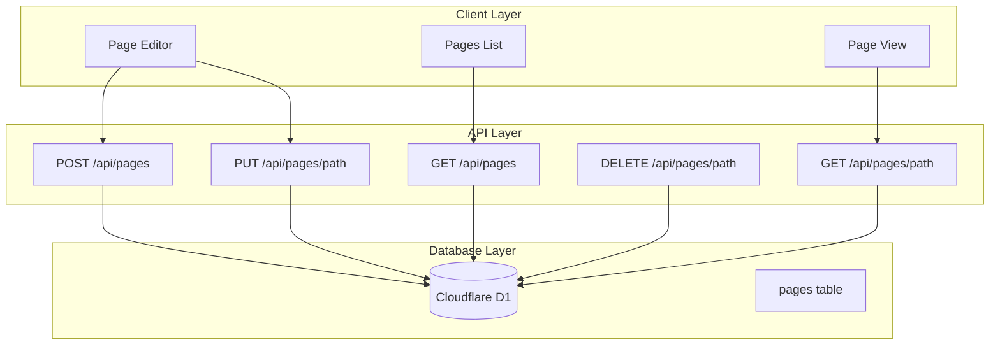

# Wiki Platform M0 Implementation

Build the foundation for user-editable wiki pages in 3 phases.

## Architecture



## Phase 1: Database Setup (Week 1)

### 1.1 Create D1 Database

```bash
wrangler d1 create howtowincapitalism-wiki
```

### 1.2 Schema File

Create [`src/lib/db/schema.sql`](src/lib/db/schema.sql):

```sql
CREATE TABLE pages (
  id TEXT PRIMARY KEY,
  path TEXT UNIQUE NOT NULL,
  title TEXT NOT NULL,
  content TEXT NOT NULL,
  author_id TEXT NOT NULL,
  visibility TEXT DEFAULT 'public',
  created_at TEXT NOT NULL,
  updated_at TEXT NOT NULL
);

CREATE INDEX idx_pages_path ON pages(path);
CREATE INDEX idx_pages_author ON pages(author_id);
```

### 1.3 Database Client

Create [`src/lib/db/client.ts`](src/lib/db/client.ts) - D1 wrapper with typed queries.

### 1.4 Page Functions

Create [`src/lib/db/pages.ts`](src/lib/db/pages.ts):

- `createPage(db, data)` - Insert new page
- `getPageByPath(db, path)` - Fetch by path
- `updatePage(db, path, data)` - Update content
- `deletePage(db, path)` - Remove page
- `listPages(db, options)` - List with pagination

### 1.5 Update wrangler.toml

Add D1 binding:

```toml
[[d1_databases]]
binding = "DB"
database_name = "howtowincapitalism-wiki"
database_id = "YOUR_ID_HERE"
```

---

## Phase 2: Page API (Week 2-3)

### 2.1 Create API Routes

Create [`src/pages/api/pages/index.ts`](src/pages/api/pages/index.ts):

- `GET` - List all pages
- `POST` - Create new page (requires contributor+)

Create [`src/pages/api/pages/[...path].ts`](src/pages/api/pages/[...path].ts):

- `GET` - Get page by path
- `PUT` - Update page (requires editor+ or owner)
- `DELETE` - Delete page (admin only)

### 2.2 Permission Integration

Reuse existing [`src/lib/auth/permissions.ts`](src/lib/auth/permissions.ts):

- `can.create()` for new pages
- `can.update(authorId)` for edits
- `can.delete()` for removal

### 2.3 Validation

Add request validation:

- Path: lowercase, alphanumeric, hyphens only
- Title: 1-200 characters
- Content: required, max 100KB

---

## Phase 3: Editor UI (Week 4-5)

### 3.1 Editor Component

Create [`src/components/editor/PageEditor.astro`](src/components/editor/PageEditor.astro):

- Split pane: textarea left, preview right
- Title and path inputs
- Save button with loading state
- Uses `marked` for Markdown preview

### 3.2 New Page

Create [`src/pages/wiki/new.astro`](src/pages/wiki/new.astro):

- Form to create page
- Permission check (contributor+)
- Redirects to page after save

### 3.3 View/Edit Page

Create [`src/pages/wiki/[...path].astro`](src/pages/wiki/[...path].astro):

- Renders page content
- Edit button (if permitted)
- Inline edit mode or redirect to edit page

### 3.4 Pages List

Create [`src/pages/wiki/index.astro`](src/pages/wiki/index.astro):

- Table of all pages
- Link to each page
- "Create New" button

### 3.5 Navigation

Add "Wiki" link to main navigation in [`src/layouts/Base.astro`](src/layouts/Base.astro).

---

## Dependencies

```bash
npm install marked nanoid
npm install @types/marked --save-dev
```

---

## File Structure After M0

```
src/
├── lib/db/
│   ├── client.ts      # D1 wrapper
│   ├── pages.ts       # Page CRUD
│   └── schema.sql     # DB schema
├── components/editor/
│   └── PageEditor.astro
├── pages/
│   ├── api/pages/
│   │   ├── index.ts
│   │   └── [...path].ts
│   └── wiki/
│       ├── index.astro
│       ├── new.astro
│       └── [...path].astro
```

---

## Success Criteria

- [ ] D1 database created and schema applied
- [ ] Pages API endpoints working
- [ ] Users can create pages at /wiki/new
- [ ] Pages viewable at /wiki/[path]
- [ ] Edit button visible to authorized users
- [ ] Markdown renders correctly
- [ ] Deployed to production