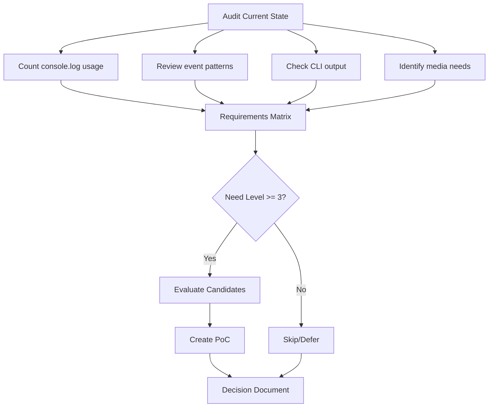

# Library Audit Plan

## Objective

Evaluate and decide which fundamental libraries to add to Pyrite across 5 categories: logging, CLI graphics, animation, media (ffmpeg), and event loop management.

## Current State

**Existing dependencies:**
- [mcp-servers/dashboard/package.json](mcp-servers/dashboard/package.json): express, ws, chokidar, gray-matter, sharp
- [mcp-servers/work-efforts/package.json](mcp-servers/work-efforts/package.json): @modelcontextprotocol/sdk
- Python: minimal (requirements.txt in docs-maintainer)

---

## Phase 1: Requirements Gathering

### 1.1 Audit Current Logging
- Search codebase for `console.log`, `console.error`, `console.warn`
- Count instances and locations
- Identify what's being logged (errors, debug, events, requests)

### 1.2 Audit Current CLI Output
- Review MCP server startup messages
- Check if any spinners/progress indicators exist
- Identify user-facing output patterns

### 1.3 Audit Event Patterns
- Review [mcp-servers/dashboard/lib/EventBus.js](mcp-servers/dashboard/lib/EventBus.js)
- Check WebSocket message handling in [mcp-servers/dashboard/server.js](mcp-servers/dashboard/server.js)
- Identify concurrency patterns (parallel file operations, etc.)

### 1.4 Identify Media Needs
- Determine if any work efforts involve video/audio processing
- Check if image processing beyond sharp is needed

---

## Phase 2: Evaluation Matrix

Create a decision matrix for each category:

```
| Category      | Need Level | Candidates        | Criteria                    |
|---------------|------------|-------------------|-----------------------------|
| Logging       | ?/5        | pino, winston     | Speed, JSON, transports     |
| CLI Graphics  | ?/5        | chalk+ora, rich   | Beauty, bundle size         |
| Animation     | ?/5        | nanospinner, gsap | CLI vs web, complexity      |
| ffmpeg        | ?/5        | fluent-ffmpeg     | Use case exists?            |
| Async Control | ?/5        | p-queue, rxjs     | Complexity vs benefit       |
```

### Evaluation Criteria (per library)
1. **Bundle size / footprint** - Does it bloat the project?
2. **Maintenance status** - Last update, open issues
3. **Learning curve** - How fast to adopt?
4. **Integration effort** - How much refactoring?
5. **Actual need** - Do we have a real use case today?

---

## Phase 3: Proof of Concept

For each "yes" decision:
1. Create minimal PoC in `experiments/`
2. Test integration with existing code
3. Document patterns/conventions

---

## Phase 4: Implementation Decisions

### Output: Decision Document

Create `_docs/30-39_reference/libraries.01_audit_decisions.md` containing:
- Decision per category (add/skip/defer)
- Rationale
- Integration notes
- Standard usage patterns

---

## Deliverables

1. **Audit report** - Current state findings
2. **Decision matrix** - Scored evaluation
3. **Decision document** - Final choices with rationale
4. **PoC code** - `experiments/library-audit/` (if applicable)

---

## Diagram: Audit Flow


