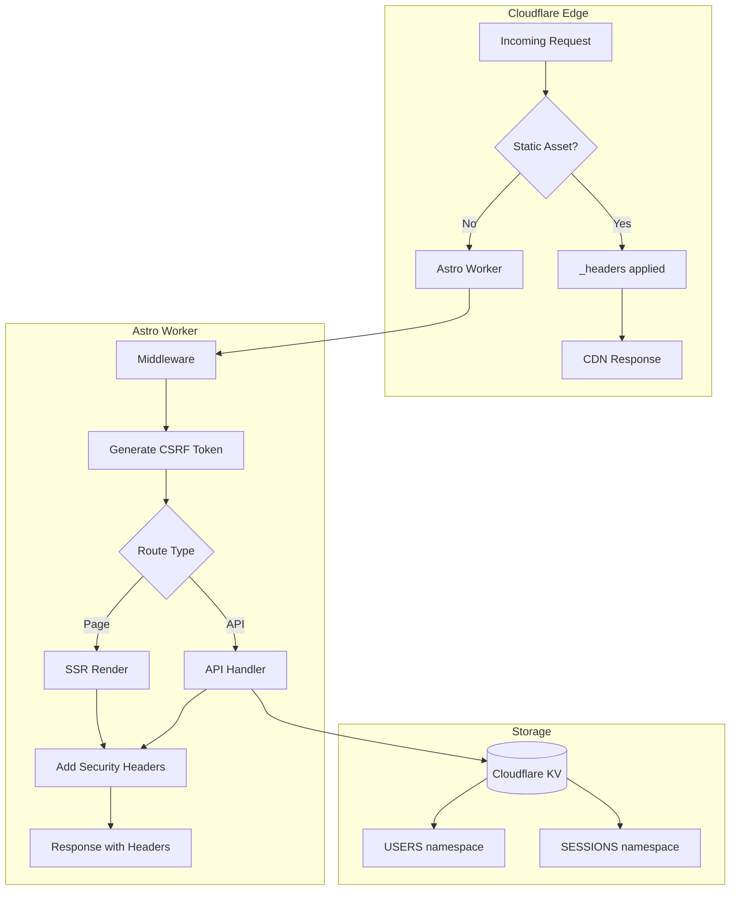

# Cloudflare Pages - Revised Analysis After App Examination

## Executive Summary

After examining the codebase, I found:

1. **The architecture is excellent** - well-designed, secure, production-ready
2. **Only one small issue** - API responses missing security headers (5-line fix)
3. **Pages Functions are NOT needed** - everything is already handled

---

## What The App Already Has

### Authentication System (Complete)

| Component | Implementation | Status |

|-----------|---------------|--------|

| Password hashing | PBKDF2, 100k iterations | Production-ready |

| Session management | KV-backed, 24hr expiry | Production-ready |

| httpOnly cookies | Secure, SameSite=Strict | Production-ready |

| Dual-env support | KV (prod) / in-memory (dev) | Production-ready |

**Key files:**

- `src/lib/auth/kv-auth.ts` (660 lines)
- `src/lib/auth/local-auth.ts` (208 lines)

### Security Features (Complete)

| Feature | Implementation | Status |

|---------|---------------|--------|

| CSRF protection | AES-256-GCM encrypted tokens | Production-ready |

| Rate limiting | IP + email based, KV-backed | Production-ready |

| Account lockout | 20 fails = 1hr lock | Production-ready |

| Turnstile CAPTCHA | Ready (optional) | Production-ready |

**Key files:**

- `src/lib/auth/csrf.ts` - AES-GCM encryption with IP/UA fingerprinting
- `src/lib/auth/rate-limit.ts` - Comprehensive rate limiting

### Email System (Complete)

- Resend integration for transactional email
- Email confirmation flow
- Password reset flow

### Static Security Headers (Complete)

`public/_headers` already has:

```
X-Frame-Options: DENY
X-Content-Type-Options: nosniff
X-XSS-Protection: 1; mode=block
Content-Security-Policy: [comprehensive policy]
Referrer-Policy: strict-origin-when-cross-origin
Permissions-Policy: camera=(), microphone=(), geolocation=()
```

### Middleware (Exists, Needs Minor Update)

`src/middleware.ts` currently:

- Generates CSRF tokens
- Injects into `locals`
- Does NOT modify response headers

---

## The Single Issue

### Problem

API routes (`/api/auth/*`) return responses without security headers:

```typescript
// Current API response pattern
return new Response(JSON.stringify(data), {
  status: 200,
  headers: { 'Content-Type': 'application/json' }  // Missing security headers
});
```

### Why It Happens

1. `public/_headers` applies to **static assets only**
2. API routes are served by the **Astro Worker**
3. Middleware doesn't capture/modify responses

### The Fix (5 Lines)

Update `src/middleware.ts`:

```typescript
import type { MiddlewareHandler } from 'astro';
import { generateCSRFToken, getRequestMetadata } from './lib/auth/csrf';

export const onRequest: MiddlewareHandler = async (context, next) => {
  const { request, locals } = context;

  // Get CSRF secret from environment
  const csrfSecret = (locals as Record<string, unknown>).runtime?.env?.CSRF_SECRET;

  // Generate CSRF token if secret is available
  if (csrfSecret) {
    const { ip, country, userAgent } = getRequestMetadata(request);
    try {
      const csrfToken = await generateCSRFToken(csrfSecret, ip, country, userAgent);
      (locals as Record<string, unknown>).csrfToken = csrfToken;
    } catch (error) {
      console.error('Failed to generate CSRF token:', error);
    }
  }

  // === NEW: Capture response and add security headers ===
  const response = await next();

  // Add security headers to ALL responses (API and pages)
  response.headers.set('X-Content-Type-Options', 'nosniff');
  response.headers.set('X-Frame-Options', 'DENY');

  return response;
};
```

That's it. No Pages Functions needed.

---

## Why Pages Functions Are NOT Needed

| Capability | Current Solution | Pages Functions Alternative |

|------------|------------------|----------------------------|

| Security headers | Astro middleware (simpler) | Would work but unnecessary |

| Rate limiting | KV-based in API routes | Same KV access |

| CSRF protection | Already implemented | No advantage |

| Auth middleware | Astro middleware | No advantage |

| Email sending | Resend in API routes | No advantage |

### When Pages Functions WOULD Be Useful

1. **Webhooks from external services** (Stripe, GitHub)

   - Currently: Not needed
   - Future: Add `functions/webhooks/stripe.ts` when needed

2. **Scheduled tasks** (cron jobs)

   - Currently: Not needed
   - Future: Add to `wrangler.toml` when needed

3. **A/B testing / feature flags**

   - Currently: Not needed
   - Future: Add `functions/_middleware.ts` when needed

---

## Architecture Diagram



---

## Verification Steps

After implementing the middleware fix:

1. **Local test:**
   ```bash
   curl -I http://localhost:4321/api/auth/me/
   # Should see X-Content-Type-Options and X-Frame-Options
   ```

2. **Production test:**
   ```bash
   curl -I https://howtowincapitalism.com/api/auth/me/
   # Should see security headers
   ```


---

## Summary

| Assessment | Finding |

|------------|---------|

| Architecture quality | Excellent - well-designed, secure |

| Auth implementation | Production-ready |

| Security features | Comprehensive |

| Issue found | API responses missing headers |

| Fix complexity | 5 lines of code |

| Pages Functions needed | No |

**Action required:** Update `src/middleware.ts` to add security headers to responses.