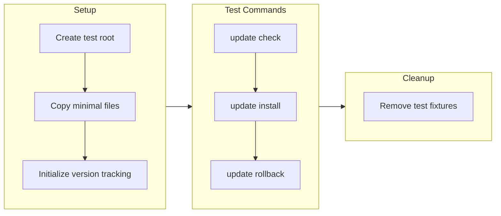

# Update System End-to-End Test Plan

## Approach

Test the full update lifecycle in an **isolated sandbox** (`tests/fixtures/update-test/`) to avoid modifying the real installation.




## File to Create

[tests/update-system.test.js](tests/update-system.test.js) - New test file

## Test Cases

### 1. Update Check (Network Test)

- Verify `checkForUpdates()` fetches from GitHub API
- Verify cache is created at `.update-cache.json`
- Verify `--refresh` bypasses cache
- Verify offline fallback uses stale cache

### 2. Update Install (Sandboxed)

- Create minimal test installation with `package.json` version set to `1.0.0`
- Run install targeting a known older tag (e.g., `v2.0.0`)
- Verify backup is created in `.backups/`
- Verify files are updated
- Verify version tracking is updated

### 3. Update Rollback

- After install, run `manualRollback()`
- Verify files restored from backup
- Verify version tracking reverted
- Test `--list` shows available backups

## Key Code Pattern

```javascript
const TEST_ROOT = path.join(__dirname, 'fixtures', 'update-test');
const UpdateChecker = require('../scripts/update-checker');
const UpdateInstaller = require('../scripts/update-installer');

// Use rootDir option to sandbox
const checker = new UpdateChecker({ rootDir: TEST_ROOT });
const installer = new UpdateInstaller({ rootDir: TEST_ROOT });
```


## Dependencies

- Requires network access for `update check` test
- Requires GitHub releases to exist for `update install` test
- No external dependencies to install

## Estimated Time