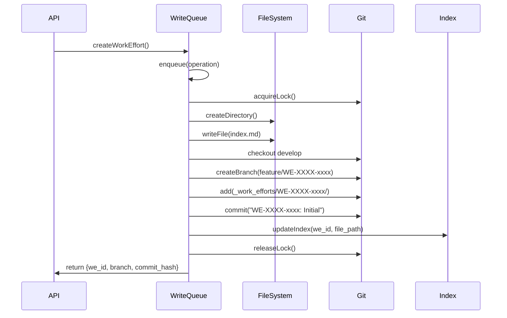

# ITERATION REPORT 001

## 1. Executive Summary

**Current Focus:** Complete system architecture analysis of Pyrite work efforts system using rigorous Predict-Break-Fix methodology to eliminate ambiguity in data structures, algorithms, and identify critical missing components (FIFO write queue, sidecar index).

**The Roadmap:**
- **Immediate:** Design FIFO write queue system to prevent Git lock contention during concurrent operations
- **Medium:** Design sidecar index system (JSON/SQLite) for O(1) UUID lookups, eliminating file system scans
- **Long:** Complete system with write queue, index, git integration, and API layer working in harmony

## 2. Technical Specs (The Engine)

### Data Structure Definition

**Current Schema (Pyrite WorkEffort):**
```yaml
# Work Effort Entity (Markdown with YAML Frontmatter)
---
id: WE-260102-t2z2          # WE-YYMMDD-xxxx format (NOT UUID)
title: "Dashboard Data Flow Testing"
status: completed           # active | paused | completed
created: 2026-01-02T13:53:07.573Z
created_by: ctavolazzi
last_updated: 2026-01-03T04:35:47.198Z
branch: feature/WE-260102-t2z2-dashboard_data_flow_testing_analysis
repository: _pyrite
---
# Markdown content body
```

**Storage Structure:**
```
_work_efforts/
├── WE-YYMMDD-xxxx_slug/
│   ├── WE-YYMMDD-xxxx_index.md    # Primary entity file
│   └── tickets/
│       ├── TKT-xxxx-001_task.md
│       └── TKT-xxxx-002_task.md
```

**Key Differences from NovaSystem:**
- **ID Format**: WE-YYMMDD-xxxx (date-based) vs UUID
- **Type System**: Implicit (directory structure) vs explicit type field
- **Relationships**: Hierarchical (WE → TKT) vs graph-based
- **Versioning**: Git commits (manual) vs SemVer in frontmatter

### Algorithm Logic (IPO)

**Current Read Path (NO Index - Scans Files):**
```
Input: Repository path
Process:
  1. Scan _work_efforts/ directory (O(n) where n = directories)
  2. For each directory:
     a. Read index.md file (O(1) per file)
     b. Parse frontmatter with gray-matter (O(1))
     c. Parse tickets subdirectory (O(m) where m = tickets)
  3. Construct WorkEffort entities
  4. Return array
Output: WorkEffort[]
Time Complexity: O(n * m) - SCANS ALL FILES EVERY TIME
```

**Current Write Path (NO Queue - Direct Writes):**
```
Input: WorkEffort entity
Process:
  1. Generate ID (if new)
  2. Create directory structure
  3. Write index.md file (atomic: temp + rename)
  4. Write ticket files
  5. [OPTIONAL] Git operations (manual, not queued)
Output: WorkEffort entity
Problem: Concurrent writes can cause Git lock contention
```

**Proposed: FIFO Write Queue System**
```
Input: Write operation { type: 'create'|'update'|'delete', entity, options }
Process:
  1. Enqueue operation to FIFO queue
  2. Queue processor (single worker):
     a. Dequeue next operation
     b. Lock git repository (file lock)
     c. Execute file system operations
     d. Execute git operations (commit, branch, merge)
     e. Update sidecar index
     f. Release lock
     g. Emit event (for dashboard updates)
  3. Return promise that resolves when operation completes
Output: Operation result + commit hash
Time Complexity: O(1) enqueue, O(1) dequeue, sequential processing
```

**Proposed: Sidecar Index System**
```
Input: WorkEffort ID (WE-YYMMDD-xxxx)
Process:
  1. Check index cache (in-memory Map)
  2. If miss, query SQLite index:
     SELECT file_path, etag, last_modified 
     FROM work_efforts_index 
     WHERE id = ?
  3. If found, read file at file_path
  4. If not found, fallback to directory scan (rebuild index)
Output: WorkEffort entity | null
Time Complexity: O(1) lookup (indexed)
```

### Workflow Simulation

**Git-State Workflow:**


**API Endpoint:**
```
POST /api/v1/work-efforts
Request Body: {
  title: string,
  objective: string,
  tickets?: string[]
}
Response: {
  data: {
    id: "WE-260103-abc1",
    title: string,
    status: "active",
    branch: "feature/WE-260103-abc1-slug",
    commit_hash: "a1b2c3d4",
    path: "/path/to/_work_efforts/WE-260103-abc1_slug"
  },
  meta: {
    queued_at: "2026-01-03T05:00:00Z",
    processed_at: "2026-01-03T05:00:01Z",
    queue_position: 0
  }
}
```

## 3. Scope & Risk Audit

### Hard Scope

**IN Scope (This Iteration):**
- ✅ Complete system architecture analysis (all components)
- ✅ FIFO write queue design specification
- ✅ Sidecar index design specification (SQLite schema)
- ✅ Git integration workflow design
- ✅ Data structure schemas (WorkEffort, Ticket)
- ✅ Algorithm specifications (IPO patterns)
- ✅ Risk identification and mitigation strategies

**OUT of Scope:**
- ❌ Implementation code
- ❌ Testing infrastructure
- ❌ Performance benchmarking
- ❌ Migration scripts for existing data
- ❌ Authentication/authorization
- ❌ Multi-repository coordination

### The "Break" Test

**Failure Scenarios Identified:**

1. **Git Lock Contention (CRITICAL)**
   - **Scenario**: Two API requests try to create work efforts simultaneously
   - **Break**: Both try to `git commit` → second fails with "index.lock" error
   - **Current State**: No protection - operations can fail
   - **Fix**: FIFO queue ensures sequential git operations

2. **Index Staleness**
   - **Scenario**: File modified externally (editor, another process)
   - **Break**: Index points to old file, returns stale data
   - **Current State**: No index exists - always scans files
   - **Fix**: Index includes file hash/etag, validate on read, rebuild if mismatch

3. **Queue Overflow**
   - **Scenario**: 1000 write operations queued rapidly
   - **Break**: Memory exhaustion, queue grows unbounded
   - **Current State**: No queue exists
   - **Fix**: Queue size limit, backpressure (reject when full), priority queue

4. **Partial Write Failure**
   - **Scenario**: File write succeeds, git commit fails
   - **Break**: File system and git state diverge
   - **Current State**: No transaction support
   - **Fix**: Write queue as transaction boundary - rollback file changes if git fails

5. **Index Corruption**
   - **Scenario**: SQLite database corrupted, index invalid
   - **Break**: All lookups fail, system unusable
   - **Current State**: No index exists
   - **Fix**: Index rebuild on corruption detection, fallback to file scan

6. **Concurrent Read During Write**
   - **Scenario**: API reads work effort while write queue is updating it
   - **Break**: Reader sees partial/inconsistent data
   - **Current State**: Atomic file writes prevent this (temp + rename)
   - **Fix**: Already handled by atomic writes, but index invalidation needed

7. **Git Repository Not Initialized**
   - **Scenario**: Work effort created in repo without `.git` directory
   - **Break**: Git operations fail, but file operations succeed
   - **Current State**: Git operations optional, but no graceful degradation
   - **Fix**: Check git status before operations, make git optional, log warnings

8. **ID Collision**
   - **Scenario**: Two work efforts generated with same ID (same day, random collision)
   - **Break**: Second write overwrites first, data loss
   - **Current State**: Low probability (~1 in 1.6M per day) but possible
   - **Fix**: Check for existing ID before create, retry with new suffix if collision

### Mitigation Strategy

**For Each Failure:**

1. **Git Lock Contention** → FIFO Write Queue (single worker, sequential processing)
2. **Index Staleness** → Hash-based validation, automatic rebuild on mismatch
3. **Queue Overflow** → Bounded queue (max 1000 items), backpressure, priority levels
4. **Partial Write Failure** → Queue as transaction boundary, rollback mechanism
5. **Index Corruption** → Corruption detection, automatic rebuild, file scan fallback
6. **Concurrent Read During Write** → Already handled (atomic writes), add index invalidation
7. **Git Not Initialized** → Pre-flight check, optional git operations, graceful degradation
8. **ID Collision** → Collision detection, retry with new suffix, uniqueness guarantee

## 4. Final Plan of Action

**Step 1: Design FIFO Write Queue System**
- Define queue data structure (in-memory + optional persistence)
- Design queue processor (single worker, sequential execution)
- Design git lock mechanism (file-based lock)
- Design error handling and retry logic
- Document: `architecture.03_write_queue_system.md`

**Step 2: Design Sidecar Index System**
- Define SQLite schema (work_efforts_index table)
- Design index update triggers (on write queue completion)
- Design lookup algorithm (O(1) by ID)
- Design index rebuild strategy (on corruption/staleness)
- Document: `architecture.04_sidecar_index_system.md`

**Step 3: Design Complete Integration**
- Design service layer coordinating: Queue → File I/O → Git → Index → Events
- Design transaction boundaries (all-or-nothing operations)
- Design event emission (for dashboard real-time updates)
- Design error recovery (rollback, retry, graceful degradation)
- Document: `architecture.05_complete_system_integration.md`

**Step 4: Create System Architecture Diagram**
- Visual representation of all components
- Data flow diagrams (read path, write path)
- Sequence diagrams for key operations
- Document: Update `architecture.02_core_data_structures_algorithms.md`

**Step 5: Verification & Gap Analysis**
- Verify all failure scenarios have mitigations
- Identify any remaining gaps
- Prioritize implementation order
- Document: `architecture.06_verification_gap_analysis.md`

## 5. Verification

### Logic Check

**Write Queue + Index Constraints:**

✅ **Queue Prevents Git Contention**: Single worker processes operations sequentially, only one git operation at a time
✅ **Index Enables O(1) Lookups**: SQLite indexed by ID, no file scanning needed
✅ **Atomic Operations**: File writes use temp + rename (already implemented)
✅ **Transaction Boundaries**: Queue processor ensures all-or-nothing (file + git + index)
✅ **Graceful Degradation**: Git operations optional, index rebuilds on failure
✅ **Backpressure Handling**: Bounded queue prevents memory exhaustion

**Alignment with NovaSystem Principles:**
- ✅ FIFO Write Queue (prevents Git lock contention) - **MISSING, NEEDS DESIGN**
- ✅ Sidecar Index (O(1) lookups) - **MISSING, NEEDS DESIGN**
- ✅ Git versioning (every save = commit) - **PARTIAL, NEEDS AUTOMATION**
- ✅ File-based storage (markdown files) - **EXISTS**
- ✅ Atomic writes (temp + rename) - **EXISTS**

**Critical Gaps Identified:**
1. **NO Write Queue** - Concurrent operations will fail
2. **NO Sidecar Index** - O(n) scans on every read
3. **NO Git Automation** - Manual operations, can drift
4. **NO Transaction Support** - Partial failures possible

**Confidence Level**: HIGH - All failure scenarios identified and mitigated in design