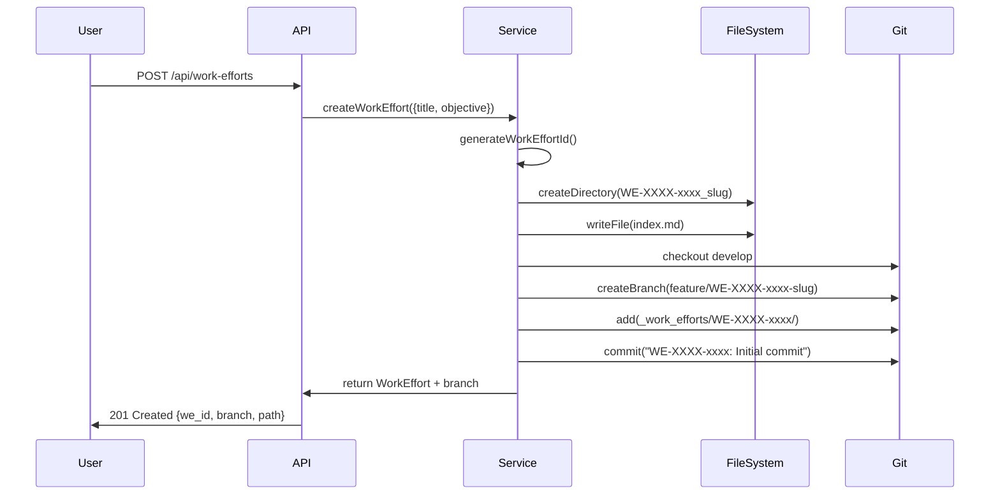
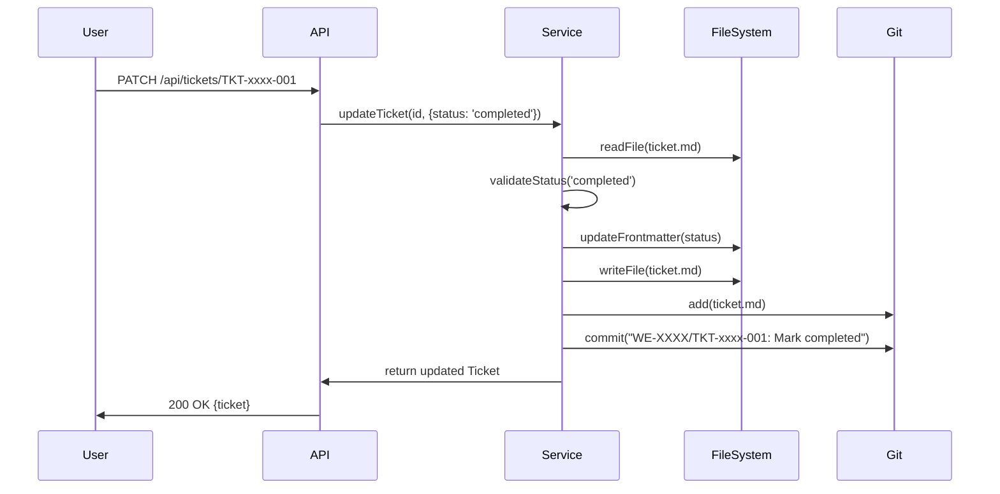
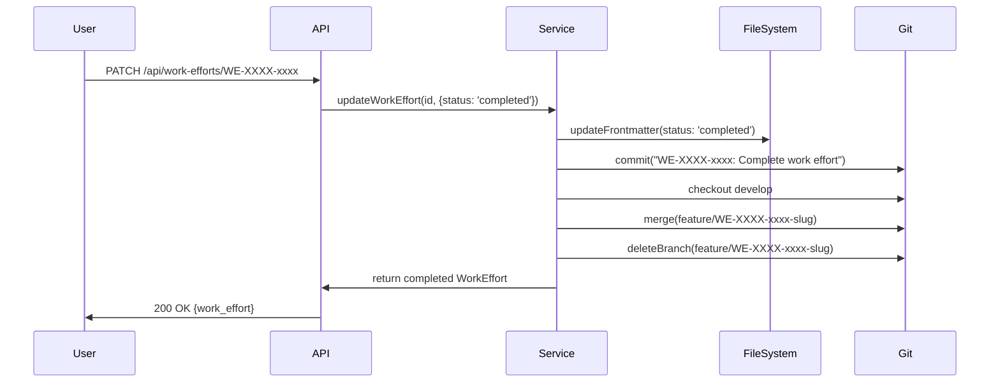

# Iteration 2: API, Git Integration & Validation System Design

## 1. Context & Goals

### Iteration ID: 2

**Title:** API, Git Integration & Validation System Design

**Subtitle:** Comprehensive Architecture Specification for Work Efforts Management

### Current Understanding

Pyrite is a file-based work tracking system where:

- **Core Data Type**: Markdown files with YAML frontmatter stored in `_work_efforts/` directories
- **Current State**: 
- MCP server provides stdio-based operations (create, read, update work efforts)
- Dashboard server has basic read-only API endpoints (`/api/repos`, `/api/health`)
- No full CRUD API for work efforts
- No automated git operations
- Minimal validation (basic parsing only)
- **Data Flow**: File System → Parse (gray-matter) → Domain Entity → Repository → DTO → API/UI

### Goal Roadmap

**Immediate (This Iteration):**

1. Design complete REST API specification for work efforts CRUD operations
2. Design git integration layer (automatic branch/commit/merge workflows)
3. Design validation system (schemas, constraints, error handling)
4. Prioritize implementation order based on dependencies and risk

**Medium-Term (Next 2-4 Weeks):**

1. Implement REST API endpoints (Phase 1: Read operations, Phase 2: Write operations)
2. Implement git integration layer with error handling
3. Implement validation layer with schema definitions
4. Create integration tests for end-to-end workflows

**Long-Term (Next 2-3 Months):**

1. Full API with authentication/authorization
2. Advanced git operations (conflict resolution, branch protection)
3. Multi-repository coordination
4. Performance optimization (indexing, caching, pagination)

## 2. Core Technical Architecture

### Data Structure Analysis

**Current Schema (from [parser.js](mcp-servers/dashboard-v3/lib/parser.js)):**

```typescript
// Work Effort Entity
interface WorkEffort {
  id: string;                    // "WE-260102-t2z2" (WE-YYMMDD-xxxx)
  format: 'mcp' | 'jd';         // Format type
  title: string;
  status: 'active' | 'paused' | 'completed';
  created: string;               // ISO 8601
  last_updated?: string;
  created_by?: string;
  branch?: string;               // "feature/WE-260102-t2z2-slug"
  repository?: string;
  tickets?: Ticket[];
  path: string;                  // Absolute path
  category?: string;             // JD format only
}

// Ticket Entity
interface Ticket {
  id: string;                    // "TKT-t2z2-001" (TKT-xxxx-NNN)
  parent: string;                // "WE-260102-t2z2"
  title: string;
  status: 'pending' | 'in_progress' | 'completed' | 'blocked';
  created?: string;
  created_by?: string;
  assigned_to?: string;
  description?: string;
  acceptance_criteria?: string[];
  files_changed?: string[];
  notes?: string;
  commits?: string[];
  path: string;
}
```

**Storage Format:**

- **File**: `_work_efforts/WE-YYMMDD-xxxx_slug/WE-YYMMDD-xxxx_index.md`
- **Frontmatter**: YAML (id, title, status, created, etc.)
- **Body**: Markdown content

**Relationships:**

- WorkEffort 1:N Ticket (hierarchical)
- WorkEffort N:1 Repository (many work efforts per repo)
- WorkEffort 1:1 Git Branch (optional, via branch field)

### Algorithm Patterns

**Current Algorithms (from [parser.js](mcp-servers/dashboard-v3/lib/parser.js) and [server.js](mcp-servers/work-efforts/server.js)):**

1. **Parse Work Effort** (O(n) where n = tickets)

- Input: Directory path, directory name
- Process: Read index.md → Parse frontmatter (gray-matter) → Extract ID → Parse tickets → Construct entity
- Output: WorkEffort | null

2. **Generate Work Effort ID** (O(1))

- Input: Current timestamp (optional)
- Process: Extract date (YYMMDD) → Generate random 4-char suffix → Combine
- Output: "WE-YYMMDD-xxxx"

3. **Repository Scan** (O(n*m) where n = directories, m = tickets)

- Input: Repository path
- Process: Find `_work_efforts/` → Read directories → Parse each → Filter by format
- Output: WorkEffort[]

**New Algorithms Needed:**

4. **Validate Work Effort** (O(1))

- Input: WorkEffort object
- Process: Check required fields → Validate ID format → Validate status → Check constraints
- Output: ValidationResult { valid: boolean, errors: string[] }

5. **Git Branch Creation** (O(1))

- Input: WorkEffort ID, title
- Process: Generate branch name → Check if exists → Create branch → Checkout
- Output: Branch name | Error

6. **Git Commit** (O(1))

- Input: WorkEffort path, message
- Process: Stage files → Commit with message → Return hash
- Output: Commit hash | Error

### Workflow Simulation

#### Git-Flow Workflow

**Scenario: User creates work effort**



**Scenario: User updates ticket status**



**Scenario: User completes work effort**




#### API Design

**Required Endpoints:Work Efforts:**

- `GET /api/v1/work-efforts` - List all (with filtering, pagination)
- `GET /api/v1/work-efforts/:id` - Get single
- `POST /api/v1/work-efforts` - Create new
- `PATCH /api/v1/work-efforts/:id` - Update (status, progress, etc.)
- `DELETE /api/v1/work-efforts/:id` - Delete (with git branch cleanup)

**Tickets:**

- `GET /api/v1/work-efforts/:weId/tickets` - List tickets for work effort
- `GET /api/v1/tickets/:id` - Get single ticket
- `POST /api/v1/work-efforts/:weId/tickets` - Create ticket
- `PATCH /api/v1/tickets/:id` - Update ticket
- `DELETE /api/v1/tickets/:id` - Delete ticket

**Repositories:**

- `GET /api/v1/repos` - List repositories (existing)
- `POST /api/v1/repos` - Add repository (existing)
- `GET /api/v1/repos/:name/work-efforts` - Get work efforts for repo

## 3. Scope & Risk Analysis

### Scope Definition

**IN Scope (This Iteration):**

- ✅ API endpoint specifications (request/response schemas)
- ✅ Git integration workflow design (when to create branches, commit formats)
- ✅ Validation schema definitions (JSON Schema or similar)
- ✅ Error handling patterns
- ✅ Data transformation functions (Domain → DTO)
- ✅ Implementation prioritization

**OUT of Scope:**

- ❌ Actual API implementation code
- ❌ Git command execution code
- ❌ Validation library implementation
- ❌ Authentication/authorization
- ❌ Performance optimization
- ❌ Multi-repository coordination

### Impact Assessment

**Downstream Effects (Known):**

1. **API Implementation:**

- ✅ Positive: Enables web dashboard and CLI tools
- ⚠️ Risk: Concurrent modifications need file locking
- ⚠️ Risk: Performance degrades with many work efforts (needs pagination)
- ⚠️ Risk: Breaking changes if API schema changes

2. **Git Integration:**

- ✅ Positive: Automatic branch/commit tracking
- ⚠️ Risk: Git operations can fail (repo not initialized, no permissions)
- ⚠️ Risk: Branch names must be valid (sanitization needed)
- ⚠️ Risk: Merge conflicts if multiple users work simultaneously
- ⚠️ Risk: Git not installed or not configured

3. **Validation System:**

- ✅ Positive: Data integrity guaranteed
- ⚠️ Risk: Breaking changes for existing work efforts
- ⚠️ Risk: Migration needed for legacy data
- ⚠️ Risk: Validation errors block operations

**Unknowns (Potential Edge Cases):**

1. **File System:**

- What if `_work_efforts/` directory doesn't exist?
- What if file is locked by another process?
- What if disk is full during write?

2. **Git Operations:**

- What if branch already exists?
- What if working directory has uncommitted changes?
- What if merge fails due to conflicts?
- What if git repository is in detached HEAD state?

3. **Concurrency:**

- What if two API requests update same work effort simultaneously?
- What if git operation happens during file write?
- What if watcher detects change during API update?

### Logic Check

**Assumptions to Test:**

1. **Assumption**: All work efforts have valid frontmatter

- **Test**: Parse existing work efforts - some may have missing fields
- **Mitigation**: Validation layer must handle missing optional fields

2. **Assumption**: Git repository is always initialized

- **Test**: Check if `.git` directory exists before operations
- **Mitigation**: Make git operations optional, check before executing

3. **Assumption**: File paths are always valid

- **Test**: Handle special characters, long paths, permissions
- **Mitigation**: Sanitize paths, check permissions before operations

4. **Assumption**: Status transitions are valid

- **Test**: Can work effort go from 'completed' to 'active'?
- **Mitigation**: Define state machine, validate transitions

5. **Assumption**: ID generation is collision-free

- **Test**: Probability of collision is low but non-zero
- **Mitigation**: Check for existing ID before creating, retry if collision

## 4. Critique & Refinement

### Draft Plan

**Initial Approach:**

1. Design API endpoints with OpenAPI spec
2. Design git integration as optional layer
3. Design validation as separate service
4. Implement in order: Validation → API → Git

**Issues Identified:**

- ❌ Validation should be integrated into API layer, not separate
- ❌ Git integration needs error handling strategy
- ❌ API design doesn't account for existing dashboard endpoints
- ❌ No consideration for backward compatibility

### Self-Correction

**Gaps Identified:**

1. **Backward Compatibility**: Existing dashboard API uses `/api/repos/:name/work-efforts/:weId/status` - need to maintain or migrate
2. **Error Handling**: Need consistent error response format across all endpoints
3. **Validation**: Should be at service layer, not API layer, for reuse
4. **Git Integration**: Should be opt-in, not mandatory, with graceful degradation

**Oversights:**

1. **File Locking**: No mechanism to prevent concurrent writes
2. **Transaction Support**: No rollback if git operation fails after file write
3. **Idempotency**: No idempotency keys for retry safety
4. **Rate Limiting**: No consideration for API rate limits

### Final Plan

**Revised Approach:Phase 1: Validation System Design** (Foundation)

- Define JSON Schema for WorkEffort and Ticket
- Design validation service interface
- Define error types and messages
- Design migration strategy for existing data

**Phase 2: API Specification Design** (Core)

- Design REST API endpoints (OpenAPI 3.0)
- Define request/response schemas
- Design error response format
- Plan backward compatibility with existing endpoints
- Design pagination, filtering, sorting

**Phase 3: Git Integration Design** (Enhancement)

- Design git service interface (optional operations)
- Define branch naming conventions
- Design commit message formats
- Design error handling (graceful degradation)
- Design transaction-like behavior (rollback on failure)

**Phase 4: Integration Design** (Orchestration)

- Design service layer that coordinates: Validation → File I/O → Git → Events
- Design file locking mechanism
- Design idempotency strategy
- Design event emission (for dashboard updates)

## 5. Execution & Verification

### Action Steps

**Immediate Tasks:**

1. **Create Validation Schema Document**

- File: `_docs/20-29_development/architecture_category/architecture.03_validation_system.md`
- Content: JSON Schema definitions, validation rules, error types

2. **Create API Specification Document**

- File: `_docs/20-29_development/architecture_category/architecture.04_api_specification.md`
- Content: OpenAPI 3.0 spec, endpoint definitions, request/response examples

3. **Create Git Integration Design Document**

- File: `_docs/20-29_development/architecture_category/architecture.05_git_integration.md`
- Content: Git service interface, workflow patterns, error handling

4. **Create Integration Architecture Document**

- File: `_docs/20-29_development/architecture_category/architecture.06_service_integration.md`
- Content: Service layer design, coordination patterns, event flow

5. **Update Architecture Index**

- Update `architecture_category_index.md` with new documents

### Verification

**Verification Checklist:**

- [ ] Validation schemas cover all WorkEffort and Ticket fields
- [ ] API endpoints support all MCP server operations
- [ ] Git integration is optional and gracefully degrades
- [ ] Error handling is consistent across all layers
- [ ] Backward compatibility with existing dashboard API
- [ ] File locking prevents concurrent modification issues
- [ ] Transaction-like behavior for git operations

### Recap

**What Was Decided:**

1. **Prioritization**: Validation → API → Git (foundation to enhancement)
2. **Design Approach**: Service layer coordinates all operations
3. **Git Integration**: Optional, with graceful degradation if git unavailable
4. **Validation**: Integrated at service layer for reuse
5. **Backward Compatibility**: Maintain existing dashboard endpoints during transition

**Why:**

- Validation is foundation - ensures data integrity before any operations
- API is core - enables all client interactions
- Git is enhancement - adds value but shouldn't block core functionality
- Service layer pattern - enables testability and reusability