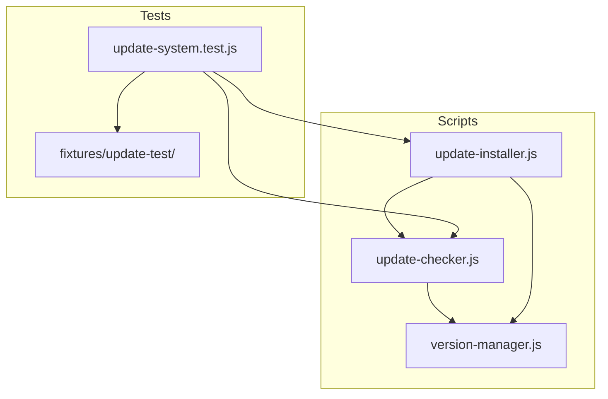

# Update System Exploration Summary

## Current State

### _pyrite Repository

A brand new cross-repository workspace created 2025-12-20 for experimental and integration work.**Location:** `/Users/ctavolazzi/Code/_pyrite`**Structure:**

- `_work_efforts/` - Johnny Decimal task tracking (initialized)
- `experiments/` - For prototypes (not yet created)
- `integrations/` - For cross-repo work (not yet created)
- `docs/` - For plans and decisions (not yet created)

**Status:** Empty starter workspace, ready for development---

### cursor-coding-protocols Repository

Contains the complete update system implementation.**Location:** `/Users/ctavolazzi/Code/cursor-coding-protocols`**Key Files:**| File | Purpose | Lines ||------|---------|-------|| `scripts/version-manager.js` | Core version tracking | ~400 || `scripts/update-checker.js` | GitHub API update checks | 206 || `scripts/update-installer.js` | Download, backup, rollback | 467 || `tests/update-system.test.js` | E2E test suite | 512 |---

## Test Suite Status

The test file `update-system.test.js` is **already fully implemented** with 17 tests:**1. Update Checker Tests (5 tests)**

- GitHub API fetch
- Cache file creation
- Cached result return
- Force refresh bypass
- Stale cache fallback

**2. Update Installer Tests (6 tests)**

- Backup creation
- List backups
- Get latest backup
- Excluded paths filtering
- Resolve "latest" version
- Specific version resolution

**3. Rollback Tests (6 tests)**

- Manual rollback restores files
- Version tracking reverted
- Backups persist after rollback
- Specific backup rollback
- Invalid backup handling
- Backup list printing

---

## Architecture

---

## Possible Next Steps

Based on exploration, here are the options:

1. **Run existing tests** - Execute `update-system.test.js` to verify current state
2. **Review test coverage** - Compare tests against the test plan document
3. **Cross-repo integration** - Set up _pyrite to work with cursor-coding-protocols
4. **Extend tests** - Add missing test cases if any gaps exist
5. **Documentation** - Create work effort in _pyrite documenting this system

---