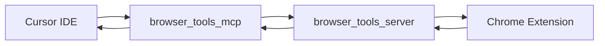

# Browser Tools MCP Implementation Plan

## Components Overview

BrowserTools MCP has three components that work together:




1. **Chrome Extension** - Captures browser data (logs, network, DOM, screenshots)
2. **browser-tools-server** - Node.js middleware (runs in terminal)
3. **browser-tools-mcp** - MCP server (configured in Cursor)

## Implementation Steps

### Step 1: Install Chrome Extension

- Download from: [v1.2.0 Chrome Extension Release](https://github.com/AgentDeskAI/browser-tools-mcp/releases/tag/v1.2.0)
- Or install manually from your forked repo's `chrome-extension/` folder via Chrome's "Load unpacked" feature

### Step 2: Add MCP Server Configuration

Update [`~/.cursor/mcp.json`](/Users/ctavolazzi/.cursor/mcp.json) to add the browser-tools-mcp server:

```json
"browser-tools": {
  "command": "npx",
  "args": [
    "-y",
    "@agentdeskai/browser-tools-mcp@latest"
  ]
}
```


### Step 3: Create Startup Script (Optional)

Create a convenience script to start the browser-tools-server middleware:

```bash
#!/bin/bash
npx @agentdeskai/browser-tools-server@latest
```

Save to: `/Users/ctavolazzi/Code/.mcp-servers/browser-tools/start-server.sh`

## Usage After Setup

1. **Start middleware server**: Run `npx @agentdeskai/browser-tools-server@latest` in a terminal
2. **Open Chrome DevTools**: Navigate to the BrowserToolsMCP panel
3. **Use in Cursor**: The MCP tools will be available for browser interaction

## Available Tools After Setup

- `getConsoleLogs` - Capture browser console output
- `getNetworkLogs` - Monitor network traffic
- `takeScreenshot` - Capture page screenshots
- `getSelectedElement` - Analyze selected DOM elements
- `wipeLogs` - Clear stored logs
- `runAccessibilityAudit` - WCAG compliance checks
- `runPerformanceAudit` - Lighthouse performance analysis
- `runSEOAudit` - Search engine optimization checks
- `runBestPracticesAudit` - Web development best practices
- `runDebuggerMode` - Run all debugging tools in sequence
- `runAuditMode` - Run all audits in sequence

## Files to Modify

- [`~/.cursor/mcp.json`](/Users/ctavolazzi/.cursor/mcp.json) - Add browser-tools server config

## Notes