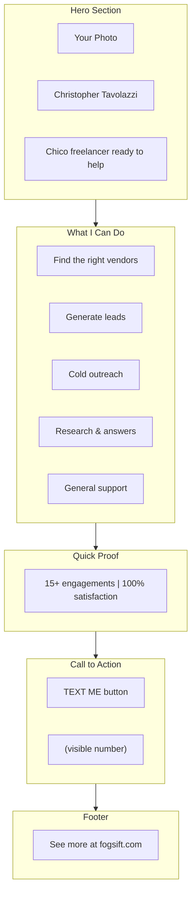

# Cold Call Landing Page Strategy

## The Problem

Your current website positions FogSift as a focused diagnostic consulting practice. Your cold call pitch is broad and flexible ("anything from finding a cleaner to lead gen"). When prospects visit fogsift.com after your call, there's a disconnect.

## The Solution

Create a dedicated landing page at **fogsift.com/hi** (short, memorable, easy to say on the phone) that:
1. Matches the tone and scope of your cold call pitch
2. Provides instant credibility
3. Makes texting you dead simple

## Page Structure

## Key Design Decisions

| Element | Current Site | Landing Page |
|---------|--------------|--------------|
| Tone | Professional consultant | Approachable freelancer |
| Scope | Diagnostic/root cause | Broad/flexible services |
| CTA | "Email" | "Text Me" |
| Feel | Boutique firm | Local guy who can help |
| Length | Multi-section | Single scroll |

## Implementation

Create [`src/hi.html`](src/hi.html) with:
- Mobile-first, fast-loading design
- Reuses existing CSS tokens for visual consistency
- Prominent SMS link: `sms:+1XXXXXXXXXX?body=Hi%20from%20your%20website`
- Fallback for desktop (shows number to text)
- Link to main site for those who want to dig deeper

## Before Implementation

I need one piece of information:
- **Your phone number** for the SMS link (or confirm you'll add it yourself)

## What This Gives You

On your cold call, you say:
> "Check out fogsift.com/hi - you can text me directly from there."

They visit on their phone, see:
1. Your face (you're real)
2. What you do (matches what you just said)
3. A big "Text Me" button

Friction: near zero.
