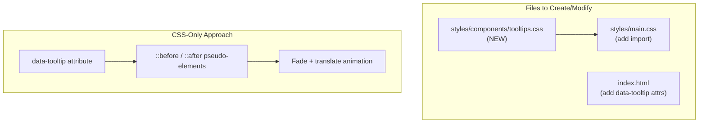

# Dashboard V3 Tooltip System

## Current State

- **Branch:** `main` (clean, up-to-date with origin)
- **Related Work Efforts:** None found for tooltips
- **Design System:** Already has `--z-tooltip: 700` defined in [tokens.css](mcp-servers/dashboard-v3/public/styles/tokens.css)

## Architecture



## Implementation

### 1. Create tooltip CSS component

New file: `public/styles/components/tooltips.css`

```css
/* CSS-only tooltip using data-tooltip attribute */
[data-tooltip] {
  position: relative;
}

[data-tooltip]::after {
  content: attr(data-tooltip);
  position: absolute;
  /* positioning, styling, animation */
  z-index: var(--z-tooltip);
  opacity: 0;
  pointer-events: none;
  transition: opacity var(--duration-fast), transform var(--duration-fast);
}

[data-tooltip]:hover::after,
[data-tooltip]:focus::after {
  opacity: 1;
}
```

Supports positioning variants: `data-tooltip-pos="top|bottom|left|right"`

### 2. Update main.css import

Add to [main.css](mcp-servers/dashboard-v3/public/styles/main.css):

```css
@import url('./components/tooltips.css');
```

### 3. Add data-tooltip attributes to index.html

Replace/supplement existing `title` attributes on ~35 interactive elements across:

| Section | Elements |
|---------|----------|
| Sidebar | Toggle, close, about, search clear, add repo |
| Topbar | Mobile menu, bell, view toggles |
| Dashboard | Hero dismiss, filters, test/demo buttons |
| Detail View | Back, status controls, tabs, actions, agent |
| Modals | Close buttons, browser controls, confirm/cancel |

### 4. Git workflow

```bash
# From main (clean)
git checkout -b feature/WE-251231-tooltip-system

# After implementation
git add -A
git commit -m "feat(dashboard-v3): Add CSS tooltip system for all interactive elements"
git push -u origin feature/WE-251231-tooltip-system
```

## Design Decisions

- **CSS-only:** No JavaScript required - uses `::after` pseudo-element
- **Theme-consistent:** Uses existing design tokens (colors, shadows, typography)
- **Accessible:** Tooltips appear on `:focus` as well as `:hover`
- **Respects motion:** Uses `prefers-reduced-motion` via existing duration tokens
- **Mobile-aware:** Tooltips hidden or repositioned on touch devices

## Scope

- Create 1 new CSS file (~80 lines)
- Modify 2 existing files (main.css import, index.html attributes)
- No JavaScript changes required
- Estimated: ~35 elements to annotate
