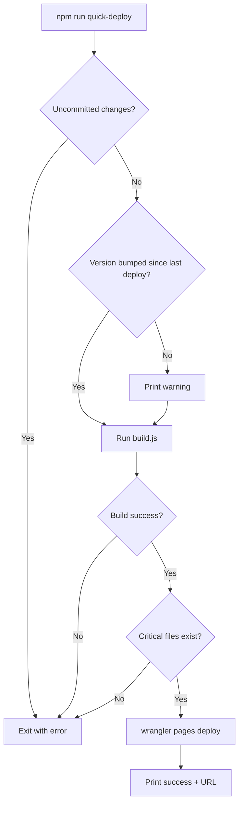

# Quick Deploy Script and Cloudflare Deployment

## Current State

- Uncommitted changes: modified `_work_efforts_/00-09_site_improvements/00_ui_ux/00.00_index.md`, `dist/images/team/christopher-badge.webp`
- Untracked: `_work_efforts/`, `src/.DS_Store`, `src/images/`
- Existing deployment: `npm run deploy` runs build + `wrangler pages deploy dist --project-name fogsift`

## Plan

### Step 1: Commit Current Changes

Stage and commit the pending changes before proceeding:

```bash
git add -A
git commit -m "chore: update work efforts and team badge"
git push origin main
```


### Step 2: Create Deploy Script

Create [`scripts/deploy.js`](scripts/deploy.js) with the following pre-deployment checks:

1. **Clean git check** - Fail if uncommitted changes exist
2. **Version bump warning** - Compare current version to last deployed (warns only)
3. **Build execution** - Run `build.js` and capture any errors
4. **Critical file verification** - Ensure `dist/index.html`, `dist/styles.css`, `dist/app.js` exist
5. **Deploy to Cloudflare** - Run `wrangler pages deploy`

### Step 3: Add npm Script

Update [`package.json`](package.json) to add:

```json
"quick-deploy": "node scripts/deploy.js"
```


### Step 4: Deploy to Cloudflare

After creating the script, run it to deploy the current version.

## Script Flow Diagram

