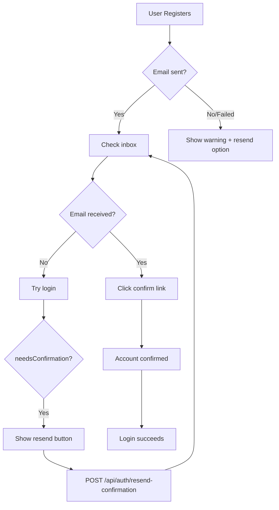

# Email Confirmation Troubleshooting Plan

## Problem Statement

After registration on production, users are not receiving confirmation emails, leaving them stuck - unable to login because `emailConfirmed: false`.

## Diagnosis Steps

### Step 1: Verify RESEND_API_KEY is configured in Cloudflare Pages

Check if the environment variable exists in your Cloudflare Pages dashboard:

- Go to Cloudflare Pages > howtowincapitalism > Settings > Environment variables
- Verify `RESEND_API_KEY` exists for Production

If missing, the code silently skips sending:

```typescript
// src/pages/api/auth/register.ts:263-278
const resendApiKey = (locals as Record<string, unknown>).runtime?.env?.RESEND_API_KEY;
if (resendApiKey) {
  // sends email
} else {
  console.warn('RESEND_API_KEY not configured - skipping confirmation email');
}
```

### Step 2: Check Resend Dashboard for delivery status

1. Log into [resend.com/emails](https://resend.com/emails)
2. Check if emails are being sent at all
3. Look for bounces, failures, or spam flags
4. Verify the sending domain is verified

### Step 3: Verify FROM_EMAIL domain

The hardcoded sender is:

```typescript
// src/lib/email/send-confirmation.ts:10
const FROM_EMAIL = 'noreply@howtowincapitalism.com';
```

This domain must be verified in Resend. If not verified, emails will fail silently or go to spam.

### Step 4: Check Cloudflare Function Logs

View logs for the register endpoint to see if emails are failing:

```bash
npx wrangler pages deployment tail --project-name howtowincapitalism
```

Look for:

- `Resend error:` messages
- `Failed to send confirmation email:` messages
- `RESEND_API_KEY not configured` warnings

## Fixes to Implement

### Fix 1: Add "Resend Confirmation Email" endpoint

Create a new API endpoint at [src/pages/api/auth/resend-confirmation.ts](src/pages/api/auth/resend-confirmation.ts):

```typescript
// POST /api/auth/resend-confirmation/
// Body: { email: string }
// - Rate limited to 1 request per 5 minutes per email
// - Generates new token, sends new email
// - Returns success even if email not found (security)
```

### Fix 2: Add UI for resending confirmation

Update the login error handling in [src/components/auth/LoginForm.astro](src/components/auth/LoginForm.astro) to show a "Resend confirmation email" link when `needsConfirmation: true`.

### Fix 3: Add better error feedback during registration

Update [src/pages/api/auth/register.ts](src/pages/api/auth/register.ts) to return a warning if email sending fails, so users know to check spam or request a resend.

## Flow After Fixes



## Files to Create/Modify

| File | Action |

|------|--------|

| `src/pages/api/auth/resend-confirmation.ts` | Create new endpoint |

| `src/components/auth/LoginForm.astro` | Add resend link on confirmation error |

| `src/pages/api/auth/register.ts` | Add warning if email fails |

| `src/lib/auth/kv-auth.ts` | Add `regenerateConfirmToken()` function |