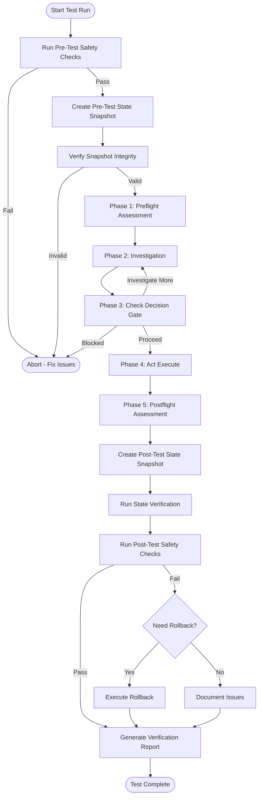

# Empiric

a Framework Test Run on _pyrite Repository

## Objective

Test and evaluate Empirica's epistemic vector-based self-awareness framework by applying it to analyze and understand the _pyrite repository. This is a proof-of-concept to demonstrate how epistemic awareness, uncertainty tracking, and the CASCADE workflow would work in practice.

## Current State Analysis

### Existing _pyrite Capabilities

- **Work Tracking**: MCP work efforts system (WE-YYMMDD-xxxx format)

- **Session Management**: Checkpoints, devlog, cross-session continuity

- **Tools**: Linting, health checks, structure validation

- **MCP Integration**: work-efforts, memory, sequential-thinking, docs-maintainer

- **Dashboards**: Real-time monitoring of work efforts

### Missing Empirica Concepts

- **Epistemic Vectors**: No measurement of KNOW, DO, CONTEXT, CLARITY, COHERENCE, SIGNAL, STATE, CHANGE, IMPACT

- **CASCADE Workflow**: No structured preflight → investigate → check → act → postflight process

- **Findings/Unknowns Tracking**: No systematic logging of discoveries vs. gaps

- **Cognitive BEADS**: No standardized context packets for handoffs

- **Git-Native Brain**: No crypto-stamped cognition mapping to code

## State Verification & Safety Tooling

### Pre-Test State Capture

**Goal**: Create a complete snapshot of repository state before running Empirica test

**Tool**: `tools/empirica-test/state_snapshot.py`

**Captures**:

1. **Git State**

   - Current branch, commit SHA, uncommitted changes
   - Git status (modified, untracked, staged files)
   - Recent commit history (last 10 commits)

2. **File System State**

   - Directory structure of key areas:
     - `_work_efforts/` (work efforts, tickets, checkpoints)
     - `tools/` (existing tools)
     - `mcp-servers/` (MCP server state)
     - `_docs/` (documentation)
   - File counts, sizes, modification times
   - Checksums (SHA256) of critical files

3. **Repository Health**

   - Run existing health checks:
     - `./pyrite health` (GitHub integration)
     - `./pyrite structure` (structure validation)
     - `./pyrite lint --scope _work_efforts` (markdown validation)
   - Capture output and status codes

4. **MCP Server State**

   - List active work efforts
   - Count tickets by status
   - Recent devlog entries (last 20)

**Output**: `experiments/empirica-test/snapshots/pre_test_state.json`

**Format**:

```json
{
  "timestamp": "2026-01-04T15:12:19Z",
  "git": {
    "branch": "main",
    "commit": "abc123...",
    "status": {...},
    "recent_commits": [...]
  },
  "filesystem": {
    "work_efforts": {
      "count": 25,
      "total_size": 123456,
      "checksums": {...}
    },
    ...
  },
  "health_checks": {
    "github": {"status": "ok", "output": "..."},
    "structure": {"status": "ok", "output": "..."},
    "lint": {"status": "ok", "output": "..."}
  },
  "mcp_state": {
    "work_efforts": [...],
    "ticket_counts": {...},
    "recent_devlog": [...]
  }
}
```

### Post-Test State Verification

**Goal**: Compare post-test state to pre-test snapshot and identify all changes

**Tool**: `tools/empirica-test/state_verify.py`

**Verifies**:

1. **Git Changes**

   - New commits since pre-test
   - Modified files (diff summary)
   - New files created
   - Deleted files (if any)

2. **File System Changes**

   - Files added/modified/deleted in key directories
   - Size changes
   - Checksum mismatches (if files were modified)

3. **Health Check Comparison**

   - Re-run all health checks
   - Compare results to pre-test
   - Flag any regressions

4. **MCP State Comparison**

   - Compare work effort counts
   - Compare ticket status distributions
   - Identify new work efforts or tickets created

**Output**: `experiments/empirica-test/snapshots/post_test_state.json` + `experiments/empirica-test/snapshots/state_diff.json`

**Diff Format**:

```json
{
  "timestamp": "2026-01-04T16:45:30Z",
  "changes": {
    "git": {
      "new_commits": 3,
      "commits": [...],
      "modified_files": ["experiments/empirica-test/..."],
      "new_files": ["experiments/empirica-test/..."],
      "deleted_files": []
    },
    "filesystem": {
      "added": [...],
      "modified": [...],
      "deleted": []
    },
    "health_checks": {
      "github": {"status": "ok", "unchanged": true},
      "structure": {"status": "ok", "unchanged": true},
      "lint": {"status": "ok", "unchanged": true}
    },
    "mcp_state": {
      "work_efforts_added": 0,
      "tickets_added": 0,
      "status_changes": {}
    }
  },
  "regressions": [],
  "warnings": []
}
```

### Safety Checks

**Tool**: `tools/empirica-test/safety_checks.py`

**Pre-Test Checks** (run before starting):

1. **Git Safety**

   - Verify working directory is clean (no uncommitted changes)
   - Verify we're on a safe branch (not `main` directly)
   - Check for uncommitted work efforts

2. **Backup Verification**

   - Confirm pre-test snapshot was created successfully
   - Verify snapshot file integrity

3. **Resource Availability**

   - Check disk space (need at least 100MB free)
   - Verify write permissions in `experiments/` directory

4. **Dependency Checks**

   - Verify required tools are available (`git`, `python3`)
   - Verify existing _pyrite tools work (`./pyrite --version`)

**Post-Test Checks** (run after completion):

1. **No Regressions**

   - All health checks still pass
   - No broken links or invalid markdown
   - Structure validation still passes

2. **Change Validation**

   - All changes are in `experiments/empirica-test/` (isolated)
   - No unexpected modifications to core _pyrite files
   - Git history is clean (no force pushes, no rebases)

3. **Rollback Readiness**

   - Verify we can identify exact commit to rollback to
   - Confirm snapshot contains all necessary state

### Rollback Mechanism

**Tool**: `tools/empirica-test/rollback.py`

**Capabilities**:

1. **Git Rollback**

   - Reset to pre-test commit
   - Remove uncommitted changes
   - Restore deleted files

2. **File Restoration**

   - Restore files from pre-test snapshot (if needed)
   - Remove files created during test

3. **State Restoration**

   - Clear test artifacts
   - Restore original directory structure

**Usage**:

```bash
# Review what would be rolled back
python3 tools/empirica-test/rollback.py --dry-run

# Execute rollback
python3 tools/empirica-test/rollback.py --confirm
```

### Documentation

**File**: `experiments/empirica-test/STATE_VERIFICATION.md`

**Contents**:

1. **Purpose**: Why state verification is needed
2. **Workflow**: Step-by-step process

   - Pre-test: Run snapshot
   - During test: Execute CASCADE workflow
   - Post-test: Run verification
   - If issues: Run rollback

3. **Tool Reference**: How to use each tool
4. **Troubleshooting**: Common issues and solutions
5. **Safety Guarantees**: What is/isn't protected

## Test Execution Workflow



## Test Plan

### Phase 0: Pre-Test Setup & State Capture

**Goal**: Ensure safe testing environment and capture baseline state

**Tasks**:

1. Run safety checks (`safety_checks.py --pre-test`)

   - Verify clean git state
   - Check resource availability
   - Validate dependencies

2. Create pre-test snapshot (`state_snapshot.py`)

   - Capture complete repository state
   - Store in `experiments/empirica-test/snapshots/`

3. Verify snapshot integrity

   - Confirm all data captured correctly
   - Validate checksums

4. Document pre-test state

   - Create `STATE_VERIFICATION.md` if needed
   - Record any warnings or concerns

**Output**:

- `experiments/empirica-test/snapshots/pre_test_state.json`
- `experiments/empirica-test/snapshots/pre_test_state.md` (human-readable)

### Phase 1: Epistemic Assessment (Preflight)

**Goal**: Measure current epistemic state across 13 vectors

**Tasks**:

1. Create epistemic vector measurement tool (`tools/empirica-test/epistemic_vectors.py`)

- Foundation Tier: KNOW, DO, CONTEXT

- Comprehension Tier: CLARITY, COHERENCE, SIGNAL

- Execution Tier: STATE, CHANGE, IMPACT

- Additional vectors as needed

2. Run preflight assessment on _pyrite repository

- Analyze codebase structure

- Measure confidence in understanding

- Identify knowledge gaps

3. Generate preflight report with vector scores (0.0-1.0)

**Output**: `experiments/empirica-test/preflight_report.json`

### Phase 2: Investigation (CASCADE Step 2)

**Goal**: Systematically reduce uncertainty through structured investigation

**Tasks**:

1. Create findings/unknowns logging system

- `empirica finding-log "message"` equivalent

- `empirica unknown-log "question"` equivalent

- Store in structured format (JSON + markdown)

2. Investigate key areas of _pyrite:

- Architecture patterns (seed architecture, MCP servers)

- Work effort system (MCP v0.3.0 format)

- Tool ecosystem (linters, health checks)

- Integration points (GitHub, MCP servers)

3. Log findings and unknowns as investigation progresses

**Output**:

- `experiments/empirica-test/findings.json`

- `experiments/empirica-test/unknowns.json`

- `experiments/empirica-test/investigation_log.md`

### Phase 3: Check (CASCADE Step 3)

**Goal**: Decision gate based on findings and remaining unknowns

**Tasks**:

1. Create check/confidence calculator

- Analyze findings vs. unknowns

- Calculate confidence score

- Determine if ready to proceed or need more investigation

2. Generate check report with:

- Confidence level (0.0-1.0)

- Decision: PROCEED / INVESTIGATE MORE / BLOCKED

- Rationale based on epistemic vectors

**Output**: `experiments/empirica-test/check_report.json`

### Phase 4: Act (CASCADE Step 4)

**Goal**: Execute with precision, logging critical actions**Tasks**:

1. Create action logging system

- `empirica act-log` equivalent

- Map actions to git commits/code changes

- Track what was done and why

2. Perform a small, concrete action on _pyrite:

- Example: Add epistemic vector tracking to existing work effort

- Example: Create integration point for Empirica concepts

- Example: Document findings in _docs

3. Log all actions with epistemic context

**Output**: `experiments/empirica-test/action_log.json`

### Phase 5: Postflight (CASCADE Step 5)

**Goal**: Measure learning deltas and verify calibration

**Tasks**:

1. Re-run epistemic vector assessment

2. Compare preflight vs. postflight vectors

3. Calculate learning deltas:

- Knowledge increase

- Uncertainty reduction

- Confidence improvement

4. Generate postflight report with:

- Vector deltas

- Calibration verification

- Lessons learned

**Output**: `experiments/empirica-test/postflight_report.json`

### Phase 6: Post-Test Verification & Cleanup

**Goal**: Verify no regressions and document all changes

**Tasks**:

1. Run post-test state capture (`state_snapshot.py`)

   - Capture current repository state
   - Store in `experiments/empirica-test/snapshots/`

2. Run state verification (`state_verify.py`)

   - Compare pre-test vs. post-test states
   - Generate diff report
   - Identify all changes made

3. Run safety checks (`safety_checks.py --post-test`)

   - Verify no regressions
   - Validate all changes are isolated
   - Confirm rollback readiness

4. Generate verification report

   - Summary of changes
   - Health check comparisons
   - Rollback instructions (if needed)

5. Document test results

   - Update `STATE_VERIFICATION.md` with results
   - Create test summary report

**Output**:

- `experiments/empirica-test/snapshots/post_test_state.json`
- `experiments/empirica-test/snapshots/state_diff.json`
- `experiments/empirica-test/verification_report.md`

## Implementation Structure

```
experiments/empirica-test/
├── README.md                    # Test run documentation
├── STATE_VERIFICATION.md        # State verification guide
├── epistemic_vectors.py        # Vector measurement tool
├── cascade_workflow.py         # CASCADE workflow orchestrator
├── findings_tracker.py         # Findings/unknowns logging
├── action_logger.py            # Action tracking
├── state_snapshot.py            # Pre/post state capture tool
├── state_verify.py             # State comparison & verification
├── safety_checks.py            # Pre/post safety validation
├── rollback.py                 # Rollback mechanism
├── preflight_report.json       # Initial epistemic state
├── check_report.json           # Decision gate results
├── postflight_report.json      # Final epistemic state + deltas
├── findings.json               # Structured findings
├── unknowns.json               # Structured unknowns
├── action_log.json             # Action history
├── investigation_log.md        # Human-readable investigation log
├── verification_report.md      # Post-test verification summary
└── snapshots/                  # State snapshots directory
    ├── pre_test_state.json     # Pre-test repository state
    ├── pre_test_state.md       # Human-readable pre-test state
    ├── post_test_state.json    # Post-test repository state
    └── state_diff.json         # Change summary
```

## Integration Points with Existing _pyrite

### Work Efforts System

- Map epistemic vectors to work effort status

- Add epistemic confidence to ticket metadata

- Use findings/unknowns in work effort descriptions

### MCP Servers

- Extend `work-efforts` MCP to include epistemic vectors

- Use `memory` MCP to persist epistemic state

- Use `sequential-thinking` for complex epistemic reasoning

### Tools

- Integrate epistemic assessment into existing tools

- Add epistemic vectors to health check output

- Include confidence scores in lint reports

### Documentation

- Document findings in `_docs/`

- Update `AGENTS.md` with epistemic workflow

- Create integration guide for Empirica concepts

## Success Criteria

1. **Complete CASCADE Workflow**: All 5 steps executed and documented

2. **Epistemic Vectors Measured**: All 13 vectors assessed at preflight and postflight

3. **Findings/Unknowns Tracked**: Systematic logging of discoveries and gaps

4. **Learning Deltas Calculated**: Quantified improvement in understanding

5. **Integration Documented**: Clear path for integrating Empirica into _pyrite

6. **State Verification Complete**: Pre/post snapshots captured, verified, and documented

7. **No Regressions**: All health checks pass before and after test

8. **Safe Rollback**: Rollback mechanism tested and verified

## Deliverables

1. **Test Implementation**: Working tools for epistemic assessment

2. **State Verification Tools**: Pre/post snapshot, verification, and rollback tools

3. **Test Report**: Complete CASCADE workflow execution on _pyrite

4. **State Verification Report**: Pre/post comparison, change summary, safety validation

5. **Integration Plan**: How Empirica concepts would enhance _pyrite

6. **Documentation**: Findings, unknowns, recommendations, and state verification guide

## Notes

- This is a **test/evaluation**, not a full implementation

- Focus on demonstrating concepts, not production-ready code

- Use existing _pyrite patterns (tools/, experiments/, _docs/)

- Document everything for future reference