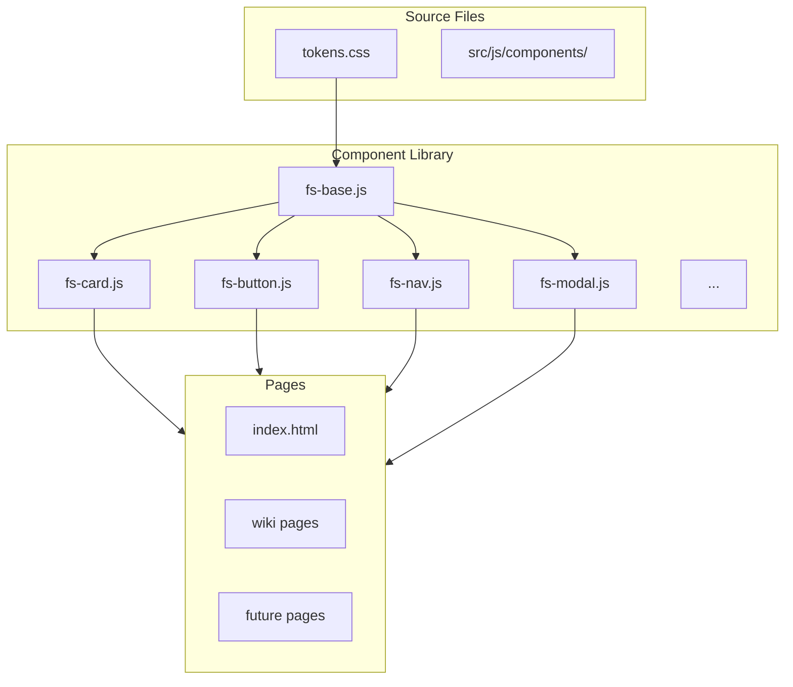

# FogSift Component Library Plan

## Approach: Web Components (Custom Elements)

Native browser Custom Elements provide the best balance of simplicity, encapsulation, and scalability for a vanilla JS project expecting 30+ pages.

---

## Architecture



---

## Directory Structure

```
src/
├── js/
│   ├── components/           # NEW: Component library
│   │   ├── fs-base.js        # Base class with shared utilities
│   │   ├── fs-card.js        # Card component
│   │   ├── fs-button.js      # CTA button
│   │   ├── fs-process-step.js
│   │   ├── fs-testimonial.js
│   │   ├── fs-pricing-card.js
│   │   ├── fs-modal.js
│   │   ├── fs-toast.js
│   │   ├── fs-theme-switcher.js
│   │   ├── fs-nav.js
│   │   └── index.js          # Exports all components
│   ├── main.js               # App init (uses components)
│   └── ...existing files
├── css/
│   ├── tokens.css            # Design tokens (existing)
│   └── components.css        # Keep for fallback/legacy
```

---

## Component Design Pattern

Each component follows this structure:

```javascript
// fs-card.js
class FsCard extends HTMLElement {
    static get observedAttributes() {
        return ['title', 'variant'];
    }
    
    constructor() {
        super();
        // Optional: use Shadow DOM for encapsulation
        // this.attachShadow({ mode: 'open' });
    }
    
    connectedCallback() {
        this.render();
    }
    
    attributeChangedCallback(name, oldVal, newVal) {
        if (oldVal !== newVal) this.render();
    }
    
    render() {
        const title = this.getAttribute('title') || '';
        const variant = this.getAttribute('variant') || 'default';
        
        this.classList.add('fs-card', `fs-card--${variant}`);
        this.innerHTML = `
            ${title ? `<h3 class="fs-card__title">${title}</h3>` : ''}
            <div class="fs-card__body">
                <slot></slot>
            </div>
        `;
    }
}

customElements.define('fs-card', FsCard);
```

**Usage in HTML:**
```html
<fs-card title="Listen" variant="process">
    <p>You tell me what's going on...</p>
</fs-card>
```

---

## Key Components to Build

| Priority | Component | Replaces | Notes |
|----------|-----------|----------|-------|
| P0 | `fs-button` | `.cta-button` | Primary CTA with honeypot support |
| P0 | `fs-card` | `.hero-badge`, `.about-card` | Generic card with variants |
| P0 | `fs-nav` | Mobile drawer + desktop nav | Unified navigation |
| P1 | `fs-process-step` | `.process-step` | Numbered step cards |
| P1 | `fs-testimonial` | `.testimonial-card` | Quote + author |
| P1 | `fs-pricing-card` | `.pricing-card` | Tier cards |
| P1 | `fs-modal` | `#article-modal` | Accessible modal dialog |
| P2 | `fs-toast` | Toast notifications | Auto-dismiss messages |
| P2 | `fs-theme-switcher` | Theme dropdowns | Unified theme control |
| P2 | `fs-stat` | `.stat-item` | Number + label |

---

## Styling Strategy

**Option A: Global CSS (Recommended for FogSift)**
- Components use existing `tokens.css` variables
- Styles in `components.css` remain usable
- No Shadow DOM encapsulation = easier theming
- Class-based styling: `.fs-card`, `.fs-card--featured`

**Option B: Shadow DOM (More Encapsulated)**
- Each component has isolated styles
- Must explicitly import tokens into each component
- Better for distribution as a standalone library

Recommend **Option A** for simplicity and seamless theme switching.

---

## Build Integration

Update `[scripts/build.js](scripts/build.js)` to:
1. Bundle all component files into a single `components.js`
2. Or keep as ES modules with import maps (modern browsers)

```javascript
// Option: ES Module entry point
// src/js/components/index.js
export * from './fs-card.js';
export * from './fs-button.js';
// ... etc
```

---

## Migration Path

1. **Phase 1: Foundation**
   - Create base component class
   - Build 3 core components (`fs-button`, `fs-card`, `fs-nav`)
   - Test on index.html

2. **Phase 2: Full Component Set**
   - Convert remaining CSS components to Web Components
   - Update templates to use new components

3. **Phase 3: Page Templates**
   - Create reusable page layouts
   - Build new pages using component library

---

## Example: Refactored Hero Section

**Before (current):**
```html
<section class="section section-hero">
    <div class="hero-badge">
        <h1 class="headline">Clear answers...</h1>
        <p class="subhead">Something eating up your</p>
        <a href="mailto:..." class="cta-button">Ask Away</a>
    </div>
</section>
```

**After (with components):**
```html
<section class="section section-hero">
    <fs-card variant="hero">
        <h1 slot="title">Clear answers to good questions.</h1>
        <p>Something eating up your <fs-rotating-text words='["time?", "bandwidth?"]'></fs-rotating-text></p>
        <fs-button href="mailto:..." honeypot>Ask Away</fs-button>
    </fs-card>
</section>
```

---

## Files to Create/Modify

| File | Action |
|------|--------|
| `src/js/components/fs-base.js` | Create - Base class |
| `src/js/components/fs-button.js` | Create - CTA button |
| `src/js/components/fs-card.js` | Create - Generic card |
| `src/js/components/fs-nav.js` | Create - Navigation |
| `src/js/components/index.js` | Create - Exports |
| `src/index.html` | Modify - Add component imports |
| `scripts/build.js` | Modify - Bundle components |

---

## Benefits

1. **Consistency** - Same component = same look everywhere
2. **Maintainability** - Change once, update everywhere
3. **Scalability** - Easy to add new pages/components
4. **No Dependencies** - Pure vanilla JS, native browser APIs
5. **Progressive** - Adopt incrementally alongside existing code
