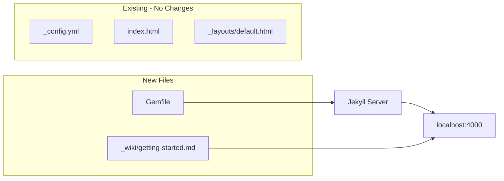

# Jekyll Local Dev + Demo Wiki Page

## Phase 1: Environment Setup

1. **Check Ruby availability** - Run `ruby -v` to verify Ruby is installed (macOS ships with it)

2. **Create Gemfile** - Add a [`Gemfile`](Gemfile) with Jekyll and required plugins:
   - jekyll
   - jekyll-feed
   - jekyll-sitemap
   - webrick (required for Ruby 3.0+)

3. **Install dependencies** - Run `bundle install` to install gems

4. **Start local server** - Run `bundle exec jekyll serve` to start at http://localhost:4000

## Phase 2: Create Demo Wiki Page

5. **Create new wiki page** - Add [`_wiki/getting-started.md`](_wiki/getting-started.md) with:
   - Front matter (title)
   - Welcome content for new CFL members
   - Basic info about the space, hours, how to join
   - Links to other wiki pages

6. **Verify locally** - Check that the new page appears on the homepage and renders correctly

## File Changes

## Expected Result

- Local Jekyll server running at http://localhost:4000
- Homepage lists 3 wiki pages: CFL Kiosk, CFL Task Dashboard, Getting Started
- New "Getting Started" page accessible at /wiki/getting-started