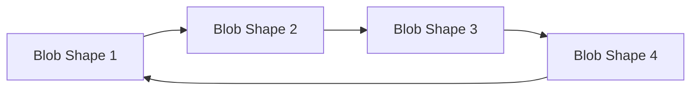

# Lava Lamp Morphing Animation

## Approach

Create a pure CSS animation using `border-radius` morphing and scale transforms to achieve an organic lava lamp effect. Four blob shapes will continuously morph between configurations using a single keyframe animation.

## Technical Design



**Animation Technique:**
- Use percentage-based `border-radius` values (e.g., `60% 40% 30% 70% / 60% 30% 70% 40%`) to create organic blob shapes
- Animate between 4 distinct configurations at 0%, 25%, 50%, 75%, 100% keyframes
- Add subtle rotation and scale pulses for fluid movement
- Total cycle: 8-12 seconds for smooth, hypnotic effect

## File Changes

### 1. Create Animation CSS
**File:** [`src/css/lava-blob.css`](src/css/lava-blob.css) (new file)

Contains:
- `.lava-container` - wrapper with sizing
- `.lava-blob` - the main morphing shape
- `@keyframes blob-morph` - 4-stage morphing animation
- Size variants (small, medium, large)
- Theme-aware colors using existing CSS variables

### 2. Create Demo Page
**File:** [`src/lava-demo.html`](src/lava-demo.html) (new file)

A simple standalone page to preview the animation with controls to see different sizes.

## Color Palette (from tokens.css)

Uses existing FogSift colors for theme compatibility:
- Primary blob: `var(--burnt-orange)` / `var(--rust)`
- Secondary blob: `var(--teal)` / `var(--accent-light)`
- Background glow: `var(--earth-mid)`

## Usage

Once created, the component can be used anywhere:

```html
<div class="lava-container">
  <div class="lava-blob"></div>
</div>
```

Or with multiple overlapping blobs for richer effect:

```html
<div class="lava-container lava-container--lg">
  <div class="lava-blob lava-blob--primary"></div>
  <div class="lava-blob lava-blob--secondary"></div>
</div>
```