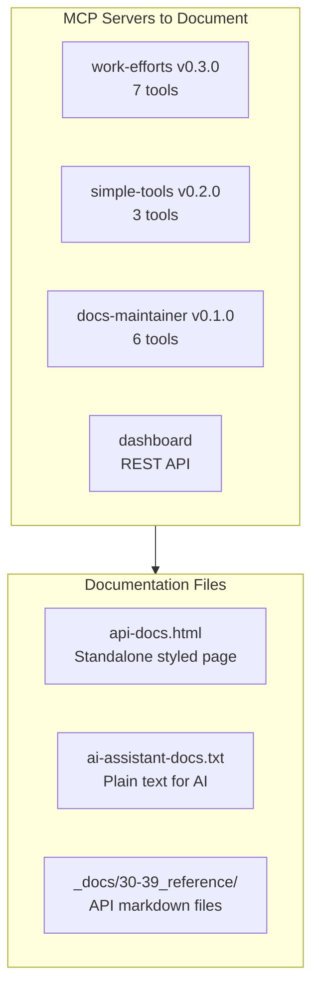

# Pyrite MCP Servers API Documentation

## Goal
Create a PixelLab-inspired documentation site with:
1. **HTML page** - Dark themed, styled, human-readable
2. **AI Docs button** - One-click copy of plain-text docs optimized for AI context

## Architecture

## Key Files

| Output | Path | Purpose |
|--------|------|---------|
| HTML docs | [`mcp-servers/docs/index.html`](mcp-servers/docs/index.html) | Styled documentation page |
| AI text docs | [`mcp-servers/docs/ai-assistant-docs.txt`](mcp-servers/docs/ai-assistant-docs.txt) | Plain text for AI copy |
| Markdown | [`_docs/30-39_reference/api_category/`](_docs/30-39_reference/) | Johnny Decimal markdown docs |

## Design (PixelLab-Inspired)

- **Dark theme** with cyan/teal accents
- **Copy button** for AI docs (copies text to clipboard)
- **Tool cards** with:
  - Tool name and version
  - Description
  - Parameters table
  - Usage example
- **Installation section** with code blocks
- **Cursor config** JSON snippet

## Documentation Content

### For Each Server:
1. Name, version, language
2. Installation instructions
3. Cursor MCP config snippet
4. Tool reference:
   - Tool name
   - Description
   - Parameters (name, type, required, description)
   - Example usage

### Servers to Document:
1. **work-efforts** - 7 tools (create/list/update work efforts and tickets, search)
2. **simple-tools** - 3 tools (random name, unique ID, date formatting)
3. **docs-maintainer** - 6 tools (initialize, create, update, rebuild, link, search, health)
4. **dashboard** - REST endpoints for Mission Control UI

## Implementation Approach

1. Create single self-contained HTML file (no build step)
2. Embed CSS inline for dark theme
3. Add JavaScript for clipboard copy functionality
4. Generate companion `.txt` file for AI assistants
5. Update `_docs` with markdown versions
