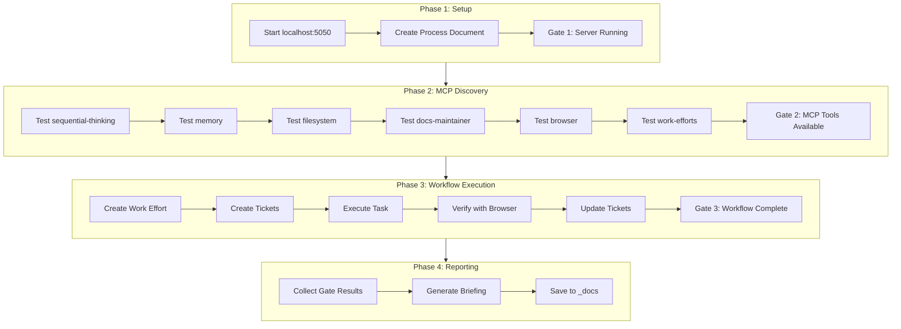

# MCP Workflow Integration Test Plan

## Objective
Test the complete MCP tool orchestration workflow with defined stages, gates, and automated reporting. The test will verify that all MCP tools work together correctly on a real task.

## Architecture

## Deliverables

### 1. Process Document
Location: [`_docs/20-29_development/workflow_category/workflow.02_mcp_integration_test_process.md`](_docs/20-29_development/workflow_category/workflow.02_mcp_integration_test_process.md)

Contents:
- Expected workflow stages
- Gate definitions with pass/fail criteria
- Expected tool chain for each phase

### 2. Test Execution Log
Location: [`_docs/20-29_development/workflow_category/workflow.03_mcp_integration_test_results.md`](_docs/20-29_development/workflow_category/workflow.03_mcp_integration_test_results.md)

Contents:
- Timestamp for each gate
- Pass/Fail status with evidence
- Error messages if any
- Screenshots or snapshots where applicable

### 3. Briefing Document
Location: [`_docs/20-29_development/workflow_category/workflow.04_mcp_integration_briefing.md`](_docs/20-29_development/workflow_category/workflow.04_mcp_integration_briefing.md)

Contents:
- Executive summary
- Gate-by-gate results table
- Issues discovered
- Recommendations

## Gate Definitions

| Gate | Name | Pass Criteria |
|------|------|---------------|
| G1 | Server Running | localhost:5050 responds, browser snapshot shows fogsift homepage |
| G2 | MCP Discovery | All 6 MCP servers respond (sequential-thinking, memory, filesystem, docs-maintainer, browser, work-efforts) |
| G3 | Workflow Execution | Work effort created, tickets created, task executed, browser verified |
| G4 | Documentation | All 3 documents created and committed |

## Test Task
The test will execute a simple but complete workflow:
- Create a work effort for "Add test badge to homepage"
- Create 2 tickets: "Add badge HTML" and "Verify with browser"
- Execute the first ticket (add a small test element)
- Verify using browser tools
- Complete tickets and work effort
- Document results

## Key Files
- Server: `npm run dev` uses [`scripts/build.js`](scripts/build.js) and browser-sync on port 5050
- MCP Docs: [`_docs/20-29_development/workflow_category/workflow.01_mcp_work_efforts_system_v0_3_0.md`](_docs/20-29_development/workflow_category/workflow.01_mcp_work_efforts_system_v0_3_0.md)
- MCP Server: `/Users/ctavolazzi/Code/.mcp-servers/work-efforts/server.js`

## Execution Steps

1. **Create Process Document** - Define expected workflow with gates
2. **Start Server** - Run `npm run dev` in background
3. **Gate 1 Check** - Verify server running with browser snapshot
4. **MCP Discovery Loop** - Test each MCP tool, record results
5. **Gate 2 Check** - Summarize MCP availability
6. **Execute Workflow** - Run through work-effort creation flow
7. **Gate 3 Check** - Verify workflow completed
8. **Generate Briefing** - Compile all results
9. **Gate 4 Check** - Verify documentation created
10. **Commit Results** - Push to git

## Notes
- The work-efforts MCP server is installed but may not be visible to AI (known issue from earlier debugging)
- Test will document this as a finding if it occurs
- Browser tools will be used to verify visual changes on localhost:5050