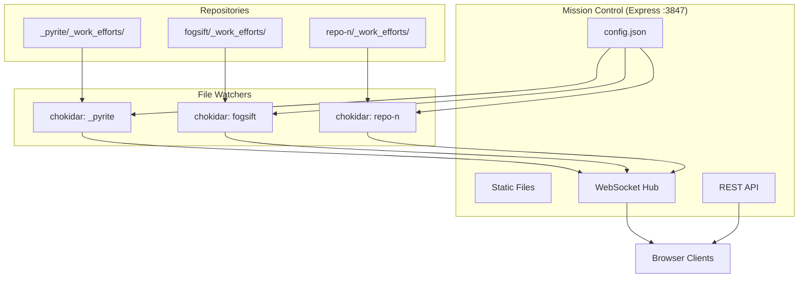

# Mission Control Dashboard

## Vision

A central dashboard to monitor AI agent progress across multiple Cursor windows, repositories, and workflows - starting with one repo, designed for many.

```
┌─────────────────────────────────────────────────────────────────┐
│  MISSION CONTROL                              ● 3 repos active  │
├─────────────────────────────────────────────────────────────────┤
│  _pyrite          fogsift           cursor-coding-protocols     │
│  ┌──────────┐     ┌──────────┐     ┌──────────┐                │
│  │ WE-a1b2  │     │ WE-c3d4  │     │ WE-e5f6  │                │
│  │ ████░░░░ │     │ ████████ │     │ ██░░░░░░ │                │
│  │ 2/5 tkts │     │ DONE     │     │ 1/4 tkts │                │
│  └──────────┘     └──────────┘     └──────────┘                │
└─────────────────────────────────────────────────────────────────┘
```

## Architecture



## Key Decisions

| Decision | Choice | Rationale |
|----------|--------|-----------|
| Folder name | `_work_efforts/` | Match existing disk structure |
| Database | None (files are truth) | No sync issues, markdown is portable |
| Multi-repo | Config-driven | Add repos via `config.json`, no restart needed |
| Framework | Express.js | Simple, JS ecosystem consistency |

## File Structure

```
mcp-servers/dashboard/
├── server.js           # Express + WebSocket + multi-repo watchers
├── package.json        
├── config.json         # Repo paths to monitor
├── public/
│   ├── index.html      # Dashboard shell
│   ├── styles.css      # Fogsift dark theme
│   └── app.js          # Client: WS connection, rendering
└── README.md
```

## Config Format

```json
{
  "repos": [
    {
      "name": "_pyrite",
      "path": "/Users/ctavolazzi/Code/active/_pyrite",
      "color": "#fb923c"
    }
  ],
  "port": 3847
}
```

Start with one repo. Add more by editing config (hot-reload support).

## API Endpoints

| Endpoint | Method | Purpose |
|----------|--------|---------|
| `/api/repos` | GET | List configured repos |
| `/api/repos/:name/work-efforts` | GET | Get all WEs for a repo |
| `/api/config` | GET/POST | Read/update config |

## WebSocket Events

```javascript
// Server -> Client
{ type: "update", repo: "_pyrite", data: {...} }
{ type: "repo_added", repo: "fogsift" }

// Client -> Server  
{ type: "subscribe", repos: ["_pyrite", "fogsift"] }
```

## UI Components

1. **Repo Switcher** - Tabs or sidebar for each repo
2. **Work Effort Cards** - Expandable cards with progress bars
3. **Ticket List** - Nested under each WE with status badges
4. **Activity Feed** - Real-time log of file changes (optional v2)

## Styling (Fogsift Dark)

```css
:root {
  --bg: #1a1412;
  --bg-card: #0f0b09;
  --text: #f5f0e6;
  --accent: #fb923c;
  --border: #3d2e26;
  --font-mono: 'JetBrains Mono', monospace;
}
```

## MVP Scope (v1)

- [x] Single repo to start (config supports multiple)
- [x] Real-time file watching
- [x] Work effort + ticket visualization
- [x] Status badges and progress indication
- [ ] ~~Settings UI~~ (v2)
- [ ] ~~Activity feed~~ (v2)

## Bug Fix Required

Update [`mcp-servers/work-efforts/server.js`](mcp-servers/work-efforts/server.js) lines 104 and 418:
```javascript
// Change from:
const workEffortsDir = path.join(repoPath, '_work_efforts_');
// To:
const workEffortsDir = path.join(repoPath, '_work_efforts');
```

## Commands

```bash
cd mcp-servers/dashboard
npm install
node server.js
# Open http://localhost:3847
```
